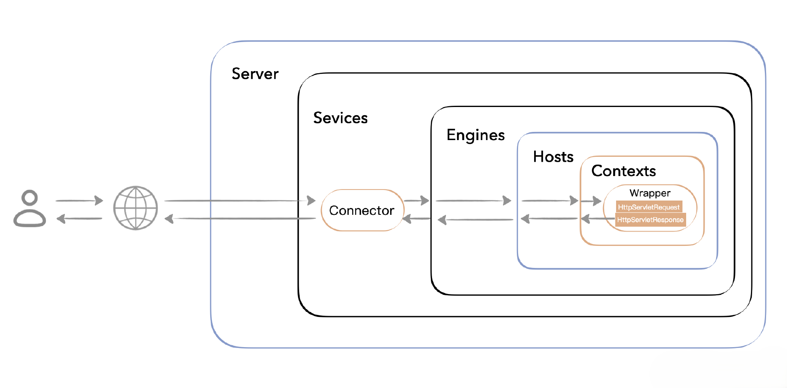

# handson-tomcat
致敬传奇，手写框架之Tomcat，帮作者点点⭐⭐攻克Web系统底层原理，领悟服务器设计哲学，带你卷向更高处

Tomcat宏观架构如下：



在手写Tomcat之前，你需要先掌握HTTP请求/响应的基本格式：

HTTP请求格式如下：
- 第一行：请求方法 路径 协议/版本
- 后面是请求头
- 空一行
- 请求体
```shell
GET /hello.txt HTTP/1.1
Accept: text/html,application/xhtml+xml,application/xml;q=0.9,image/avif,image/webp,image/apng,*/*;q=0.8,application/signed-exchange;v=b3;q=0.7
Accept-Encoding: gzip, deflate, br
Accept-Language: zh-CN,zh;q=0.9
Cache-Control: max-age=0
Connection: keep-alive
Host: localhost:8080
Sec-Fetch-Dest: document
Sec-Fetch-Mode: navigate
Sec-Fetch-Site: none
Sec-Fetch-User: ?1
Upgrade-Insecure-Requests: 1
User-Agent: Mozilla/5.0 (Macintosh; Intel Mac OS X 10_15_7) AppleWebKit/537.36 (KHTML, like Gecko) Chrome/113.0.0.0 Safari/537.36
sec-ch-ua: "Google Chrome";v="113", "Chromium";v="113", "Not-A.Brand";v="24"

请求体（支持不同的类型如json、xml、x-www-form-urlencoded等）
```

HTTP响应格式类似：
- 状态行: 协议/版本 响应码 msg
- 响应头
- 空行
- 响应体
```shell
HTTP/1.1 200 OK
Content-Type: text/html
Content-Length: 12
Server: tomcat

Hello World!
```

与`handson-spring`一样，`handson-tomcat`依旧采取多分支开发的方式，分支结构如下：
- a-server01：实现一个最简单的静态资源服务器，根据请求返回基本的响应结构
- a-server02：服务器引入`commons-lang3`，自定义动态资源`Servlet`，并支持`Servlet`内容动态填充
- a-server03：服务器引入`javax.servlet-api`，对用户自定义的`Servlet`适配标准的`Servlet`规范
- b-connector01：引入`Tomcat`连接层，同时对`HttpServer`一拆为二`Connector`和`Processor`，做到职责分离
- b-connector02：提高服务器性能，实现`Processor`对象池
- b-connector03：进一步提高服务器性能，设计线程`Processor`，同时实现与`Connector`线程之间的同步机制
- b-connector04：对`Request`相关的代码适配`Servlet`规范，封装`RequestLine`并解析请求第一行信息，和`DefaultHeaders`请求头信息
- b-connector05：对`Response`相关的代码适配`Servlet`规范，并进行响应码，响应头的解析
- b-connector06：门面模式的应用，分别对`HttpRequest`和`HttpResponse`适配门面，选择性的隐藏内部细节
- b-connector07：更进一步，对`HttpRequest`进行`GET`路径参数，以及`POST`请求体的解析，同时改造 SocketInputStream，由继承 InputStream 改为继承 ServletInputStream。使输入流适配Servlet规范
- b-connector08：对请求侧设计`Cookie`，解析请求路径或者请求头`Cookie`中的`jsessionid`，对服务器设计存储`Sessions`集合`<jsessionid,session>`
- b-connector09：对响应头设计`Set-Cookie`，使之有状态，终于可以把多次没有上下文关联的`HTTP`访问视为同一个用户访问。在 Response 返回参数中回写 Session 信息，使得客户端程序能够接受这个信息，下次请求 Server时携带Session信息
- b-connector10：本节我们简单探讨了一下 Keep-alive 和 chunked 模式，让同一个 Socket 可以用于多次访问，减少了 Socket 的连接和关闭。
- c-container-01：本节初步引入了容器的实现，ServletContainer，同时为了后续增强对Servlet生命周期的管理用ServletWrapper代替了Servlet
- c-container-02：参考Tomcat项目结构，形成了两层容器，ServletContext(原ServletContainer)和ServletWrapper，Tomcat 把 Wrapper 也看作一种容器，也就是隶属于 Context 之下的子容器（Child Container）
- c-container-03：简单引入日志模块，同时利用奇妙的this引入逆序职责链模式Pipeline+Valve，每一层容器都可以引入职责链模式
- c-container-04：奇妙的this顺序职责链模式Filter，每一层容器都可以引入职责链模式
- 更多分支正在更新中...

main分支包含以上所有功能特性，全量/增量开发文档见[docs](docs)目录

