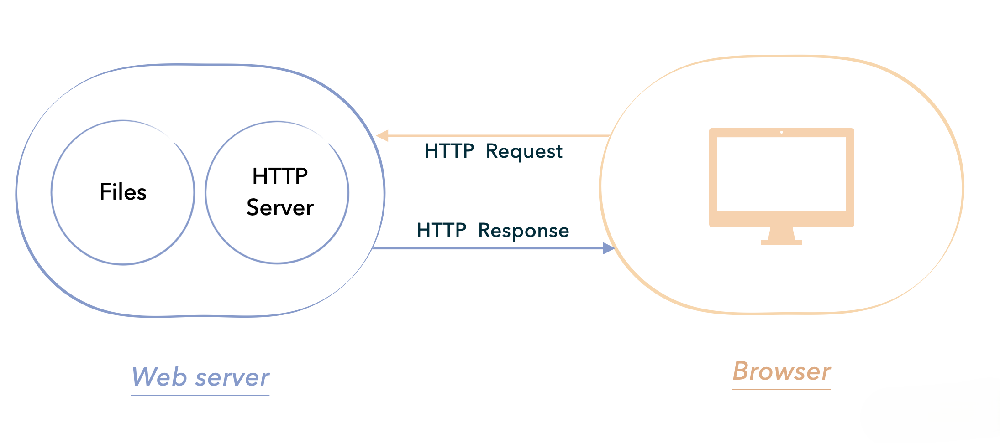

与 MiniSpring 相同，我们也会从一个最简单的程序开始，一步步地演化迭代，最终实现 Tomcat 的核心功能。这节课，我们就来构造第一个简单的 Web 服务器应用程序。结构如图所示：



可以看出，当用户从浏览器这端发起一个静态的请求时，这个极简 HTTP Server 仅仅是简单地将本地的静态文件返回给客户端。这也正是我们手写 MiniTomcat 的第一步。

## Web 请求流程

一个 Web 服务器，简单来讲，就是要按照 HTTP 协议的规范处理前端发过来的 Request 并返回 Response。在这节课中，我们计划请求 http://localhost:8080/hello.txt 这个地址，实现一个最简单的 Web 应用服务器。

在浏览器中输入一个网页地址，键入回车的那一刻，从请求开始到请求结束这个过程会经历几步:

1. DNS 解析，将域名解析为 IP 地址。
2. 与目标端建立 TCP 连接。
3. 发送 HTTP 请求。
4. 服务器解析 HTTP 请求并返回处理后的报文。
5. 浏览器解析返回的报文并渲染页面。
6. TCP 连接断开。

在这个过程中，还有很多诸如三次握手，DNS 解析顺序等具体技术细节，因为不是这节课的主要论题，所以这里不再详细说明。在上述 Web 请求流程中，我们重点关注以下三步：

- "发送 HTTP 请求”
- “服务器解析 HTTP 请求并返回处理后的报文”
- “浏览器解析返回的报文并渲染页面”

## 项目结构

首先我们定义项目的结构，为减少阅读 Tomcat 实际源码的障碍，项目结构以及类的名字会仿照 Tomcat 源码中的定义。作为起步，在这节课中项目结构简单定义如下：

```shell
MiniTomcat
├─ src
│  ├─ server
│  │  ├─ HttpServer.java
│  │  ├─ Request.java
│  │  ├─ Response.java
├─ webroot
│  ├─ hello.txt
```
## Request 请求类

我们打开浏览器，尝试输入 http://localhost:8080/hello.txt， 看看请求参数有哪些内容。

```shell
GET /hello.txt HTTP/1.1
Accept: text/html,application/xhtml+xml,application/xml;q=0.9,image/avif,image/webp,image/apng,*/*;q=0.8,application/signed-exchange;v=b3;q=0.7
Accept-Encoding: gzip, deflate, br
Accept-Language: zh-CN,zh;q=0.9
Cache-Control: max-age=0
Connection: keep-alive
Host: localhost:8080
Sec-Fetch-Dest: document
Sec-Fetch-Mode: navigate
Sec-Fetch-Site: none
Sec-Fetch-User: ?1
Upgrade-Insecure-Requests: 1
User-Agent: Mozilla/5.0 (Macintosh; Intel Mac OS X 10_15_7) AppleWebKit/537.36 (KHTML, like Gecko) Chrome/113.0.0.0 Safari/537.36
sec-ch-ua: "Google Chrome";v="113", "Chromium";v="113", "Not-A.Brand";v="24"
```

以上是 HTTP 协议规定的请求标准格式。由上述内容可以看出，请求按行划分，首先可以分为两部分：第一行与其他行。

第一行的内容中包含请求方法（GET）、请求路径（/hello.txt）、使用的协议以及版本（HTTP/1.1）。

从第一行往下就是具体的请求头了，以 Key-Value 键值对的形式按行列出。一般关注较多的 Key 是 Accept、Host、Content-Type、Authorization 等。

现在我们就有了作为参考的 Request 示例，接下来我们就参考标准格式，对 Request 参数进行解析，提取我们需要的关键元素与信息。

我们定义 Request.java 类，用来构造请求参数对象。

```java
package src.server;
public class Request {
    private InputStream input;
    private String uri;
    public Request(InputStream input) {
        this.input = input;
    }
    public void parse() {
        StringBuffer request = new StringBuffer(2048);
        int i;
        byte[] buffer = new byte[2048];
        try {
            i = input.read(buffer);
        } catch (IOException e) {
            e.printStackTrace();
            i = -1;
        }
        for (int j = 0; j < i; j++) {
            request.append((char) buffer[j]);
        }
        uri = parseUri(request.toString());
    }
    private String parseUri(String requestString) {
        int index1, index2;
        index1 = requestString.indexOf(' ');
        if (index1 != -1) {
            index2 = requestString.indexOf(' ', index1 + 1);
            if (index2 > index1) return requestString.substring(index1 + 1, index2);
        }
        return null;
    }
    public String getUri() {
        return uri;
    }
}
```

Request 类中目前有两个域，一个是类型为 InputStream的 input，另外一个是 类型为 String的URI。

我们希望以input接收请求来的输入流，并提取出其中的 URI 来。 因此，Request 对象必须由传入的 InputStream 这一输入流对类进行初始化。

在 Request 类中，最核心的当数 parse() 方法， 主要将 I/O 的输入流转换成固定的请求格式

InputStream 先用 byte 数组接收，执行 input.read(buffer) 后，input 的内容会转换成 byte 数组，填充 buffer。read方法的返回值表示写入 buffer 中的总字节数（代码中的 2048）。 随后将 byte 数组的内容通过循环拼接至 StringBuffer 中，转换成我们熟悉的请求格式。

然后我们用 parseUri 方法，获取 Uri。前面我们说过，HTTP 协议规定，在请求格式第一行的内容中，包含请求方法、请求路径、使用的协议以及版本，并用空格分开。所以parseUri的功能在于，获取传入参数第一行两个空格中的一段，作为请求的 URI。如果格式稍微有点出入，这个解析就会失败。从这里也可以看出，遵守协议的重要性。

```java
  private String parseUri(String requestString) {
    int index1, index2;
    index1 = requestString.indexOf(' ');
    if (index1 != -1) {
      index2 = requestString.indexOf(' ', index1 + 1);
      if (index2 > index1)
        return requestString.substring(index1 + 1, index2);
    }
    return null;
  }
```
## 构造服务器Server

在构造了 HTTP 请求类之后，我们来看看服务器是如何处理这个 HTTP 请求以及如何传输返回报文的。在 src/server 目录下，定义 HttpServer.java 类。

```java
package src.server;
public class HttpServer {
    public static final String WEB_ROOT = System.getProperty("user.dir") + File.separator + "webroot";
    public static void main(String[] args) {
        HttpServer server = new HttpServer();
        server.await();
    }
    public void await() { //服务器循环等待请求并处理
        ServerSocket serverSocket = null;
        int port = 8080;
        try {
            serverSocket = new ServerSocket(port, 1, InetAddress.getByName("127.0.0.1"));
        } catch (IOException e) {
            e.printStackTrace();
            System.exit(1);
        }
        while (true) {
            Socket socket = null;
            InputStream input = null;
            OutputStream output = null;
            try {
                socket = serverSocket.accept(); //接收请求连接
                input = socket.getInputStream();
                output = socket.getOutputStream();
                // create Request object and parse
                Request request = new Request(input);
                request.parse();
                // create Response object
                Response response = new Response(output);
                response.setRequest(request);
                response.sendStaticResource();
                // close the socket
                socket.close();
            } catch (Exception e) {
                e.printStackTrace();
            }
        }
    }
}
```

可以看到启动类很简单，实例化一个 HTTP Server 对象后，调用 await() 方法。

await() 方法其实就是一个简单的网络服务器程序。如果你熟悉 Java 网络 I/O 的话，一眼就能看出来，整个过程就是启动了一个 ServerSocket 接收客户端的请求，生成 Socket 连接后包装成 Request/Response 进行处理。具体解释如下：

- 使用 ServerSocket 监听 8080 端口，为方便测试，在这个地方直接写死 127.0.0.1 这个值，我们可以在本地进行测试。
- 通过 serverSocket.accept() 为每一个连接生成一个 socket。
- 通过 socket.getInputStream() 获取通过浏览器传入的输入流，包装成前面提到的 Request 对象，调用 parse() 解析 URI。在这一步我们完成了对 Request 请求的解析工作。
- 然后创建一个 Response，通过 Response 输出，具体实现后面再说。
- 最后关闭 socket.close()，中断这次 TCP 连接
- 然后程序循环，等待下一次连接。

## Response 返回对象

和构造 Request 请求对象一样，我们用同样的方法来构造 Response 返回对象，将 HTTP 返回对象处理成浏览器可渲染，便于用户浏览的数据。先定义 Response.java 类。

不一样的地方在于 Response 通过 OutputStream 输出内容。因此持有OutputStream，并通过OutputStream来初始化Response

```java
package src.server;
public class Response {
    private static final int BUFFER_SIZE = 1024;
    Request request;
    OutputStream output;
    public Response(OutputStream output) {
        this.output = output;
    }
    public void setRequest(Request request) {
        this.request = request;
    }
    public void sendStaticResource() throws IOException {
        byte[] bytes = new byte[BUFFER_SIZE];
        FileInputStream fis = null;
        try {
            File file = new File(HttpServer.WEB_ROOT, request.getUri());
            if (file.exists()) {
                fis = new FileInputStream(file);
                int ch = fis.read(bytes, 0, BUFFER_SIZE);
                while (ch != -1) {
                    output.write(bytes, 0, ch);
                    ch = fis.read(bytes, 0, BUFFER_SIZE);
                }
                output.flush();
            }
            else {
                String errorMessage = "HTTP/1.1 404 FIle Not Found\r\n" +
                        "Content-Type: text/html\r\n" +
                        "Content-Length: 23\r\n" +
                        "\r\n" +
                        "<h1>File Not Found</h1>";
                output.write(errorMessage.getBytes());
            }
        }
        catch (Exception e) {
            System.out.println(e.toString());
        }
        finally {
            if (fis != null) {
                fis.close();
            }
        }
    }
}
```

我们可以看到，现在这个 Response 其实只能返回静态文件数据。在 sendStaticResource() 方法中，我们的实现非常简单粗糙，就是直接把 webroot 下的文件内容完整地输出了。如下

```java
File file = new File(HttpServer.WEB_ROOT, request.getUri());
if (file.exists()) {
    fis = new FileInputStream(file);
    int ch = fis.read(bytes, 0, BUFFER_SIZE);
    while (ch != -1) {
        output.write(bytes, 0, ch);
        ch = fis.read(bytes, 0, BUFFER_SIZE);
    }
    output.flush();
}
```

我们看到，Response 它就是根据解析到的 URI 在内部创建一个 file，逐个字节读取 file 的内容，然后写入 output 里。中间并没有进行任何处理，也没有按照 HTTP 协议拼接格式串。

也正因如此，这就需要我们自己手动在文件中写出完整的返回数据格式，在 webroot 下创建 hello.txt。

```shell
HTTP/1.1 200 OK
Content-Type: text/html
Content-Length: 12

Hello World!
```

如上所示，这个文本文件的内容就是按照 HTTP 规定的返回格式手工写好的。因为这是第一步，实现极简，我们先这么写，这也是后面需要优化改造的点。

不过从这里我们可以感受到 HTTP 协议本身的简单，就是一些文本字符串的格式约定。

可以看到，返回格式和请求格式有些不一样，区别在于第一行先展示协议及其版本（HTTP/1.1）、HTTP 状态码（200）与 HTTP 状态内容（OK）。在返回头设置完毕后空一行，显示返回体 Hello World!。

## 本节测试

在上述准备工作完毕后，在 HttpServer 类中运行 main() 方法，程序会在本地 8080 端口启动一个 Socket 持续监听请求。

浏览器访问：http://localhost:8080/hello.txt

浏览器输出：


控制台输出：
```shell
C:\Users\liu.yan153\.jdks\corretto-1.8.0_412\bin\java.exe "-javaagent:D:\Program Files\JetBrains\IntelliJ IDEA Community Edition 2024.1\lib\idea_rt.jar=49963:D:\Program Files\JetBrains\IntelliJ IDEA Community Edition 2024.1\bin" -Dfile.encoding=UTF-8 -classpath C:\Users\liu.yan153\.jdks\corretto-1.8.0_412\jre\lib\charsets.jar;C:\Users\liu.yan153\.jdks\corretto-1.8.0_412\jre\lib\ext\access-bridge-64.jar;C:\Users\liu.yan153\.jdks\corretto-1.8.0_412\jre\lib\ext\cldrdata.jar;C:\Users\liu.yan153\.jdks\corretto-1.8.0_412\jre\lib\ext\dnsns.jar;C:\Users\liu.yan153\.jdks\corretto-1.8.0_412\jre\lib\ext\jaccess.jar;C:\Users\liu.yan153\.jdks\corretto-1.8.0_412\jre\lib\ext\jfxrt.jar;C:\Users\liu.yan153\.jdks\corretto-1.8.0_412\jre\lib\ext\localedata.jar;C:\Users\liu.yan153\.jdks\corretto-1.8.0_412\jre\lib\ext\nashorn.jar;C:\Users\liu.yan153\.jdks\corretto-1.8.0_412\jre\lib\ext\sunec.jar;C:\Users\liu.yan153\.jdks\corretto-1.8.0_412\jre\lib\ext\sunjce_provider.jar;C:\Users\liu.yan153\.jdks\corretto-1.8.0_412\jre\lib\ext\sunmscapi.jar;C:\Users\liu.yan153\.jdks\corretto-1.8.0_412\jre\lib\ext\sunpkcs11.jar;C:\Users\liu.yan153\.jdks\corretto-1.8.0_412\jre\lib\ext\zipfs.jar;C:\Users\liu.yan153\.jdks\corretto-1.8.0_412\jre\lib\jce.jar;C:\Users\liu.yan153\.jdks\corretto-1.8.0_412\jre\lib\jfr.jar;C:\Users\liu.yan153\.jdks\corretto-1.8.0_412\jre\lib\jfxswt.jar;C:\Users\liu.yan153\.jdks\corretto-1.8.0_412\jre\lib\jsse.jar;C:\Users\liu.yan153\.jdks\corretto-1.8.0_412\jre\lib\management-agent.jar;C:\Users\liu.yan153\.jdks\corretto-1.8.0_412\jre\lib\resources.jar;C:\Users\liu.yan153\.jdks\corretto-1.8.0_412\jre\lib\rt.jar;D:\github\handson-tomcat\out\production\handson-tomcat src.server.HttpServer
GET /hello.txt HTTP/1.1
Host: localhost:8080
Connection: keep-alive
sec-ch-ua: "Google Chrome";v="131", "Chromium";v="131", "Not_A Brand";v="24"
sec-ch-ua-mobile: ?0
sec-ch-ua-platform: "Windows"
Upgrade-Insecure-Requests: 1
User-Agent: Mozilla/5.0 (Windows NT 10.0; Win64; x64) AppleWebKit/537.36 (KHTML, like Gecko) Chrome/131.0.0.0 Safari/537.36
Accept: text/html,application/xhtml+xml,application/xml;q=0.9,image/avif,image/webp,image/apng,*/*;q=0.8,application/signed-exchange;v=b3;q=0.7
Sec-Fetch-Site: none
Sec-Fetch-Mode: navigate
Sec-Fetch-User: ?1
Sec-Fetch-Dest: document
Accept-Encoding: gzip, deflate, br, zstd
Accept-Language: zh-CN,zh;q=0.9,en-US;q=0.8,en;q=0.7
Cookie: Idea-550c27cf=c043acbd-201a-4908-8321-5ff0f6c4710e
```