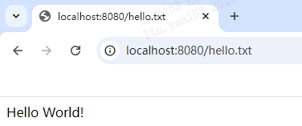

浏览器访问：http://localhost:8080/hello.txt

控制台输出：



控制台输出：
```shell
C:\Users\liu.yan153\.jdks\corretto-1.8.0_412\bin\java.exe "-javaagent:D:\Program Files\JetBrains\IntelliJ IDEA Community Edition 2024.1\lib\idea_rt.jar=49963:D:\Program Files\JetBrains\IntelliJ IDEA Community Edition 2024.1\bin" -Dfile.encoding=UTF-8 -classpath C:\Users\liu.yan153\.jdks\corretto-1.8.0_412\jre\lib\charsets.jar;C:\Users\liu.yan153\.jdks\corretto-1.8.0_412\jre\lib\ext\access-bridge-64.jar;C:\Users\liu.yan153\.jdks\corretto-1.8.0_412\jre\lib\ext\cldrdata.jar;C:\Users\liu.yan153\.jdks\corretto-1.8.0_412\jre\lib\ext\dnsns.jar;C:\Users\liu.yan153\.jdks\corretto-1.8.0_412\jre\lib\ext\jaccess.jar;C:\Users\liu.yan153\.jdks\corretto-1.8.0_412\jre\lib\ext\jfxrt.jar;C:\Users\liu.yan153\.jdks\corretto-1.8.0_412\jre\lib\ext\localedata.jar;C:\Users\liu.yan153\.jdks\corretto-1.8.0_412\jre\lib\ext\nashorn.jar;C:\Users\liu.yan153\.jdks\corretto-1.8.0_412\jre\lib\ext\sunec.jar;C:\Users\liu.yan153\.jdks\corretto-1.8.0_412\jre\lib\ext\sunjce_provider.jar;C:\Users\liu.yan153\.jdks\corretto-1.8.0_412\jre\lib\ext\sunmscapi.jar;C:\Users\liu.yan153\.jdks\corretto-1.8.0_412\jre\lib\ext\sunpkcs11.jar;C:\Users\liu.yan153\.jdks\corretto-1.8.0_412\jre\lib\ext\zipfs.jar;C:\Users\liu.yan153\.jdks\corretto-1.8.0_412\jre\lib\jce.jar;C:\Users\liu.yan153\.jdks\corretto-1.8.0_412\jre\lib\jfr.jar;C:\Users\liu.yan153\.jdks\corretto-1.8.0_412\jre\lib\jfxswt.jar;C:\Users\liu.yan153\.jdks\corretto-1.8.0_412\jre\lib\jsse.jar;C:\Users\liu.yan153\.jdks\corretto-1.8.0_412\jre\lib\management-agent.jar;C:\Users\liu.yan153\.jdks\corretto-1.8.0_412\jre\lib\resources.jar;C:\Users\liu.yan153\.jdks\corretto-1.8.0_412\jre\lib\rt.jar;D:\github\handson-tomcat\out\production\handson-tomcat src.server.HttpServer
GET /hello.txt HTTP/1.1
Host: localhost:8080
Connection: keep-alive
sec-ch-ua: "Google Chrome";v="131", "Chromium";v="131", "Not_A Brand";v="24"
sec-ch-ua-mobile: ?0
sec-ch-ua-platform: "Windows"
Upgrade-Insecure-Requests: 1
User-Agent: Mozilla/5.0 (Windows NT 10.0; Win64; x64) AppleWebKit/537.36 (KHTML, like Gecko) Chrome/131.0.0.0 Safari/537.36
Accept: text/html,application/xhtml+xml,application/xml;q=0.9,image/avif,image/webp,image/apng,*/*;q=0.8,application/signed-exchange;v=b3;q=0.7
Sec-Fetch-Site: none
Sec-Fetch-Mode: navigate
Sec-Fetch-User: ?1
Sec-Fetch-Dest: document
Accept-Encoding: gzip, deflate, br, zstd
Accept-Language: zh-CN,zh;q=0.9,en-US;q=0.8,en;q=0.7
Cookie: Idea-550c27cf=c043acbd-201a-4908-8321-5ff0f6c4710e
```