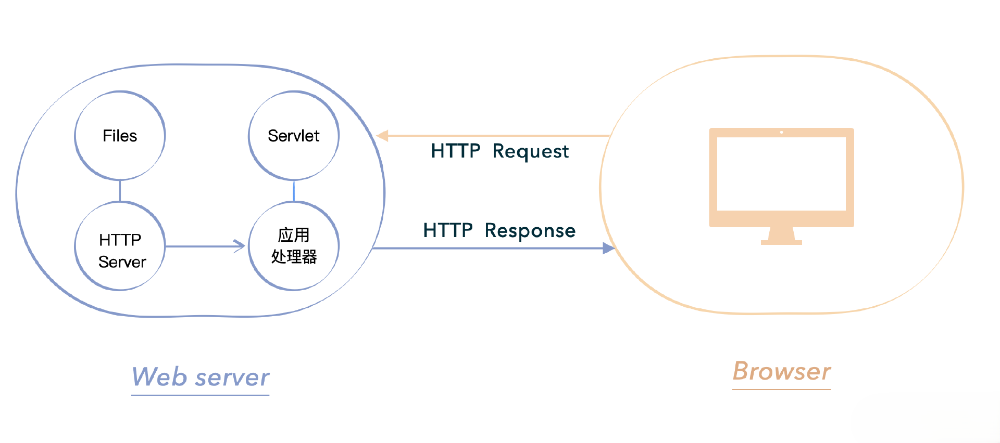
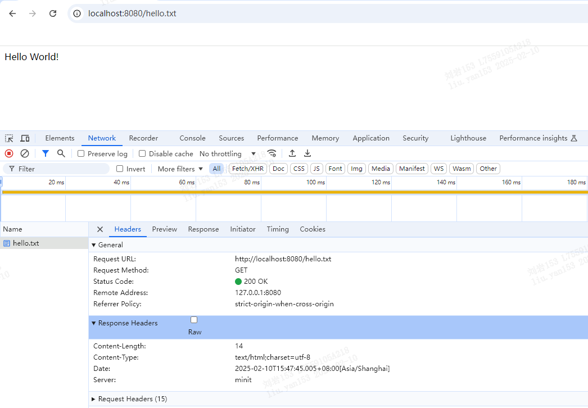
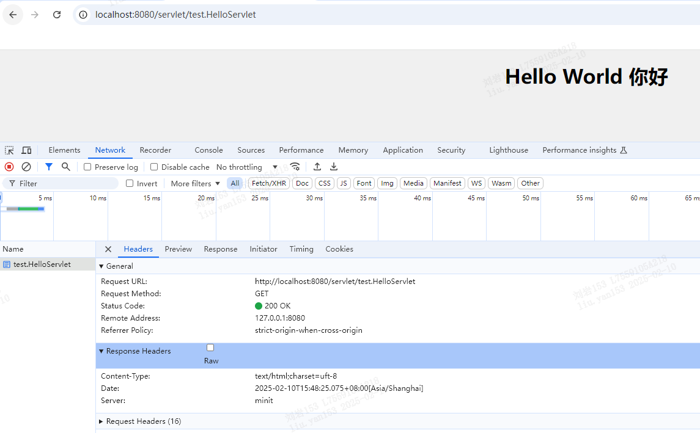

上节课我们初步构造了一个最原始的可运行的 HTTP Server，做到了将文件内容输出到浏览器。但我们也发现，这个原始版本的 HTTP Server 局限性很大，只能使用静态资源，不能组装 Response 返回结果，竟然还要求静态资源本身的文本格式符合 HTTP 协议中 Response 的规范，而且也不满足不同异常场景下的 Response 返回。这个服务需要业务程序员自行准备完整的满足 HTTP Response 规范格式的静态资源，非常不友好。

其次，一个正常的 HTTP 服务响应请求不应只有静态资源，也应存在动态资源。这就是这节课我们要引入的一个重要概念——Servlet，它是实现动态资源返回的好工具。总体结构图如下，现在就让我们一起来动手实现。



## 项目结构

这节课我们计划采用 Maven 结构对项目的包依赖进行管理，省去了手工导入 jar 包的环节。但有一点我们始终坚持，就是引入最少的依赖包，一切功能尽可能用最原生的 JDK 来实现。这节课项目结构变化如下：

```shell
MiniTomcat
├─ src
│  ├─ main
│  │  ├─ java
│  │  │  ├─ server
│  │  │  │  ├─ HttpServer.java
│  │  │  │  ├─ Request.java
│  │  │  │  ├─ Response.java
│  │  │  │  ├─ Servlet.java
│  │  │  │  ├─ ServletProcessor.java
│  │  │  │  ├─ StatisResourceProcessor.java
│  │  ├─ resources
│  ├─ test
│  │  ├─ java
│  │  │  ├─ test
│  │  │  │  ├─ HelloServlet.java
│  │  ├─ resources
├─ webroot
│  ├─ test
│  │  ├─ HelloServlet.class
│  ├─ hello.txt
├─ pom.xml
```

我们按照 Maven 项目规范，把 server 目录整体移动到 src/main/java 目录下，新增 test 模块和 pom 模块。

其他类的具体功能我们会放在后面慢慢介绍。你可以先看一下这节课 pom.xml 配置内容，现在只引用了 Apache commons-lang3 这个依赖包。

```xml
<project xmlns="http://maven.apache.org/POM/4.0.0" xmlns:xsi="http://www.w3.org/2001/XMLSchema-instance" xsi:schemaLocation="http://maven.apache.org/POM/4.0.0 http://maven.apache.org/xsd/maven-4.0.0.xsd">
    <modelVersion>4.0.0</modelVersion>
    <groupId>day2</groupId>
    <artifactId>day2</artifactId>
    <version>0.0.1-SNAPSHOT</version>
    <dependencies>
        <dependency>
            <groupId>org.apache.commons</groupId>
            <artifactId>commons-lang3</artifactId>
            <version>3.4</version>
        </dependency>
    </dependencies>
</project>
```

## Response 响应规范

我们先动手改造上一节课的 Response，不能再要求在静态资源文本中写死格式了，而是服务器自己进行封装。

既然要封装 Response 请求，自然我们得了解一点 HTTP 这个协议对返回内容的规定。根据规定，Response 由四部分组成：状态行、Header 头、空行与响应体。

我们看一下上一节课的静态资源 hello.txt。

- 第一行是状态行，表示使用 HTTP 协议、版本（1.1）、返回状态码（200）以及返回状态名称（OK），中间由一个空格分隔
- 接下来是k-v形式的Header 头，Content-Type: text/html 和 Content-Length: 12 则是以键值对的形式展示的返回头（Header），依行排列，这里面包含对服务器和返回数据的描述。常用键的取值还有 Cookie、Authorization 等。
- 空行
- 响应体：Hello World!，包括但不限于文本、文件、图片等。我们把它叫做响应体。

```shell
HTTP/1.1 200 OK
Content-Type: text/html
Content-Length: 12

Hello World!
```

由这些内容可以看出，只有响应体是需要业务程序员关心的，说明除响应体之外的内容，我们都可以把它封装到 Response 里。

## Response 封装

在 MiniTomcat 项目中，我们规定响应格式如下，接下来我们会根据这个格式对 Response 进行封装。

```shell
HTTP/1.1 ${StatusCode} ${StatusName}
Content-Type: ${ContentType}
Content-Length: ${ContentLength}
Server: minit
Date: ${ZonedDateTime}
```

上述 ${StatusCode}、${StatusName} 等占位符，我们会利用到 apache commons-lang 包里的 StringUtils 工具进行占位符填充，这里我们不再自己造轮子进行替换工作，commons-lang 包默认已由 pom.xml 引入。

在这一节课的内容中，我们引入 StaticResourceProcessor.java，专用于处理 Response 的返回值，原有的 Response.java 只作为返回实体类存在。

```java
public class Response {
    Request request;
    OutputStream output;
    public Response(OutputStream output) {
        this.output = output;
    }
    public void setRequest(Request request) {
        this.request = request;
    }
    public OutputStream getOutput() {
        return this.output;
    }
}
```

既然如此，寻找静态资源文件的任务，自然就得由 StaticResourceProcessor.java 承担。

从上面的代码可以看出，核心代码就是 process() 这个方法，它做了两件事情
1. 一是拼响应头
2. 二是从文本文件中读取字节流

这两部分内容都输出到 Response 的 output stream 中。这里额外判断了一下文件存不存在，如果不存在就返回 404。

相比上一节课的 Response 返回类，它最大的变化在于引入了 composeResponseHead 方法对返回的状态行以及返回头 Header 进行动态组装。

StrSubstitutor 是 commons-lang 包中提供的一个字符串处理工具，传入 MAP 类型的数据结构后，会根据 MAP 里的 Key 值对比，用 Value 值把占位符替换掉。

```java
public class StaticResourceProcessor {
    private static final int BUFFER_SIZE = 1024;
    //下面的字符串是当文件没有找到时返回的404错误描述
    private static String fileNotFoundMessage = "HTTP/1.1 404 File Not Found\r\n" +
            "Content-Type: text/html\r\n" +
            "Content-Length: 23\r\n" +
            "\r\n" +
            "<h1>File Not Found</h1>";
    //下面的字符串是正常情况下返回的，根据http协议，里面包含了相应的变量。
    private static String OKMessage = "HTTP/1.1 ${StatusCode} ${StatusName}\r\n"+
            "Content-Type: ${ContentType}\r\n"+
            "Content-Length: ${ContentLength}\r\n"+
            "Server: minit\r\n"+
            "Date: ${ZonedDateTime}\r\n"+
            "\r\n";
    //处理过程很简单，先将响应头写入输出流，然后从文件中读取内容写入输出流
    public void process(Request request, Response response) throws IOException {
        byte[] bytes = new byte[BUFFER_SIZE];
        FileInputStream fis = null;
        OutputStream output = null;
        try {
            output = response.getOutput();
            File file = new File(HttpServer.WEB_ROOT, request.getUri());
            if (file.exists()) {
                //拼响应头
                String head = composeResponseHead(file);
                output.write(head.getBytes("utf-8"));
                //读取文件内容，写入输出流
                fis = new FileInputStream(file);
                int ch = fis.read(bytes, 0, BUFFER_SIZE);
                while (ch != -1) {
                    output.write(bytes, 0, ch);
                    ch = fis.read(bytes, 0, BUFFER_SIZE);
                }
                output.flush();
            }
            else {
                output.write(fileNotFoundMessage.getBytes());
            }
        } catch (IOException e) {
            System.out.println(e.toString());
        } finally {
            if (fis != null) {
                fis.close();
            }
        }
    }
    //拼响应头，填充变量值
    private String composeResponseHead(File file) {
        long fileLength = file.length();
        Map<String, Object> valuesMap = new HashMap<>();
        valuesMap.put("StatusCode", "200");
        valuesMap.put("StatusName", "OK");
        valuesMap.put("ContentType", "text/html;charset=utf-8");
        valuesMap.put("ContentLength", fileLength);
        valuesMap.put("ZonedDateTime", DateTimeFormatter.ISO_ZONED_DATE_TIME.format(ZonedDateTime.now()));
        StrSubstitutor sub = new StrSubstitutor(valuesMap);
        String responseHead = sub.replace(OKMessage);
        return responseHead;
    }
}
```

改造之后，在 hello.txt 文件中，我们只需要写上返回体的内容，不需要自己手写响应头，就可以在浏览器内渲染出相关内容。

```shell

Hello World!
```

## 引入动态资源Servlet

上面我们就针对静态资源进行了改造，接下来我们开始考虑如何处理动态资源。在 Java 中，提到 Web 服务器绕不开一个概念——Servlet。

Servlet 是一个接口，一般我们认为实现了这个接口的类，都可以统称为 Servlet。它的主要的功能在于交互式地浏览以及修改数据，随后动态地生成网页端展示的内容。

接下来我们开始逐步实现 Servlet 的调用。这节课我们简单地以 /servlet/ 这个路径来区分是否要调用 Servlet 获取动态资源。如果包含这个路径，就调用对应 Servlet；反之，就判断为是调用静态资源。今后我们再慢慢地改进路径匹配的方式。

通过这种方式，我们只需要在获取 Request 请求后调用 getUri()，就可以判断使用哪一种方式进行处理。

定义 Servlet 接口，按照 Servlet 的规范应该实现 javax.servlet.Servlet。但这里我们希望能简单一点，自己定义一个接口，作为起步来探讨。

这个接口中只有一个 service 方法，可以留给业务程序员自行实现。每次调用 Servlet 的时候，其实都是在调用这个方法，根据这里方法内的实现动态生成 Web 上的内容。
```java
package server;

public interface Servlet {
    public void service(Request req, Response res) throws IOException;
}
```

接下来我们看看 ServletProcessor.java 的定义。

```java
public class ServletProcessor {
    //响应头定义，里面包含变量
    private static String OKMessage = "HTTP/1.1 ${StatusCode} ${StatusName}\r\n"+
            "Content-Type: ${ContentType}\r\n"+
            "Server: minit\r\n"+
            "Date: ${ZonedDateTime}\r\n"+
            "\r\n";

    public void process(Request request, Response response) {
        //首先根据uri最后一个/号来定位，后面的字符串认为是servlet名字
        String uri = request.getUri();
        String servletName = uri.substring(uri.lastIndexOf("/") + 1);
        URLClassLoader loader = null;
        OutputStream output = null;

        try {
            // create a URLClassLoader
            URL[] urls = new URL[1];
            URLStreamHandler streamHandler = null;
            File classPath = new File(HttpServer.WEB_ROOT);
            String repository = (new URL("file", null, classPath.getCanonicalPath() + File.separator)).toString() ;
            urls[0] = new URL(null, repository, streamHandler);
            loader = new URLClassLoader(urls);
        }
        catch (IOException e) {
            System.out.println(e.toString() );
        }
        //由上面的URLClassLoader加载这个servlet
        Class<?> servletClass = null;
        try {
            servletClass = loader.loadClass(servletName);
        }
        catch (ClassNotFoundException e) {
            System.out.println(e.toString());
        }
        //写响应头
        output = response.getOutput();
        String head = composeResponseHead();
        try {
            output.write(head.getBytes("utf-8"));
        } catch (UnsupportedEncodingException e1) {
            e1.printStackTrace();
        } catch (IOException e1) {
            e1.printStackTrace();
        }
        //创建servlet新实例，然后调用service()，由它来写动态内容到响应体
        Servlet servlet = null;
        try {
            servlet = (Servlet) servletClass.newInstance();
            servlet.service(request, response);
        }
        catch (Exception e) {
            System.out.println(e.toString());
        }
        catch (Throwable e) {
            System.out.println(e.toString());
        }

        try {
            output.flush();
        } catch (IOException e) {
            e.printStackTrace();
        }

    }
    //生成响应头，填充变量值
    private String composeResponseHead() {
        Map<String,Object> valuesMap = new HashMap<>();
        valuesMap.put("StatusCode","200");
        valuesMap.put("StatusName","OK");
        valuesMap.put("ContentType","text/html;charset=uft-8");
        valuesMap.put("ZonedDateTime", DateTimeFormatter.ISO_ZONED_DATE_TIME.format(ZonedDateTime.now()));
        StrSubstitutor sub = new StrSubstitutor(valuesMap);
        String responseHead = sub.replace(OKMessage);
        return responseHead;
    }
}
```

composeResponseHead 方法不多介绍了，与 StaticResourceProcessor 中一致。这里我们重点关注一下 process 方法，它的核心在于通过 URI 中的"/"定位到对应的 Servlet 名称，通过反射获取到对应的 Servlet 实现类并加载，调用 service 方法获取动态资源返回体，结合组装的返回头一并返回给客户端。

看代码的细节，这是因为 Servlet 是由应用程序员编写的，我们写服务器的时候不知道路径，所以我们就规定一个目录，让程序员将 Servlet 放到这个目录下，HttpServer.WEB_ROOT

```java
public static final String WEB_ROOT = System.getProperty("user.dir") + File.separator + "webroot";
```

然后为了将这些应用程序类和服务器自身的类分开，我们引入一个 URLClassLoader 来进行加载。后面涉及到多应用的时候，会再详细介绍 Java 的类加载机制

```java
URL[] urls = new URL[1];
URLStreamHandler streamHandler = null;
File classPath = new File(HttpServer.WEB_ROOT);
String repository = (new URL("file", null, classPath.getCanonicalPath() + File.separator)).toString() ;
urls[0] = new URL(null, repository, streamHandler);
loader = new URLClassLoader(urls);
```

需要注意的是，后期URLClassLoader需要加载的是Servlet.class，因此你需要先编译好自己编写的Servlet，然后放在目标路径下

```java
Class<?> servletClass = null;
try {
    servletClass = loader.loadClass(servletName);
}
```

**重要设计思想！调用Servlet它的 service() 方法，将 Request 和 Response 作为参数传进去。应用程序员写 Servlet 的时候，就可以用这个 Request 获取参数，然后将结果写入到 Response 中。**

```java
//创建servlet新实例，然后调用service()，由它来写动态内容到响应体
Servlet servlet = null;
try {
    servlet = (Servlet) servletClass.newInstance();
    servlet.service(request, response);
}
```

最后，服务器会自动加上 flush()，保证输出。

这个过程与实际的 Servlet 服务器规范大体一致，主要的区别在于单例模式。按照 Servlet 规范，一个 Servlet 应当是单对象多线程的。而我们现在每次都是创建一个新的 Servlet 对象，后面需要进一步修正。

## 调整服务器程序

好了，现在我们已经准备好了动态资源与静态资源的处理类，接下来就需要调整服务端的处理代码了，主要需要调整 HTTP Server 类里的 await 方法，你可以看一下调整过后的 HTTP Server 类。

```java
public class HttpServer {
    public static final String WEB_ROOT = System.getProperty("user.dir") + File.separator + "webroot";
    public static void main(String[] args) {
        HttpServer server = new HttpServer();
        server.await();
    }
    public void await() {
        ServerSocket serverSocket = null;
        int port = 8080;
        try {
            serverSocket = new ServerSocket(port, 1, InetAddress.getByName("127.0.0.1"));
        } catch (IOException e) {
            e.printStackTrace();
            System.exit(1);
        }
        while (true) {
            Socket socket = null;
            InputStream input = null;
            OutputStream output = null;
            try {
                socket = serverSocket.accept();
                input = socket.getInputStream();
                output = socket.getOutputStream();
                // create Request object and parse
                Request request = new Request(input);
                request.parse();
                // create Response object
                Response response = new Response(output);
                response.setRequest(request);
                if (request.getUri().startsWith("/servlet/")) {
                    ServletProcessor processor = new ServletProcessor();
                    processor.process(request, response);
                }
                else {
                    StaticResourceProcessor processor = new StaticResourceProcessor();
                    processor.process(request, response);
                }
                // close the socket
                socket.close();
            } catch (Exception e) {
                e.printStackTrace();
            }
        }
    }
}
```

和上一节课相比，唯一的变化在于新增了对是否为 Servlet 的判断。

```java
if (request.getUri().startsWith("/servlet/")) {
    ServletProcessor processor = new ServletProcessor();
    processor.process(request, response);
}
else {
    StaticResourceProcessor processor = new StaticResourceProcessor();
    processor.process(request, response);
}
```

如果是 Servlet，就启用 ServletProcessor，如果不是 Servlet，就认为是一个静态资源。现在改造工作就完成了，接下来我们模拟客户端，编写一段测试代码对我们的功能进行测试。

## 本节测试

测试在 src/test/java/test 目录下，定义 HelloServlet.java，实现我们自己定义的 Servlet 接口。

```java
package test;

import server.Request;
import server.Response;

import java.io.IOException;

public class HelloServlet implements Servlet {
    @Override
    public void service(Request req, Response res) throws IOException {
        String doc = "<!DOCTYPE html> \n" +
                "<html>\n" +
                "<head><meta charset=\"utf-8\"><title>Test</title></head>\n" +
                "<body bgcolor=\"#f0f0f0\">\n" +
                "<h1 align=\"center\">" + "Hello World 你好" + "</h1>\n";
        res.getOutput().write(doc.getBytes("utf-8"));
    }
}
```

可以看到，返回的内容都是纯 HTML 语法，只编写了返回体，不再关心返回头的内容。在编写完毕后，我们需要单独编译这个类，生成 HelloServlet.class，把编译后的文件放到 /webroot/test 目录下，原因在于我们的服务器需要从 webroot 目录下获取资源文件。

在准备工作进行完毕之后，我们运行 HttpServer 服务器,

键入 http://localhost:8080/hello.txt 后，可以发现 hello.txt 里所有的文本内容，都作为返回体展示在浏览器页面上了。



我们再输入 http://localhost:8080/servlet/test.HelloServlet 就可以看到浏览器显示：Hello World 你好，这也是我们在 HelloServlet 中定义的返回资源内容。



---

可以看到我们动态赋值的响应头`Server: minit`也显示在了浏览器的调试窗口上`

