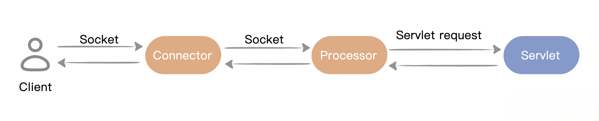

本节开始引入tomcat连接层，同时对HttpServer一拆为二Connector和Processor，实现职责分离，分别负责处理接收、响应客户端请求以及调用 Servlet。

这样整个服务器基本的工作流程就是：由 Connector 接收连接，来了一个 Socket 之后，就转手交给 Processor 进行处理，处理完之后再返回给 Connector 来关闭。



## 项目结构
对比上节课的目录，你会发现新增了 HttpConnector.java 和 HttpProcessor.java，这正是用来拆分 HttpServer 两个类的

```shell
MiniTomcat
├─ src
│  ├─ main
│  │  ├─ java
│  │  │  ├─ server
│  │  │  │  ├─ HttpConnector.java
│  │  │  │  ├─ HttpProcessor.java
│  │  │  │  ├─ HttpServer.java
│  │  │  │  ├─ Request.java
│  │  │  │  ├─ Response.java
│  │  │  │  ├─ ServletProcessor.java
│  │  │  │  ├─ StatisResourceProcessor.java
│  │  ├─ resources
│  ├─ test
│  │  ├─ java
│  │  │  ├─ test
│  │  │  │  ├─ HelloServlet.java
│  │  ├─ resources
├─ webroot
│  ├─ test
│  │  ├─ HelloServlet.class
│  ├─ hello.txt
├─ pom.xml
```

## 拆分出HttpProcessor
实现 HttpProcessor.java 如下：

```java
public class HttpProcessor {
    public HttpProcessor(){
    }
    public void process(Socket socket) {
        InputStream input = null;
        OutputStream output = null;
        try {
            input = socket.getInputStream();
            output = socket.getOutputStream();
            // create Request object and parse
            Request request = new Request(input);
            request.parse();
            // create Response object
            Response response = new Response(output);
            response.setRequest(request);

            // check if this is a request for a servlet or a static resource
            // a request for a servlet begins with "/servlet/"
            if (request.getUri().startsWith("/servlet/")) {
                ServletProcessor processor = new ServletProcessor();
                processor.process(request, response);
            }
            else {
                StaticResourceProcessor processor = new StaticResourceProcessor();
                processor.process(request, response);
            }
            // Close the socket
            //socket.close();
        } catch (Exception e) {
            e.printStackTrace();
        }
    }
}
```
在 HttpProcessor 中，process 方法具体实现和原本并没有差异，只是新增 Socket 参数传入。现在有了这个专门的机构来分工，调用 Servlet 或者是静态资源。

## 拆分出HttpProcessor
HttpConnector 实现如下：

```java
public class HttpConnector implements Runnable {
    public void run() {
        ServerSocket serverSocket = null;
        int port = 8080;
        try {
            serverSocket = new ServerSocket(port, 1, InetAddress.getByName("127.0.0.1"));
        } catch (IOException e) {
            e.printStackTrace();
            System.exit(1);
        }
        while (true) {
            Socket socket = null;
            try {
                socket = serverSocket.accept();
                HttpProcessor processor = new HttpProcessor();
                processor.process(socket);
                // Close the socket
                socket.close();
            } catch (Exception e) {
                e.printStackTrace();
            }
        }
    }
    public void start() {
        Thread thread = new Thread(this);
        thread.start();
    }
}
```
需要注意的是 HttpConnector，它实现了 Runnable 接口，把它看作一个线程，代替原来HttpServer的主线程。而 Socket 的关闭，最后也统一交给 Connector 处理。

最后调整 HttpServer 类，当前这个类的实现非常简单，只用于启动 Connector 这个线程，来等待客户端的请求连接。

```java
public class HttpServer {
    public static final String WEB_ROOT =
            System.getProperty("user.dir") + File.separator + "webroot";
    public static void main(String[] args) {
        HttpConnector connector = new HttpConnector();
        connector.start();
    }
}
```
