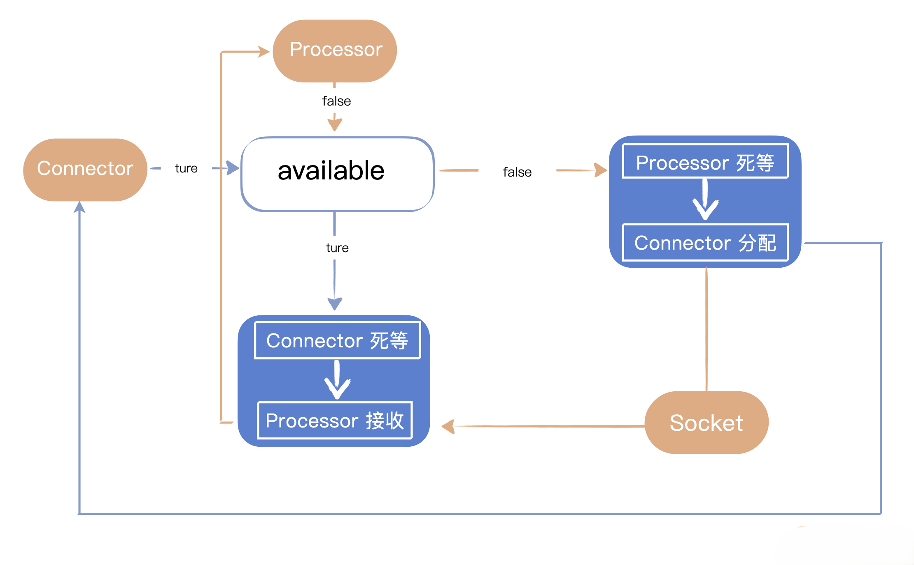

到上节为止，HttpProcessor 并没有做到多线程，也没有实现 NIO，只是在池中放置了多个对象，做到了多路复用，整体架构还是阻塞式运行的。

所以我们要继续改造，优化 HttpProcessor 的性能。

设计线程 HttpProcessor,同时实现与Connector线程之间的同步机制

## 设计线程 HttpProcessor

接下来，我们计划设计线程 Processor，通过这个手段继续优化它的性能。Processors对象池进一步升级为Processors线程池，将会使一个 Connector 同时服务于多个 Processor线程。

基本的思路是使用多个线程，让 Connector 和 Processor 分别由不同的线程来运行。工作的基本流程是由 Connector 接收某个 Socket 连接后交给某个 Processor 线程处理，而 Processor 线程等待某个 Socket 连接到来后进行处理，处理完毕之后要交回给 Connector。

**这里的核心是要设计一个线程之间的同步机制**，注意线程同步机制并不意味着程序就是同步的，因为这里至少存在1个connector线程和1个processor线程，多线程一定提高了并发性能：

- 通过布尔值volatile available来协调线程同步，volatile保证线程间的共享变量可见性,初始为false，Processor一直等待
- Connector 接收 Socket 连接后交给 Processor 线程处理，同时唤醒全部的Processor，Connector下次陷入等待。但本轮的Connector是非阻塞的，与Processor 之间天然是异步的
- Processor 开始处理之后，唤醒全部的Connector，同时下次Processor陷入等待。可以看到在Processor处理完成之前，就可以将Connector唤醒, Connector 就可以全身而退，去处理下一个 HttpProcessor 了。

首先我们让 HttpProcessor 实现 Runnable 接口，这样每一个 HttpProcessor 都可以在独立的线程中运行。改造如下：
```java
public class HttpProcessor implements Runnable{
    @Override
    public void run() {
        while (true) {
            // 等待socket分配过来
            Socket socket = await();
            if (socket == null) continue;
            // 处理请求
            process(socket);
            // 回收processor
            connector.recycle(this);
        }
    }
}
```
上述 Processor 的 run() 方法执行过程是，等待某个 Socket，收到 Connector 交过来的 Socket 后，Process 方法处理这个 Socket，处理完毕之后交回给 Connector 回收，并重新把这个 processor 放入池里。

这是 Processor 接收者这一边，而另一边就是作为分配者的 Connector。类似地，我们提供一个 assign 方法让 Connector 分配 Socket 给 Processor。

接下来我们重点解决分配者和接收者如何同步的问题。因为这是两个线程，一定需要同步才能协同工作。基本的思路就是 await() 方法里等着 Socket，而 assign() 方法里分配 Socket，中间通过一个标志来表示分配和接收状态，以此进行同步。

这个同步的机制内部其实就是用的 Java 自身提供的 notify 和 wait，老生常态，不再啰嗦了
```java
synchronized void assign(Socket socket) {
    // 等待connector提供一个新的socket
    while (available) {
        try {
            wait();
        } catch (InterruptedException e) {
        }
    }
    // 获取到这个新的Socket
    this.socket = socket;
    // 把标志设置回去
    available = true;
    //通知另外的线程
    notifyAll();
}
private synchronized Socket await() {
    // 等待connector提供一个新的socket
    while (!available) {
        try {
            wait();
        }catch (InterruptedException e) {
        }
    }
    // 获得这个新的Socket
    Socket socket = this.socket;
    //设置标志为false
    available = false;
    //通知另外的线程
    notifyAll();
    return (socket);
}
```

下面我列出 HttpProcessor 的完整代码，要注意 available 标志和 assign() 方法定义、await()方法定义都是写在 Processor 类里的。
```java
public class HttpProcessor implements Runnable{
    Socket socket;
    boolean available = false;
    HttpConnector connector;
    public HttpProcessor(HttpConnector connector) {
        this.connector = connector;
    }
    @Override
    public void run() {
        while (true) {
            // 等待分配下一个 socket
            Socket socket = await();
            if (socket == null) continue;
            // 处理来自这个socket的请求
            process(socket);
            // 完成此请求
            connector.recycle(this);
        }
    }
    public void start() {
        Thread thread = new Thread(this);
        thread.start();
    }
    public void process(Socket socket) {
        try {
            Thread.sleep(3000);
        } catch (InterruptedException e1) {
            e1.printStackTrace();
        }
        InputStream input = null;
        OutputStream output = null;
        try {
            input = socket.getInputStream();
            output = socket.getOutputStream();
            // 创建请求对象并解析
            Request request = new Request(input);
            request.parse();
            // 创建响应对象
            Response response = new Response(output);
            response.setRequest(request);
//               response.sendStaticResource();
            // 检查这是对servlet还是静态资源的请求
            // a request for a servlet begins with "/servlet/"
            if (request.getUri().startsWith("/servlet/")) {
                ServletProcessor processor = new ServletProcessor();
                processor.process(request, response);
            }
            else {
                StaticResourceProcessor processor = new StaticResourceProcessor();
                processor.process(request, response);
            }
            // 关闭 socket
            socket.close();
        } catch (Exception e) {
            e.printStackTrace();
        }
    }
    synchronized void assign(Socket socket) {
        // 等待 connector 提供新的 Socket
        while (available) {
            try {
                wait();
            } catch (InterruptedException e) {
            }
        }
        // 存储新可用的 Socket 并通知我们的线程
        this.socket = socket;
        available = true;
        notifyAll();
    }
    private synchronized Socket await() {
        // 等待 connector 提供一个新的 Socket
        while (!available) {
            try {
                wait();
            }catch (InterruptedException e) {
            }
        }
        // 通知Connector我们已经收到这个Socket了
        Socket socket = this.socket;
        available = false;
        notifyAll();
        return (socket);
    }
}
```
因为 HttpProcessor 构造函数调整，增加了 HttpConnector 的参数，所以我把 HttpConnector 类调整后的代码一并列出了，随后我们统一说明调整步骤还有调整的理由。

## HttpConnector线程改造
虽然available 标志和 assign() 方法定义、await()方法定义都是写在 Processor 类里的。 但是这并不表示 assign() 是 Processor 线程来执行，因为这个方法的调用者是 Connector。
```java
public class HttpConnector implements Runnable {
    int minProcessors = 3;
    int maxProcessors = 10;
    int curProcessors = 0;
    //存放Processor的池子
    Deque<HttpProcessor> processors = new ArrayDeque<>();
    public void run() {
        ServerSocket serverSocket = null;
        int port = 8080;
        try {
            serverSocket = new ServerSocket(port, 1, InetAddress.getByName("127.0.0.1"));
        } catch (IOException e) {
            e.printStackTrace();
            System.exit(1);
        }
        // 初始化池子initialize processors pool
        for (int i = 0; i < minProcessors; i++) {
            HttpProcessor initprocessor = new HttpProcessor(this);
            initprocessor.start();
            processors.push(initprocessor);
        }
        curProcessors = minProcessors;
        while (true) {
            Socket socket = null;
            try {
                socket = serverSocket.accept();
                //对每一个socket，从池子中拿到一个processor
                HttpProcessor processor = createProcessor();
                if (processor == null) {
                    socket.close();
                    continue;
                }
                //分配给这个processor
                processor.assign(socket);
                // Close the socket
//                socket.close();
            } catch (Exception e) {
                e.printStackTrace();
            }
        }
    }
    public void start() {
        Thread thread = new Thread(this);
        thread.start();
    }
    //从池子中获取一个processor，池子为空且数量小于最大限制则会新建一个processor
    private HttpProcessor createProcessor() {
        synchronized (processors) {
            if (processors.size() > 0) {
                return ((HttpProcessor) processors.pop());
            }
            if (curProcessors < maxProcessors) {
                return (newProcessor());
            }
            else {
                return (null);
            }
        }
    }
    private HttpProcessor newProcessor() {
        HttpProcessor initprocessor = new HttpProcessor(this);
        initprocessor.start();
        processors.push(initprocessor);
        curProcessors++;
        return ((HttpProcessor) processors.pop());
    }
    void recycle(HttpProcessor processor) {
        processors.push(processor);
    }
}
```
Tomcat 中两个线程互锁的这种机制很经典，在后续版本的 NIO 和 Servlet 协调的设计中都用到了。

这样也就做到了 Connector和Processor 的异步化

也正因为做到了异步化，我们就不能再利用 Connector 去关闭 Socket 了，因为 Connector 是不知道 Processor 何时处理完毕的，Socket 的关闭任务就交给 Processor 自己处理了。因此在 Connector 类里，socket.close() 这一行被注释掉了，而在 Processor 类里新增了那一行代码。

## 本节测试

同样在编写完毕HelloServlet后，我们需要单独编译这个类，生成 HelloServlet.class，把编译后的文件放到 /webroot/test 目录下，原因在于我们的服务器需要从 webroot 目录下获取资源文件。

键入 http://localhost:8080/hello.txt 后，可以发现 hello.txt 里所有的文本内容，都作为返回体展示在浏览器页面上了。

我们再输入 http://localhost:8080/servlet/test.HelloServlet 就可以看到浏览器显示：Hello World 你好，这也是我们在 HelloServlet 中定义的返回资源内容。

这一次我们的测试类还是和之前差不多，但在 Processor 的 process 方法中，我们新增了 Thread.sleep 方法。同时在Thread.sleep之前打印进入信息
```java
    System.out.println("HttpProcessor正在处理...");
    try {
        Thread.sleep(100000);
    } catch (InterruptedException e1) {
        e1.printStackTrace();
    }
```
另外结合Processors对象池：
- minProcessors：3
- maxProcessors：10

为了方便测试servlet并发效果http://localhost:8080/servlet/test.HelloServlet，我们将Thread.sleep时间调大，比如100s

可以看到，前10个并发瞬间获取到Processor

```shell
C:\Users\liu.yan153\.jdks\corretto-1.8.0_412\bin\java.exe "-javaagent:D:\Program Files\JetBrains\IntelliJ IDEA Community Edition 2024.1\lib\idea_rt.jar=59996:D:\Program Files\JetBrains\IntelliJ IDEA Community Edition 2024.1\bin" -Dfile.encoding=UTF-8 -classpath C:\Users\liu.yan153\.jdks\corretto-1.8.0_412\jre\lib\charsets.jar;C:\Users\liu.yan153\.jdks\corretto-1.8.0_412\jre\lib\ext\access-bridge-64.jar;C:\Users\liu.yan153\.jdks\corretto-1.8.0_412\jre\lib\ext\cldrdata.jar;C:\Users\liu.yan153\.jdks\corretto-1.8.0_412\jre\lib\ext\dnsns.jar;C:\Users\liu.yan153\.jdks\corretto-1.8.0_412\jre\lib\ext\jaccess.jar;C:\Users\liu.yan153\.jdks\corretto-1.8.0_412\jre\lib\ext\jfxrt.jar;C:\Users\liu.yan153\.jdks\corretto-1.8.0_412\jre\lib\ext\localedata.jar;C:\Users\liu.yan153\.jdks\corretto-1.8.0_412\jre\lib\ext\nashorn.jar;C:\Users\liu.yan153\.jdks\corretto-1.8.0_412\jre\lib\ext\sunec.jar;C:\Users\liu.yan153\.jdks\corretto-1.8.0_412\jre\lib\ext\sunjce_provider.jar;C:\Users\liu.yan153\.jdks\corretto-1.8.0_412\jre\lib\ext\sunmscapi.jar;C:\Users\liu.yan153\.jdks\corretto-1.8.0_412\jre\lib\ext\sunpkcs11.jar;C:\Users\liu.yan153\.jdks\corretto-1.8.0_412\jre\lib\ext\zipfs.jar;C:\Users\liu.yan153\.jdks\corretto-1.8.0_412\jre\lib\jce.jar;C:\Users\liu.yan153\.jdks\corretto-1.8.0_412\jre\lib\jfr.jar;C:\Users\liu.yan153\.jdks\corretto-1.8.0_412\jre\lib\jfxswt.jar;C:\Users\liu.yan153\.jdks\corretto-1.8.0_412\jre\lib\jsse.jar;C:\Users\liu.yan153\.jdks\corretto-1.8.0_412\jre\lib\management-agent.jar;C:\Users\liu.yan153\.jdks\corretto-1.8.0_412\jre\lib\resources.jar;C:\Users\liu.yan153\.jdks\corretto-1.8.0_412\jre\lib\rt.jar;D:\github\handson-tomcat\target\classes;C:\Users\liu.yan153\.m2\repository\org\apache\commons\commons-lang3\3.4\commons-lang3-3.4.jar;C:\Users\liu.yan153\.m2\repository\javax\servlet\javax.servlet-api\4.0.1\javax.servlet-api-4.0.1.jar server.HttpServer
HttpProcessor正在处理...
HttpProcessor正在处理...
HttpProcessor正在处理...
HttpProcessor正在处理...
HttpProcessor正在处理...
HttpProcessor正在处理...
HttpProcessor正在处理...
HttpProcessor正在处理...
HttpProcessor正在处理...
HttpProcessor正在处理...
```

第11个并发开始就没有Processor资源了


