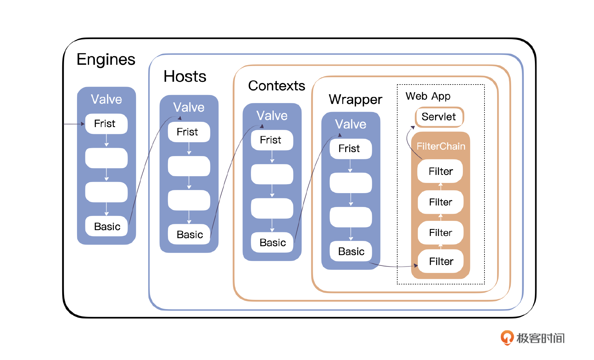

---

本节我们做两件事情：
1. 简单定义下日志组件,注意只是简单引入，与下文的责任链无关
2. 引入逆序的责任链模式Pipeline+Valve


我们将新增 Logger、Pipeline、Valve、ValveContext 接口，以及处理日志 Logger 与 Valve 的实现类等众多 Java 文件，具体内容后面我们会详细说明。你可以看一下现在这个项目的目录结构。
```shell
MiniTomcat
├─ src
│  ├─ main
│  │  ├─ java
│  │  │  ├─ com
│  │  │  │  ├─ minit
│  │  │  │  │  ├─ connector
│  │  │  │  │  │  ├─ http
│  │  │  │  │  │  │  ├─ DefaultHeaders.java
│  │  │  │  │  │  │  ├─ HttpConnector.java
│  │  │  │  │  │  │  ├─ HttpHeader.java
│  │  │  │  │  │  │  ├─ HttpProcessor.java
│  │  │  │  │  │  │  ├─ HttpRequestImpl.java
│  │  │  │  │  │  │  ├─ HttpRequestLine.java
│  │  │  │  │  │  │  ├─ HttpResponseImpl.java
│  │  │  │  │  │  │  ├─ ServletProcessor.java
│  │  │  │  │  │  │  ├─ SocketInputStream.java
│  │  │  │  │  │  │  ├─ StatisResourceProcessor.java
│  │  │  │  │  │  ├─ HttpRequestFacade.java
│  │  │  │  │  │  ├─ HttpResponseFacade.java
│  │  │  │  │  ├─ core
│  │  │  │  │  │  ├─ ContainerBase.java
│  │  │  │  │  │  ├─ StandardContext.java
│  │  │  │  │  │  ├─ StandardContextValve.java
│  │  │  │  │  │  ├─ StandardPipeline.java
│  │  │  │  │  │  ├─ StandardWrapper.java
│  │  │  │  │  │  ├─ StandardWrapperValve.java
│  │  │  │  │  ├─ logger
│  │  │  │  │  │  ├─ Constants.java
│  │  │  │  │  │  ├─ FileLogger.java
│  │  │  │  │  │  ├─ LoggerBase.java
│  │  │  │  │  │  ├─ SystemErrLogger.java
│  │  │  │  │  │  ├─ SystemOutLogger.java
│  │  │  │  │  ├─ session
│  │  │  │  │  │  ├─ StandardSession.java
│  │  │  │  │  │  ├─ StandardSessionFacade.java
│  │  │  │  │  ├─ startup
│  │  │  │  │  │  ├─ BootStrap.java
│  │  │  │  │  ├─ util
│  │  │  │  │  │  ├─ CookieTools.java
│  │  │  │  │  │  ├─ StringManager.java
│  │  │  │  │  ├─ valves
│  │  │  │  │  │  ├─ AccessLogValve.java
│  │  │  │  │  │  ├─ ValveBase.java
│  │  │  │  ├─ Connector.java
│  │  │  │  ├─ Container.java
│  │  │  │  ├─ Context.java
│  │  │  │  ├─ Logger.java
│  │  │  │  ├─ Pipeline.java
│  │  │  │  ├─ Request.java
│  │  │  │  ├─ Response.java
│  │  │  │  ├─ Session.java
│  │  │  │  ├─ Valve.java
│  │  │  │  ├─ ValveContext.java
│  │  │  │  ├─ Wrapper.java
│  │  ├─ resources
│  ├─ test
│  │  ├─ java
│  │  │  ├─ test
│  │  │  │  ├─ HelloServlet.java
│  │  │  │  ├─ TestServlet.java
│  │  ├─ resources
├─ webroot
│  ├─ test
│  │  ├─ HelloServlet.class
│  │  ├─ TestServlet.class
│  ├─ hello.txt
├─ pom.xml
```
## 引入日志组件
首先我们开始着手定义我们服务器的通用日志组件，先看一下 Logger 接口的定义。
```java
package com.minit;
public interface Logger {
    public static final int FATAL = Integer.MIN_VALUE;
    public static final int ERROR = 1;
    public static final int WARNING = 2;
    public static final int INFORMATION = 3;
    public static final int DEBUG = 4;
    public String getInfo();
    public int getVerbosity();
    public void setVerbosity(int verbosity);
    public void log(String message);
    public void log(Exception exception, String msg);
    public void log(String message, Throwable throwable);
    public void log(String message, int verbosity);
    public void log(String message, Throwable throwable, int verbosity);
}
```

我们可以看到接口主要定义了不同的日志级别，以及重载了多个 log 方法，支持不同的传参。

接下来我们在 Container 接口里新增与 Logger 相关的 Getter 和 Setter 方法定义，用作 Container 的通用实现，你可以看一下示例代码。

```java
package com.minit;
public interface Container {
    public Logger getLogger();
    public void setLogger(Logger logger);
}
```

有了这些定义之后，我们在之前已经定义好的 /com/minit/logger 目录下提供 LoggerBase 作为 Logger 接口的抽象实现类，主体如下：
```java
package com.minit.logger;
public abstract class LoggerBase implements Logger {
    protected int debug = 0;
    protected static final String info = "com.minit.logger.LoggerBase/1.0";
    protected int verbosity = ERROR;
    public int getDebug() {
        return (this.debug);
    }
    public void setDebug(int debug) {
        this.debug = debug;
    }
    public String getInfo() {
        return (info);
    }
    public int getVerbosity() {
        return (this.verbosity);
    }
    public void setVerbosity(int verbosity) {
        this.verbosity = verbosity;
    }
    public void setVerbosityLevel(String verbosity) {
        if ("FATAL".equalsIgnoreCase(verbosity))
            this.verbosity = FATAL;
        else if ("ERROR".equalsIgnoreCase(verbosity))
            this.verbosity = ERROR;
        else if ("WARNING".equalsIgnoreCase(verbosity))
            this.verbosity = WARNING;
        else if ("INFORMATION".equalsIgnoreCase(verbosity))
            this.verbosity = INFORMATION;
        else if ("DEBUG".equalsIgnoreCase(verbosity))
            this.verbosity = DEBUG;
    }
    //这个log方法由上层业务程序员实现
    public abstract void log(String msg);
    
    public void log(Exception exception, String msg) {
        log(msg, exception);
    }
    //核心方法，printStackTrace，然后调用一个业务实现的log(msg)
    public void log(String msg, Throwable throwable) {
        CharArrayWriter buf = new CharArrayWriter();
        PrintWriter writer = new PrintWriter(buf);
        writer.println(msg);
        throwable.printStackTrace(writer);
        Throwable rootCause = null;
        if  (throwable instanceof ServletException)
            rootCause = ((ServletException) throwable).getRootCause();
        if (rootCause != null) {
            writer.println("----- Root Cause -----");
            rootCause.printStackTrace(writer);
        }
        log(buf.toString());
    }
    public void log(String message, int verbosity) {
        if (this.verbosity >= verbosity)
            log(message);
    }
    public void log(String message, Throwable throwable, int verbosity) {
        if (this.verbosity >= verbosity)
            log(message, throwable);
    }
}
```
public void log(String msg, Throwable throwable) 这个方法是核心，根据具体实现可以知道，当存在 Exception 异常时，后端会调用 printStackTrace 抛出异常，

然后调用 abstract void log(String msg) 方法，记录日志，这个方法是抽象方法，所以交给具体的实现类去记录。

接下来我们再定义通用类，为后续定义实现类做准备。首先在 /com/minit/util 包内定义 StringManager 工具类，这个类的作用在于提供单独的实例用来管理各自包下的日志打印，只需要调用 getManager 方法即可，不需要频繁创建日志打印对象。主体内容如下所示：
```java
package com.minit.util;
public class StringManager {
    private StringManager(String packageName) {
    }
    public String getString(String key) {
        if (key == null) {
            String msg = "key is null";
            throw new NullPointerException(msg);
        }
        String str = null;
        str = key;
        return str;
    }
    //用参数拼串
    public String getString(String key, Object[] args) {
        String iString = null;
        String value = getString(key);
        try {
            //消除null对象
            Object nonNullArgs[] = args;
            for (int i=0; i<args.length; i++) {
                if (args[i] == null) {
                    if (nonNullArgs==args) nonNullArgs=(Object[])args.clone();
                    nonNullArgs[i] = "null";
                }
            }
            //拼串
            iString = MessageFormat.format(value, nonNullArgs);
        } catch (IllegalArgumentException iae) {
            StringBuffer buf = new StringBuffer();
            buf.append(value);
            for (int i = 0; i < args.length; i++) {
                buf.append(" arg[" + i + "]=" + args[i]);
            }
            iString = buf.toString();
        }
        return iString;
    }
    public String getString(String key, Object arg) {
        Object[] args = new Object[] {arg};
        return getString(key, args);
    }
    public String getString(String key, Object arg1, Object arg2) {
        Object[] args = new Object[] {arg1, arg2};
        return getString(key, args);
    }
    public String getString(String key, Object arg1, Object arg2,
                            Object arg3) {
        Object[] args = new Object[] {arg1, arg2, arg3};
        return getString(key, args);
    }
    public String getString(String key, Object arg1, Object arg2,
                            Object arg3, Object arg4) {
        Object[] args = new Object[] {arg1, arg2, arg3, arg4};
        return getString(key, args);
    }
    private static Map<String,StringManager> managers = new ConcurrentHashMap<>();
    //每个package有相应的StringManager
    public synchronized static StringManager getManager(String packageName) {
        StringManager mgr = (StringManager)managers.get(packageName);
        if (mgr == null) {
            mgr = new StringManager(packageName);
            managers.put(packageName, mgr);
        }
        return mgr;
    }
}
```

再之后，我们为 Logger 分别定义 Constants 常量类、SystemErrLogger 标准错误日志类，还有 SystemOutLogger 标准输出日志类，这几个类目前的定义比较简单，你可以看一下。

Constants 常量类：
```java
package com.minit.logger;
public class Constants {
    public static final String Package = "com.minit.logger";
}
```

SystemErrLogger 标准错误日志类：
```java
package com.minit.logger;
public class SystemErrLogger extends LoggerBase {
    protected static final String info =
            "com.minit.logger.SystemErrLogger/0.1";
    public void log(String msg) {
        System.err.println(msg);
    }
}
```

SystemOutLogger 标准输出日志类：
```java
package com.minit.logger;
public class SystemOutLogger extends LoggerBase {
    protected static final String info =
            "com.minit.logger.SystemOutLogger/1.0";
    public void log(String msg) {
        System.out.println(msg);
    }
}
```

有了前面的铺垫，接下来我们在这里定义 LoggerBase 其中一个实现类：FileLogger，这个类可以做到根据时间自动生成日志文件，你可以参考我给出的代码主体部分。
```java
package com.minit.logger;
public class FileLogger extends LoggerBase{
    private String date = "";
    private String directory = "logs";
    protected static final String info = "com.minit.logger.FileLogger/0.1";
    private String prefix = "minit.";
    private StringManager sm = StringManager.getManager(Constants.Package);
    private boolean started = false;
    private String suffix = ".log";
    private boolean timestamp = true;
    private PrintWriter writer = null;
    public String getDirectory() {
        return (directory);
    }
    public void setDirectory(String directory) {
        String oldDirectory = this.directory;
        this.directory = directory;
    }
    public String getPrefix() {
        return (prefix);
    }
    public void setPrefix(String prefix) {
        String oldPrefix = this.prefix;
        this.prefix = prefix;
    }
    public String getSuffix() {
        return (suffix);
    }
    public void setSuffix(String suffix) {
        String oldSuffix = this.suffix;
        this.suffix = suffix;
    }
    public boolean getTimestamp() {
        return (timestamp);
    }
    public void setTimestamp(boolean timestamp) {
        boolean oldTimestamp = this.timestamp;
        this.timestamp = timestamp;
    }
    public void log(String msg) {
        // 当前时间Construct the timestamp we will use, if requested
        Timestamp ts = new Timestamp(System.currentTimeMillis());
        String tsString = ts.toString().substring(0, 19);
        String tsDate = tsString.substring(0, 10);
        // 如果日期变化了，新生成一个log文件
        // If the date has changed, switch log files
        if (!date.equals(tsDate)) {
            synchronized (this) {
                if (!date.equals(tsDate)) {
                    close();
                    date = tsDate;
                    open();
                }
            }
        }
        // 记录日志，带上时间戳 
        if (writer != null) {
            if (timestamp) {
                writer.println(tsString + " " + msg);
            } else {
                writer.println(msg);
            }
        }
    }
    private void close() {
        if (writer == null)
            return;
        writer.flush();
        writer.close();
        writer = null;
        date = "";
    }
    private void open() {
        File dir = new File(directory);
        if (!dir.isAbsolute())
            dir = new File(System.getProperty("catalina.base"), directory);
        dir.mkdirs();
        // 打开日志文件 Open the current log file
        try {
            String pathname = dir.getAbsolutePath() + File.separator +
                    prefix + date + suffix;
            writer = new PrintWriter(new FileWriter(pathname, true), true);
        } catch (IOException e) {
            writer = null;
        }
    }
}
```

根据定义的属性，还有 void log(String msg) 方法，服务器会在 /logs/ 目录下生成一个类似 minit.yyyy-MM-dd.log 格式的日志文件，内部标明了这个文件创建的日期，如果记录的这个日期和当前日期不一样就关闭当前文件，同时再创建一个新的文件，这样就做到每天的日志文件不同，加以区分，方便定位问题。
- open() 方法可以用来打开一个文件
- close() 则用于关闭一个文件

最后我们在 BootStrap 中创建这个 Logger，并且指派给 Container 使用，用来打印日志。
```java
package com.minit.startup;
public class BootStrap {
    public static final String WEB_ROOT =
            System.getProperty("user.dir") + File.separator + "webroot";
    private static int debug = 0;
    public static void main(String[] args) {
        if (debug >= 1)
            log(".... startup ....");
        HttpConnector connector = new HttpConnector();
        StandardContext container = new StandardContext();
        connector.setContainer(container);
        container.setConnector(connector);
        Logger logger = new FileLogger();
        container.setLogger(logger);
        connector.start();
    }
    private static void log(String message) {
        System.out.print("Bootstrap: ");
        System.out.println(message);
    }
    private static void log(String message, Throwable exception) {
        log(message);
        exception.printStackTrace(System.out);
    }
}
```

在这里，我们把 Logger 传给 Container 的原因在于，多个 Container 可以使用不同的 Logger，针对不同的目录和文件进行操作。

最后我们再完善一些代码，Logger 的定义就改造完毕了。

首先我们在 ContainerBase 中增加与日志相关的代码。
```java
package com.minit.core;
public abstract class ContainerBase implements Container {
    //ContainerBase中增加与日志相关的代码
    protected Logger logger = null;
    public Logger getLogger() {
        if (logger != null)
            return (logger);
        if (parent != null)
            return (parent.getLogger());
        return (null);
    }
    public synchronized void setLogger(Logger logger) {
        Logger oldLogger = this.logger;
        if (oldLogger == logger)
            return;
        this.logger = logger;
    }
    protected void log(String message) {
        Logger logger = getLogger();
        if (logger != null)
            logger.log(logName() + ": " + message);
        else
            System.out.println(logName() + ": " + message);
    }

    protected void log(String message, Throwable throwable) {
        Logger logger = getLogger();
        if (logger != null)
            logger.log(logName() + ": " + message, throwable);
        else {
            System.out.println(logName() + ": " + message + ": " + throwable);
            throwable.printStackTrace(System.out);
        }
    }
    protected String logName() {
        String className = this.getClass().getName();
        int period = className.lastIndexOf(".");
        if (period >= 0)
            className = className.substring(period + 1);
        return (className + "[" + getName() + "]");
    }
}
```

再在 StandardContext 中增加与日志相关的代码。
```java
package com.minit.core;
public class StandardContext extends ContainerBase implements Context {
    public StandardContext() {
        try {
            // create a URLClassLoader
            URL[] urls = new URL[1];
            URLStreamHandler streamHandler = null;
            File classPath = new File(Bootstrap.WEB_ROOT);
            String repository = (new URL("file", null, classPath.getCanonicalPath() + File.separator)).toString() ;
            urls[0] = new URL(null, repository, streamHandler);
            loader = new URLClassLoader(urls);
        } catch (IOException e) {
            System.out.println(e.toString() );
        }
        log("Container created.");
    }
}
```

在 HttpConnector 中增加与日志相关的代码。
```java
public class HttpConnector implements Connector, Runnable {
    private String info = "com.minit.connector.http.HttpConnector/0.1";
    private int port = 8080;
    int minProcessors = 3;
    int maxProcessors = 10;
    int curProcessors = 0;
    Deque<HttpProcessor> processors = new ArrayDeque<>();
    public static Map<String, HttpSession> sessions = new ConcurrentHashMap<>();
    Container container = null;
    private String threadName = null;
    
    //启动connector，记录启动日志
    public void start() {
        threadName = "HttpConnector[" + port + "]";
        log("httpConnector.starting  " + threadName);
        Thread thread = new Thread(this);
        thread.start();
    }
    
    private HttpProcessor newProcessor() {
        HttpProcessor initprocessor = new HttpProcessor(this);
        initprocessor.start();
        processors.push(initprocessor);
        curProcessors++;
        log("newProcessor");
        return ((HttpProcessor) processors.pop());
    }
    //记录日志
    private void log(String message) {
        Logger logger = container.getLogger();
        String localName = threadName;
        if (localName == null)
            localName = "HttpConnector";
        if (logger != null)
            logger.log(localName + " " + message);
        else
            System.out.println(localName + " " + message);
    }
    //记录日志
    private void log(String message, Throwable throwable) {
        Logger logger = container.getLogger();
        String localName = threadName;
        if (localName == null)
            localName = "HttpConnector";
        if (logger != null)
            logger.log(localName + " " + message, throwable);
        else {
            System.out.println(localName + " " + message);
            throwable.printStackTrace(System.out);
        }
    }
    public Container getContainer() {
        return this.container;
    }
    public void setContainer(Container container) {
        this.container = container;
    }
    @Override
    public String getInfo() {
        return this.info;
    }
}
```

引入日志组件后，我们转向第二部分，也是 Tomcat 设计里的一个特色：职责链。

## 引入职责链模式(逆序的)
当服务器要调用某个具体的 Servlet 的时候，是先经过这些 container 的 invoke() 方法，一层一层调用的。

每一个 Container 内部在真正的任务执行前（如执行 Servlet），都会途径过滤层，这些层叫作 Valve，一个一个地执行 Valve 之后再执行 Servlet，这样可以给 Container 做一些过滤的操作，比如权限校验、日志打印、报错输出等。

在 Tomcat 中，还引入了一个概念——Pipeline，Container 的 invoke() 方法没有硬编码，而是调用 Pipeline 的 invoke 方法。
```java
public void invoke(Request request, Response response) throws IOException, ServletException {
    pipeline.invoke(request, response);
}
```

简单来讲，就是每一层的 Container 内都有一个 Pipeline，也是一根糖葫芦链条，这根糖葫芦是许多 Valve 串起来的。但是逆序触发的

调用某个 Container 的 invoke()，就是找到 Pipeline 的第一个 Valve 进行调用，第一个 Valve 会调用下一个，一个一个传下去，到最后一个 Basic Valve，然后调用下一层容器，直到结束。


### 定义责任链接口
这里我们先定义通用的 Valve、ValveContext 与 Pipeline 接口。Valve 接口表示的 Container 中的一段用户增加的逻辑，主要就是一个 invoke 方法。
```java
package com.minit;
public interface Valve {
    public String getInfo();
    public Container getContainer();
    public void setContainer(Container container);
    public void invoke(Request request, Response response,ValveContext context)
            throws IOException, ServletException;
}
```

ValveContext 接口负责调用下一个 Valve，这样就会形成一系列对 Valve 的调用。
```java
package com.minit;
import java.io.IOException;
import javax.servlet.ServletException;
public interface ValveContext {
    public String getInfo();
    public void invokeNext(Request request, Response response) throws IOException, ServletException;
}
```

Pipeline 表示的是 Container 中的 Valve 链条，其中有特殊的 basic。Pipeline 启动 Valve 链条的调用。
```java
package com.minit;
import java.io.IOException;
import javax.servlet.ServletException;
public interface Pipeline {
    public Valve getBasic();
    public void setBasic(Valve valve);
    public void addValve(Valve valve);
    public Valve[] getValves();
    public void invoke(Request request, Response response) throws IOException, ServletException;
    public void removeValve(Valve valve);
}
```
### 定义责任链实现类
接着定义实现基类——ValveBase。
```java
package com.minit.valves;
public abstract class ValveBase implements Valve {
    protected Container container = null;
    protected int debug = 0;
    protected static String info = "com.minit.valves.ValveBase/0.1";
    public Container getContainer() {
        return (container);
    }
    public void setContainer(Container container) {
        this.container = container;
    }
    public int getDebug() {
        return (this.debug);
    }
    public void setDebug(int debug) {
        this.debug = debug;
    }
    public String getInfo() {
        return (info);
    }
}
```

结合之前的内容，我们将 Log 与 Valve 结合，定义 AccessLogValve 类。这个 Valve 的作用是记录日志，你可以看一下程序的主体。
```java
package com.minit.valves;
public final class AccessLogValve extends ValveBase {
    //下面的属性都是与访问日志相关的配置参数
    public static final String COMMON_ALIAS = "common";
    public static final String COMMON_PATTERN = "%h %l %u %t \"%r\" %s %b";
    public static final String COMBINED_ALIAS = "combined";
    public static final String COMBINED_PATTERN = "%h %l %u %t \"%r\" %s %b \"%{Referer}i\" \"%{User-Agent}i\"";
    public AccessLogValve() {
        super();
        setPattern("common");
    }
    private String dateStamp = "";
    private String directory = "logs";
    protected static final String info =
            "com.minit.valves.AccessLogValve/0.1";
    protected static final String months[] =
            { "Jan", "Feb", "Mar", "Apr", "May", "Jun",
                    "Jul", "Aug", "Sep", "Oct", "Nov", "Dec" };
    private boolean common = false;
    private boolean combined = false;
    private String pattern = null;
    private String prefix = "access_log.";
    private String suffix = "";
    private PrintWriter writer = null;
    private DateTimeFormatter dateFormatter = null;
    private DateTimeFormatter dayFormatter = null;
    private DateTimeFormatter monthFormatter = null;
    private DateTimeFormatter yearFormatter = null;
    private DateTimeFormatter timeFormatter = null;
    private String timeZone = null;
    private LocalDate currentDate = null;
    private String space = " ";
    private long rotationLastChecked = 0L;
    
    //省略属性的getter/setter
    
    //这是核心方法invoke
    public void invoke(Request request, Response response, ValveContext context)
            throws IOException, ServletException {
        // 先调用context中的invokeNext，实现职责链调用
        // Pass this request on to the next valve in our pipeline
        context.invokeNext(request, response);
        
        //以下是本valve本身的业务逻辑
        LocalDate date = getDate();
        StringBuffer result = new StringBuffer();
        // Check to see if we should log using the "common" access log pattern
        //拼串
        if (common || combined) {
            //拼串，省略
        } else { //按照模式拼串
            // Generate a message based on the defined pattern
            boolean replace = false;
            for (int i = 0; i < pattern.length(); i++) {
                char ch = pattern.charAt(i);
                if (replace) {
                    result.append(replace(ch, date, request, response));
                    replace = false;
                } else if (ch == '%') {
                    replace = true;
                } else {
                    result.append(ch);
                }
            }
        }
        log(result.toString(), date);
    }
    private synchronized void close() {
        if (writer == null)
            return;
        writer.flush();
        writer.close();
        writer = null;
        dateStamp = "";
    }
    //按照日期生成日志文件，并记录日志
    public void log(String message, LocalDate date) {
        // Only do a logfile switch check once a second, max.
        long systime = System.currentTimeMillis();
        if ((systime - rotationLastChecked) > 1000) {
            // We need a new currentDate
            currentDate = LocalDate.now();
            rotationLastChecked = systime;
            // Check for a change of date
            String tsDate = dateFormatter.format(currentDate);
            // If the date has changed, switch log files
            if (!dateStamp.equals(tsDate)) {
                synchronized (this) {
                    if (!dateStamp.equals(tsDate)) {
                        close();
                        dateStamp = tsDate;
                        open();
                    }
                }
            }
        }
        // Log this message
        if (writer != null) {
            writer.println(message);
        }
    }

    //打开日志文件
    private synchronized void open() {
        // Create the directory if necessary
        File dir = new File(directory);
        if (!dir.isAbsolute())
            dir = new File(System.getProperty("minit.base"), directory);
        dir.mkdirs();
        // Open the current log file
        try {
            String pathname = dir.getAbsolutePath() + File.separator +
                    prefix + dateStamp + suffix;
            writer = new PrintWriter(new FileWriter(pathname, true), true);
        } catch (IOException e) {
            writer = null;
        }
    }
    //替换字符串
    private String replace(char pattern, LocalDate date, Request request,
                           Response response) {
        //省略
    }
    private LocalDate getDate() {
        // Only create a new Date once per second, max.
        long systime = System.currentTimeMillis();
        if ((systime - currentDate.getLong(ChronoField.MILLI_OF_SECOND)) > 1000) {
            currentDate = LocalDate.now();
        }
        return currentDate;
    }
}
```

接下来我们定义 StandardPipeline，提供 Pipeline 的标准实现，主体如下：
```java
package com.minit.core;
public class StandardPipeline implements Pipeline{
    public StandardPipeline() {
        this(null);
    }
    public StandardPipeline(Container container) {
        super();
        setContainer(container);
    }
    protected Valve basic = null; //basic valve
    protected Container container = null;
    protected int debug = 0;
    protected String info = "com.minit.core.StandardPipeline/0.1";
    protected Valve valves[] = new Valve[0]; //一组valve，可以逐个调用
    
    public Valve getBasic() {
        return (this.basic);
    }
    public void setBasic(Valve valve) {
        // Change components if necessary
        Valve oldBasic = this.basic;
        if (oldBasic == valve)
            return;
        // Start the new component if necessary
        if (valve == null)
            return;
        valve.setContainer(container);
        this.basic = valve;
    }

    //添加valve
    public void addValve(Valve valve) {
        // Add this Valve to the set associated with this Pipeline
        synchronized (valves) {
            Valve results[] = new Valve[valves.length +1];
            System.arraycopy(valves, 0, results, 0, valves.length);
            valve.setContainer(container);
            results[valves.length] = valve;
            valves = results;
        }
    }

    public Valve[] getValves() {
        if (basic == null)
            return (valves);
        synchronized (valves) {
            Valve results[] = new Valve[valves.length + 1];
            System.arraycopy(valves, 0, results, 0, valves.length);
            results[valves.length] = basic;
            return (results);
        }
    }
    //核心方法invoke
    public void invoke(Request request, Response response)
            throws IOException, ServletException {
        System.out.println("StandardPipeline invoke()");
        // 转而调用context中的invoke，发起职责链调用
        // Invoke the first Valve in this pipeline for this request
        (new StandardPipelineValveContext()).invokeNext(request, response);
    }
    
    public void removeValve(Valve valve) {
        synchronized (valves) {
            // Locate this Valve in our list
            int j = -1;
            for (int i = 0; i < valves.length; i++) {
                if (valve == valves[i]) {
                    j = i;
                    break;
                }
            }
            if (j < 0)
                return;
            valve.setContainer(null);
            // Remove this valve from our list
            Valve results[] = new Valve[valves.length - 1];
            int n = 0;
            for (int i = 0; i < valves.length; i++) {
                if (i == j)
                    continue;
                results[n++] = valves[i];
            }
            valves = results;
        }
    }
    
    //内部类，维护了stage，表示valves数组中的位置，逐个invoke
    protected class StandardPipelineValveContext implements ValveContext {
        protected int stage = 0;

        public void invokeNext(Request request, Response response)
                throws IOException, ServletException {
            System.out.println("StandardPipelineValveContext invokeNext()");
            int subscript = stage;
            stage = stage + 1;
            // Invoke the requested Valve for the current request thread
            if (subscript < valves.length) {
                valves[subscript].invoke(request, response, this);
            } else if ((subscript == valves.length) && (basic != null)) {
                basic.invoke(request, response, this);
            } else {
                throw new ServletException("standardPipeline.noValve");
            }
        }
    }
}
```

在 StandardPipeline 类中，我们使用了一个数组保存当前 valves 的值以及单独的 Basic Valve。
```java
protected Valve valves[] = new Valve[0];
protected Valve basic = null;
```

StandardPipeline中定义了内部类StandardPiplineValveContext继承自ValveContext，所以对 Pipeline 的调用变成了启动 StandardPipelineValveContext 的 invokeNext()。
```java
public void invoke(Request request, Response response)
        throws IOException, ServletException {
    System.out.println("StandardPipeline invoke()");
    (new StandardPipelineValveContext()).invokeNext(request, response);
}
```

内部类StandardPiplineValveContext维护了一个 stage 的域，用来记录 Valve 的编号。
```java
protected class StandardPipelineValveContext implements ValveContext {
    protected int stage = 0;
    public void invokeNext(Request request, Response response) throws IOException, ServletException {
        int subscript = stage;
        stage = stage + 1;
        // Invoke the requested Valve for the current request thread
        if (subscript < valves.length) {
            valves[subscript].invoke(request, response, this);
        } else if ((subscript == valves.length) && (basic != null)) {
            basic.invoke(request, response, this);
        } else {
            throw new ServletException("standardPipeline.noValve");
        }
    }
}
```

在判断条件中，根据编号调用 valve.invoke()，调用到最后，就是调用 Basic Valve 的 invoke() 方法。

而每个 valve.invoke() 方法调用的本质在于调用 ValveContext 的 invokeNext() 方法， 随后执行本身的业务任务，参考 AccessLogValve 也是这样。
```java
AccessLogValve.java

public void invoke(Request request, Response response, ValveContext context) throws IOException, ServletException {
    context.invokeNext(request, response);
    //随后执行本身的业务任务
}
```

这样一个一个传递下去，整个链路就调用完毕。

### 调整原有代码结构
因为整个服务器的起点是 Connector 和 Container，所以我们得把 Pipeline 加入到 Container 中，这就需要调整 ContainerBase 里的实现。你可以看一下当前 ContainerBase 类的实现，主体如下：
```java
package com.minit.core;
import com.minit.*;
import javax.servlet.ServletException;
import java.io.IOException;
import java.util.Map;
import java.util.concurrent.ConcurrentHashMap;
public abstract class ContainerBase implements Container, Pipeline {
    protected Map<String, Container> children = new ConcurrentHashMap<>();
    protected ClassLoader loader = null;
    protected String name = null;
    protected Container parent = null;
    protected Logger logger = null;
    protected Pipeline pipeline = new StandardPipeline(this); //增加pipeline支持
    public Pipeline getPipeline() {
        return (this.pipeline);
    }
    public void invoke(Request request, Response response) throws IOException, ServletException {
        System.out.println("ContainerBase invoke()");
        pipeline.invoke(request, response);
    }
    public synchronized void addValve(Valve valve) {
        pipeline.addValve(valve);
    }
    public Valve getBasic() {
        return (pipeline.getBasic());
    }
    public Valve[] getValves() {
        return (pipeline.getValves());
    }
    public synchronized void removeValve(Valve valve) {
        pipeline.removeValve(valve);
    }
    public void setBasic(Valve valve) {
        pipeline.setBasic(valve);
    }
    public ClassLoader getLoader() {
        if (loader != null)
            return (loader);
        if (parent != null)
            return (parent.getLoader());
        return (null);
    }
    public synchronized void setLoader(ClassLoader loader) {
        ClassLoader oldLoader = this.loader;
        if (oldLoader == loader) {
            return;
        }
        this.loader = loader;
    }

    protected void log(String message) {
        Logger logger = getLogger();
        if (logger != null)
            logger.log(logName() + ": " + message);
        else
            System.out.println(logName() + ": " + message);
    }

    protected void log(String message, Throwable throwable) {
        Logger logger = getLogger();
        if (logger != null)
            logger.log(logName() + ": " + message, throwable);
        else {
            System.out.println(logName() + ": " + message + ": " + throwable);
            throwable.printStackTrace(System.out);
        }
    }

}
```

主要是增加了 StandardPipeline 的处理，在 ContainerBase 中引入 Pipeline，调用 invoke() 就变成了调用 Pipeline 中的 invoke() 方法实现。
```java
    protected Pipeline pipeline = new StandardPipeline(this);
    public Pipeline getPipeline() {
        return (this.pipeline);
    }
    public void invoke(Request request, Response response) throws IOException, ServletException {
        System.out.println("ContainerBase invoke()");
        pipeline.invoke(request, response);
    }
    public synchronized void addValve(Valve valve) {
        pipeline.addValve(valve);
    }
```

而在 StandardContext 的构造方法中我们也进行调整，增加对 Pipeline 的处理。简单起见，只设置了basicValve，并没有添加多个Valve
```java
 public StandardContext() {
        super();
        pipeline.setBasic(new StandardContextValve());
}
```

处理之后，在 StandardContext 类里调用 invoke() 方法就很简单了，只要调用 ContainerBase 的 invoke() 启动 Pipeline，随后调用 Pipiline 中的 invoke() 就可以了。
```java
public void invoke(Request request, Response response) throws IOException, ServletException {
    super.invoke(request, response);
}
```

你可以看一下 StandardContext 类中新增和调整的代码。
```java
package com.minit.core;
public class StandardContext extends ContainerBase implements Context{
    public StandardContext() {
        super();
        pipeline.setBasic(new StandardContextValve());
        try {
            // create a URLClassLoader
            URL[] urls = new URL[1];
            URLStreamHandler streamHandler = null;
            File classPath = new File(BootStrap.WEB_ROOT);
            String repository = (new URL("file", null, classPath.getCanonicalPath() + File.separator)).toString() ;
            urls[0] = new URL(null, repository, streamHandler);
            loader = new URLClassLoader(urls);
        } catch (IOException e) {
            System.out.println(e.toString() );
        }
        log("Container created.");
    }

    public void invoke(Request request, Response response)
            throws IOException, ServletException {
        System.out.println("StandardContext invoke()");
        super.invoke(request, response);
    }

    public Wrapper getWrapper(String name){
        StandardWrapper servletWrapper = servletInstanceMap.get(name);
        if ( servletWrapper == null) {
            String servletClassName = name;
            servletWrapper = new StandardWrapper(servletClassName,this);
            this.servletClsMap.put(name, servletClassName);
            this.servletInstanceMap.put(name, servletWrapper);
        }
        return servletWrapper;
    }
}
```

下面是被 StandardContext 引用的 StandardContextValve 类的定义。

我们以前写在 StandardContext 类里面的 invoke() 方法实现代码，现在用 StandardContextValve 的 invoke() 来取代了，

StandardContextValve可以直接拿到当前Container的原因是，每一个StandardContextValve都被StandardPipeline提前通过setBasic设置了Container
```java
    public void setBasic(Valve valve) {
        // Change components if necessary
        Valve oldBasic = this.basic;
        if (oldBasic == valve)
            return;

        // Start the new component if necessary
        if (valve == null)
            return;
        valve.setContainer(container);
        this.basic = valve;

    }
```

StandardContextValve中这里面拿到 Wrapper 后直接调用。这里没有 invokeNext() 的实现，因为这个 Valve 是 Basic Valve，是最后调用的。
```java
package com.minit.core;
final class StandardContextValve extends ValveBase {
    private static final String info =
            "org.apache.catalina.core.StandardContextValve/1.0";
    public String getInfo() {
        return (info);
    }
    public void invoke(Request request, Response response, ValveContext valveContext)
            throws IOException, ServletException {
        System.out.println("StandardContextValve invoke()");
        StandardWrapper servletWrapper = null;
        String uri = ((HttpRequestImpl)request).getUri();
        String servletName = uri.substring(uri.lastIndexOf("/") + 1);
        String servletClassName = servletName;
        StandardContext context = (StandardContext)getContainer();
        servletWrapper = (StandardWrapper)context.getWrapper(servletName);
        try {
            System.out.println("Call service()");
            servletWrapper.invoke(request, response);
        }
        catch (Exception e) {
            System.out.println(e.toString());
        }
        catch (Throwable e) {
            System.out.println(e.toString());
        }
    }
}
```

同理， 子容器当前的 StandardWrapper，也是通过pipeline.setBasic(new StandardWrapperValve());
```java
package com.minit.core;
public class StandardWrapper extends ContainerBase implements Wrapper {
    public StandardWrapper(String servletClass, StandardContext parent) {
        super();
        pipeline.setBasic(new StandardWrapperValve());
        this.parent = parent;
        this.servletClass = servletClass;
        try {
            loadServlet();
        } catch (ServletException e) {
            e.printStackTrace();
        }
    }

    public void invoke(Request request, Response response)
            throws IOException, ServletException {
        System.out.println("StandardWrapper invoke()");
        super.invoke(request, response);
    }
}
```
以前写在 StandardWrapper 类的 invoke 实现代码，现在也要用一个 StandardWrapperValve 来取代了。
```java
package com.minit.core;
public class StandardWrapperValve extends ValveBase {
    @Override
    public void invoke(Request request, Response response, ValveContext context) throws IOException, ServletException {
        // TODO Auto-generated method stub
        System.out.println("StandardWrapperValve invoke()");
        HttpServletRequest requestFacade = new HttpRequestFacade((HttpRequestImpl) request);
        HttpServletResponse responseFacade = new HttpResponseFacade((HttpResponseImpl) response);
        Servlet instance = ((StandardWrapper)getContainer()).getServlet();
        if (instance != null) {
            instance.service(requestFacade, responseFacade);
        }
    }
}
```

到这里我们的职责链模式就改造好了，最后还有一些调整和改动，让它更贴近 Tomcat。主要是 HttpRequestImpl 和 HttpResponseImpl 两个实现类，分别支持实现 Request 接口和 Response 接口。

ServletProcessor 类里的 process 方法签名也一并调整成 Request 与 Response。

```java
package com.minit.connector.http;
public class ServletProcessor {
    public void process(Request request, Response response) throws IOException, ServletException {
        this.connector.getContainer().invoke(request, response);
    }
}
```

## 小结
