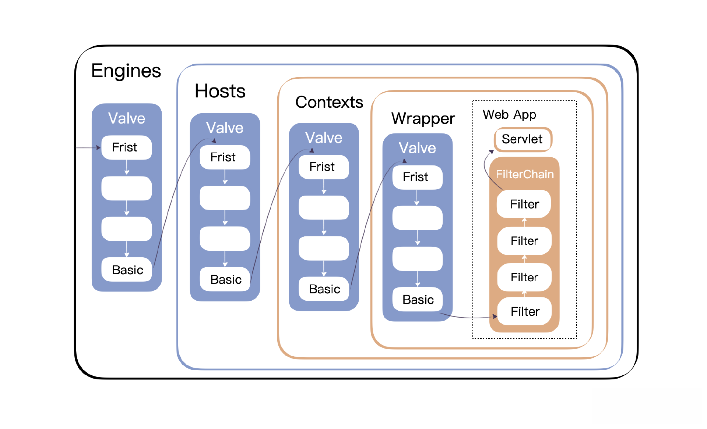

引入顺序职责链模式Filter，Filter设计主要用于Tomcat容器内最后面的Web应用层面请求和响应处理，因此设计为顺序职责链

过滤器可以检查请求对象以及返回对象，并通过请求对象和返回对象的包装类进行修改，而且多个过滤器之间可以串联，就像流水线一样一层层进行过滤，协同起来组装成最终的请求对象和响应对象。

我们一起来动手实现。

## Servlet过滤器规范
首先我们看看如何引入过滤器。按照 Servlet 规范，已经存在 Filter、FilterConfig 和 FilterChain 三个接口。

## 引入过滤器
我们先采用 ApplicationFilterConfig 类，对 Filter 进行包装。你可以看一下 ApplicationFilterConfig 类的定义。
```java
package com.minit.core;
final class ApplicationFilterConfig implements FilterConfig {
    public ApplicationFilterConfig(Context context, FilterDef filterDef)
            throws ClassCastException, ClassNotFoundException,
            IllegalAccessException, InstantiationException,
            ServletException {
        super();
        this.context = context;
        setFilterDef(filterDef);
    }
    private Context context = null;
    private Filter filter = null;
    private FilterDef filterDef = null;
    public String getFilterName() {
        return (filterDef.getFilterName());
    }
    public String getInitParameter(String name) {
        Map<String,String> map = filterDef.getParameterMap();
        if (map == null)
            return (null);
        else
            return ((String) map.get(name));
    }
    public Enumeration<String> getInitParameterNames() {
        Map<String,String> map = filterDef.getParameterMap();
        if (map == null)
            return Collections.enumeration(new ArrayList<String>());
        else
            return (Collections.enumeration(map.keySet()));
    }
    public ServletContext getServletContext() {
        return (this.context.getServletContext());
    }
    public String toString() {
        StringBuffer sb = new StringBuffer("ApplicationFilterConfig[");
        sb.append("name=");
        sb.append(filterDef.getFilterName());
        sb.append(", filterClass=");
        sb.append(filterDef.getFilterClass());
        sb.append("]");
        return (sb.toString());
    }
    Filter getFilter() throws ClassCastException, ClassNotFoundException,
            IllegalAccessException, InstantiationException, ServletException {
        // 返回现有的过滤器实例（如果有的话）
        if (this.filter != null)
            return (this.filter);
        // 确定我们将使用的类加载器
        String filterClass = filterDef.getFilterClass();
        ClassLoader classLoader = null;
        classLoader = context.getLoader();
        ClassLoader oldCtxClassLoader =
                Thread.currentThread().getContextClassLoader();
        // 实例化这个过滤器的新实例并返回
        Class clazz = classLoader.loadClass(filterClass);
        this.filter = (Filter) clazz.newInstance();
        filter.init(this);
        return (this.filter);
    }
    FilterDef getFilterDef() {
        return (this.filterDef);
    }
    void release() {
        if (this.filter != null)
            filter.destroy();
        this.filter = null;
    }
    void setFilterDef(FilterDef filterDef)
            throws ClassCastException, ClassNotFoundException,
            IllegalAccessException, InstantiationException,
            ServletException {
        this.filterDef = filterDef;
        if (filterDef == null) {
            // 释放之前分配的所有过滤器实例
            if (this.filter != null)
                this.filter.destroy();
            this.filter = null;
        } else {
            // 分配一个新的过滤器实例
            Filter filter = getFilter();
        }
    }
}
```

通过 ApplicationFilterConfig 类的实现我们可以看到：
- 引入了 Filter 对象，这个 Filter 对象就是 javax.servlet.Filter。具体的Filter实例化是通过getFilter的反射机制读取用户指定的过滤器
- 同时还定义了 Context 和 FilterDef，FilterDef 定义了 Filter 的部分参数信息

你可以看一下FilterDef定义：

```java
package com.minit.core;
import java.util.Map;
import java.util.concurrent.ConcurrentHashMap;
public final class FilterDef {
    private String description = null;
    public String getDescription() {
        return (this.description);
    }
    public void setDescription(String description) {
        this.description = description;
    }
    private String displayName = null;
    public String getDisplayName() {
        return (this.displayName);
    }
    public void setDisplayName(String displayName) {
        this.displayName = displayName;
    }
    private String filterClass = null;
    public String getFilterClass() {
        return (this.filterClass);
    }
    public void setFilterClass(String filterClass) {
        this.filterClass = filterClass;
    }
    private String filterName = null;
    public String getFilterName() {
        return (this.filterName);
    }
    public void setFilterName(String filterName) {
        this.filterName = filterName;
    }
    private String largeIcon = null;
    public String getLargeIcon() {
        return (this.largeIcon);
    }
    public void setLargeIcon(String largeIcon) {
        this.largeIcon = largeIcon;
    }
    private Map<String,String> parameters = new ConcurrentHashMap<>();
    public Map<String,String> getParameterMap() {
        return (this.parameters);
    }
    private String smallIcon = null;
    public String getSmallIcon() {
        return (this.smallIcon);
    }
    public void setSmallIcon(String smallIcon) {
        this.smallIcon = smallIcon;
    }
    public void addInitParameter(String name, String value) {
        parameters.put(name, value);
    }
    public String toString() {
        StringBuffer sb = new StringBuffer("FilterDef[");
        sb.append("filterName=");
        sb.append(this.filterName);
        sb.append(", filterClass=");
        sb.append(this.filterClass);
        sb.append("]");
        return (sb.toString());
    }
}
```

FilterDef 定义不难理解，主要包括 Filter 的描述、名称等信息，定义了众多 Getter 和 Setter 方法。在 FilterDef 类定义完毕后，我们就通过 Config 拿到了 Filter，并进行初始化工作。

## ApplicationFilterChain
由于支持多个 FilterConfig，所以我们使用链路模式进行管理，定义 ApplicationFilterChain 类。

```java
package com.minit.core;
import java.io.IOException;
import java.util.ArrayList;
import java.util.Iterator;
import javax.servlet.Filter;
import javax.servlet.FilterChain;
import javax.servlet.Servlet;
import javax.servlet.ServletException;
import javax.servlet.ServletRequest;
import javax.servlet.ServletResponse;
import javax.servlet.http.HttpServletRequest;
import javax.servlet.http.HttpServletResponse;
import com.minit.connector.HttpRequestFacade;
import com.minit.connector.HttpResponseFacade;
import com.minit.connector.http.HttpRequestImpl;
import com.minit.connector.http.HttpResponseImpl;
final class ApplicationFilterChain implements FilterChain {
    public ApplicationFilterChain() {
        super();
    }
    private ArrayList<ApplicationFilterConfig> filters = new ArrayList<>();
    private Iterator<ApplicationFilterConfig> iterator = null;
    private Servlet servlet = null;
    
    //核心方法，启动过滤
    public void doFilter(ServletRequest request, ServletResponse response)
            throws IOException, ServletException {
        System.out.println("FilterChain doFilter()");
        internalDoFilter(request,response);
    }
    private void internalDoFilter(ServletRequest request, ServletResponse response)
            throws IOException, ServletException {
        if (this.iterator == null)
            this.iterator = filters.iterator();
        if (this.iterator.hasNext()) {
            //拿到下一个filter
            ApplicationFilterConfig filterConfig =
                    (ApplicationFilterConfig) iterator.next();
            Filter filter = null;
            try {
                //进行过滤，这是职责链模式，一个一个往下传
                filter = filterConfig.getFilter();
                System.out.println("Filter doFilter()");
                //调用filter的过滤逻辑，根据规范，filter中要再次调用filterChain.doFilter
                //这样又会回到internalDoFilter()方法，就会再拿到下一个filter，
                //如此实现一个一个往下传
                filter.doFilter(request, response, this);
            } catch (IOException e) {
                throw e;
            } catch (ServletException e) {
                throw e;
            } catch (RuntimeException e) {
                throw e;
            } catch (Throwable e) {
                throw new ServletException("filterChain.filter", e);
            }
            return;
        }
        try {
            //最后调用servlet
            HttpServletRequest requestFacade = new HttpRequestFacade((HttpRequestImpl) request);
            HttpServletResponse responseFacade = new HttpResponseFacade((HttpResponseImpl) response);
            servlet.service(requestFacade, responseFacade);
        } catch (IOException e) {
            throw e;
        } catch (ServletException e) {
            throw e;
        } catch (RuntimeException e) {
            throw e;
        } catch (Throwable e) {
            throw new ServletException("filterChain.servlet", e);
        }
    }
    void addFilter(ApplicationFilterConfig filterConfig) {
        this.filters.add(filterConfig);
    }
    void release() {
        this.filters.clear();
        this.iterator = iterator;
        this.servlet = null;
    }
    void setServlet(Servlet servlet) {
        this.servlet = servlet;
    }
}
```

我们使用 ArrayList 存放所有的 filter，而最重要的实现方法就是 doFilter，这也是 FilterChain 接口本身所定义的，我们在这进行了实现。doFilter 方法内又调用了 internalDoFilter 方法来实现。我们使用了 iterator 迭代器指向 filters，通过 filterConfig.getFilter() 方法获取第一个 filter 后调用 filter.doFilter(request, response, this)。

需要注意的是，这个地方调用了第一个 Filter.doFilter()，而不是在 ApplicationFilterChain 中迭代遍历。之后的 filter 还是采用职责链设计模式，由第一个 Filter 调用下一个，一个一个地继续。

当所有 Filter 过滤完之后，执行 servlet.service(requestFacade, responseFacade) 方法，这也是 Filter Chain 自动完成的，service() 成了 Chain 之后的一个环节，所以 Processor 和 Container 不再需要显式地调用 service()。

## 原始代码改造
有了这些准备后，我们接下来可以把 Filter 加入到 Container 里，每一层都可以加；
- 我们只在 StandardContext 这一层保存
- 重新启动的时候在 BootStrap 里加上
- 调用的程序写在 StandardWrapperValve 里。

接下来我们看看如何实现，首先定义 FilterMap 类以及 URLDecoder 工具类。

URLDecoder 工具类：
```java
package com.minit.util;
public class URLDecoder {
    public static String URLDecode(String str) {
        return URLDecode(str, null);
    }
    public static String URLDecode(String str, String enc) {
        if (str == null)
            return (null);
        int len = str.length();
        byte[] bytes = new byte[len];
        bytes = str.getBytes();
        return URLDecode(bytes, enc);
    }
    public static String URLDecode(byte[] bytes) {
        return URLDecode(bytes, null);
    }
    public static String URLDecode(byte[] bytes, String enc) {
        if (bytes == null)
            return (null);
        int len = bytes.length;
        int ix = 0;
        int ox = 0;
        while (ix < len) {
            byte b = bytes[ix++];     // 获取要测试的字节
            if (b == '+') {
                b = (byte)' ';
            } else if (b == '%') {
                b = (byte) ((convertHexDigit(bytes[ix++]) << 4)
                        + convertHexDigit(bytes[ix++]));
            }
            bytes[ox++] = b;
        }
        if (enc != null) {
            try {
                return new String(bytes, 0, ox, enc);
            } catch (Exception e) {
                e.printStackTrace();
            }
        }
        return new String(bytes, 0, ox);
    }
    private static byte convertHexDigit( byte b ) {
        if ((b >= '0') && (b <= '9')) return (byte)(b - '0');
        if ((b >= 'a') && (b <= 'f')) return (byte)(b - 'a' + 10);
        if ((b >= 'A') && (b <= 'F')) return (byte)(b - 'A' + 10);
        return 0;
    }
}
```

FilterMap 类：
```java
package com.minit.core;
import com.minit.util.URLDecoder;
public final class FilterMap {
    private String filterName = null;
    public String getFilterName() {
        return (this.filterName);
    }
    public void setFilterName(String filterName) {
        this.filterName = filterName;
    }
    private String servletName = null;
    public String getServletName() {
        return (this.servletName);
    }
    public void setServletName(String servletName) {
        this.servletName = servletName;
    }
    private String urlPattern = null;
    public String getURLPattern() {
        return (this.urlPattern);
    }
    public void setURLPattern(String urlPattern) {
        this.urlPattern = URLDecoder.URLDecode(urlPattern);
    }
    public String toString() {
        StringBuffer sb = new StringBuffer("FilterMap[");
        sb.append("filterName=");
        sb.append(this.filterName);
        if (servletName != null) {
            sb.append(", servletName=");
            sb.append(servletName);
        }
        if (urlPattern != null) {
            sb.append(", urlPattern=");
            sb.append(urlPattern);
        }
        sb.append("]");
        return (sb.toString());
    }
}
```

紧接着调整 StandardContext，新增下面这些代码。这些代码进行了过滤器的配置和处理。
```java
package com.minit.core;
public class StandardContext extends ContainerBase implements Context{
    //下面的属性记录了filter的配置
    private Map<String,ApplicationFilterConfig> filterConfigs = new ConcurrentHashMap<>();
    private Map<String,FilterDef> filterDefs = new ConcurrentHashMap<>();
    private FilterMap filterMaps[] = new FilterMap[0];
    
    public void addFilterDef(FilterDef filterDef) {
        filterDefs.put(filterDef.getFilterName(), filterDef);
    }
    public void addFilterMap(FilterMap filterMap) {
        // 验证所建议的过滤器映射
        String filterName = filterMap.getFilterName();
        String servletName = filterMap.getServletName();
        String urlPattern = filterMap.getURLPattern();
        if (findFilterDef(filterName) == null)
            throw new IllegalArgumentException("standardContext.filterMap.name"+filterName);
        if ((servletName == null) && (urlPattern == null))
            throw new IllegalArgumentException("standardContext.filterMap.either");
        if ((servletName != null) && (urlPattern != null))
            throw new IllegalArgumentException("standardContext.filterMap.either");
        // 因为过滤器模式是2.3中的新功能，所以不需要调整
        // 对于2.2版本的向后兼容性
        if ((urlPattern != null) && !validateURLPattern(urlPattern))
            throw new IllegalArgumentException("standardContext.filterMap.pattern"+urlPattern);
        // 将这个过滤器映射添加到我们已注册的集合中
        synchronized (filterMaps) {
            FilterMap results[] =new FilterMap[filterMaps.length + 1];
            System.arraycopy(filterMaps, 0, results, 0, filterMaps.length);
            results[filterMaps.length] = filterMap;
            filterMaps = results;
        }
    }
    public FilterDef findFilterDef(String filterName) {
        return ((FilterDef) filterDefs.get(filterName));
    }
    public FilterDef[] findFilterDefs() {
        synchronized (filterDefs) {
            FilterDef results[] = new FilterDef[filterDefs.size()];
            return ((FilterDef[]) filterDefs.values().toArray(results));
        }
    }
    public FilterMap[] findFilterMaps() {
        return (filterMaps);
    }
    public void removeFilterDef(FilterDef filterDef) {
        filterDefs.remove(filterDef.getFilterName());
    }
    
    public void removeFilterMap(FilterMap filterMap) {
        synchronized (filterMaps) {
            // 确保当前存在这个过滤器映射
            int n = -1;
            for (int i = 0; i < filterMaps.length; i++) {
                if (filterMaps[i] == filterMap) {
                    n = i;
                    break;
                }
            }
            if (n < 0)
                return;
            // 删除指定的过滤器映射
            FilterMap results[] = new FilterMap[filterMaps.length - 1];
            System.arraycopy(filterMaps, 0, results, 0, n);
            System.arraycopy(filterMaps, n + 1, results, n,
                    (filterMaps.length - 1) - n);
            filterMaps = results;
        }
    }
    //对配置好的所有filter名字，创建实例，存储在filterConfigs中，可以生效了
    public boolean filterStart() {
        System.out.println("Filter Start..........");
        // 为每个定义的过滤器实例化并记录一个FilterConfig
        boolean ok = true;
        synchronized (filterConfigs) {
            filterConfigs.clear();
            Iterator<String> names = filterDefs.keySet().iterator();
            while (names.hasNext()) {
                String name = names.next();
                ApplicationFilterConfig filterConfig = null;
                try {
                    filterConfig = new ApplicationFilterConfig
                            (this, (FilterDef) filterDefs.get(name));
                    filterConfigs.put(name, filterConfig);
                } catch (Throwable t) {
                    ok = false;
                }
            }
        }
        return (ok);
    }
    public FilterConfig findFilterConfig(String name) {
        return (filterConfigs.get(name));
    }
    private boolean validateURLPattern(String urlPattern) {
        if (urlPattern == null)
            return (false);
        if (urlPattern.startsWith("*.")) {
            if (urlPattern.indexOf('/') < 0)
                return (true);
            else
                return (false);
        }
        if (urlPattern.startsWith("/"))
            return (true);
        else
            return (false);
    }
}
```

可以看到 StandardContext 里主要定义了 filter 的启动方法，用来在 BootStrap 启动类中启动过滤器。

接下来再调整 StandardContextValve 类里的 invoke 方法的实现，增加了 filter 的支持，不是直接调用 Servlet，而是放在 filterChain 中进行调用，即先进行过滤，然后再到 Servlet。
```java
package com.minit.core;
public class StandardWrapperValve extends ValveBase {
    private FilterDef filterDef = null;
    @Override
    public void invoke(Request request, Response response, ValveContext context) throws IOException, ServletException {
        //创建filter Chain，再调用filter，然后调用servlet
        System.out.println("StandardWrapperValve invoke()");
        Servlet instance = ((StandardWrapper)getContainer()).getServlet();
        ApplicationFilterChain filterChain = createFilterChain(request, instance);
        if ((instance != null) && (filterChain != null)) {
            filterChain.doFilter((ServletRequest)request, (ServletResponse)response);
        }
        filterChain.release();
    }
    //根据context中的filter map信息挑选出符合模式的filter，创建filterChain
    private ApplicationFilterChain createFilterChain(Request request, Servlet servlet) {
        System.out.println("createFilterChain()");
        if (servlet == null)
            return (null);
        ApplicationFilterChain filterChain = new ApplicationFilterChain();
        filterChain.setServlet(servlet);
        StandardWrapper wrapper = (StandardWrapper) getContainer();
        StandardContext context = (StandardContext) wrapper.getParent();
        //从context中拿到filter的信息
        FilterMap filterMaps[] = context.findFilterMaps();
        if ((filterMaps == null) || (filterMaps.length == 0))
            return (filterChain);
        //要匹配的路径
        String requestPath = null;
        if (request instanceof HttpServletRequest) {
            String contextPath = "";
            String requestURI = ((HttpRequestImpl)request).getUri(); //((HttpServletRequest) request).getRequestURI();
            if (requestURI.length() >= contextPath.length())
                requestPath = requestURI.substring(contextPath.length());
        }
        //要匹配的servlet名
        String servletName = wrapper.getName();
        
        //下面遍历filter Map，找到匹配URL模式的filter，加入到filterChain中
        int n = 0;
        for (int i = 0; i < filterMaps.length; i++) {
            if (!matchFiltersURL(filterMaps[i], requestPath))
                continue;
            ApplicationFilterConfig filterConfig = (ApplicationFilterConfig)
                    context.findFilterConfig(filterMaps[i].getFilterName());
            if (filterConfig == null) {
                continue;
            }
            filterChain.addFilter(filterConfig);
            n++;
        }
        //下面遍历filter Map，找到匹配servlet的filter，加入到filterChain中
        for (int i = 0; i < filterMaps.length; i++) {
            if (!matchFiltersServlet(filterMaps[i], servletName))
                continue;
            ApplicationFilterConfig filterConfig = (ApplicationFilterConfig)
                    context.findFilterConfig(filterMaps[i].getFilterName());
            if (filterConfig == null) {
                continue;
            }
            filterChain.addFilter(filterConfig);
            n++;
        }
        return (filterChain);
    }
    //字符串模式匹配filter的过滤路径
    private boolean matchFiltersURL(FilterMap filterMap, String requestPath) {
        if (requestPath == null)
            return (false);
        String testPath = filterMap.getURLPattern();
        if (testPath == null)
            return (false);
        if (testPath.equals(requestPath))
            return (true);
        if (testPath.equals("/*"))
            return (true);
        if (testPath.endsWith("/*")) { //路径符合/前缀，通配成功
            String comparePath = requestPath;
            while (true) {  //以/截取前段字符串，循环匹配
                if (testPath.equals(comparePath + "/*"))
                    return (true);
                int slash = comparePath.lastIndexOf('/');
                if (slash < 0)
                    break;
                comparePath = comparePath.substring(0, slash);
            }
            return (false);
        }
        if (testPath.startsWith("*.")) {
            int slash = requestPath.lastIndexOf('/');
            int period = requestPath.lastIndexOf('.');
            if ((slash >= 0) && (period > slash))
                return (testPath.equals("*." + requestPath.substring(period + 1)));
        }
        return (false); // NOTE - Not relevant for selecting filters
    }
    private boolean matchFiltersServlet(FilterMap filterMap, String servletName) {
        if (servletName == null)
            return (false);
        else
            return (servletName.equals(filterMap.getServletName()));
    }
}
```

最后调整 BootStrap 类，你可以看一下当前 main 函数的实现。主要的变化就是配置了 filter 信息、名称、类名、过滤路径等等。
```java
package com.minit.startup;
public class BootStrap {
    public static void main(String[] args) {
        if (debug >= 1)
            log(".... startup ....");
        HttpConnector connector = new HttpConnector();
        StandardContext container = new StandardContext();
        connector.setContainer(container);
        container.setConnector(connector);
        Logger logger = new FileLogger();
        container.setLogger(logger);
        FilterDef filterDef = new FilterDef();
        filterDef.setFilterName("TestFilter");
        filterDef.setFilterClass("test.TestFilter");
        container.addFilterDef(filterDef);
        FilterMap filterMap = new FilterMap();
        filterMap.setFilterName("TestFilter");
        filterMap.setURLPattern("/*");
        container.addFilterMap(filterMap);
        container.filterStart();
        connector.start();
    }
}
```

这样 Filter 就定义好了，我们可以在测试文件夹里定义 TestFIlter 类来测试一下。
```java
package test;
public class TestFilter implements Filter{
    @Override
    public void doFilter(ServletRequest request, ServletResponse response, FilterChain chain)
            throws IOException, ServletException {
        System.out.println("The very first Filter");
        chain.doFilter(request, response);
    }
}
```

## 小结
Tomcat的Filter只是针对WebApp层的过滤，而非容器层的过滤，并且是按照过滤器添加的顺序正序过滤



测试方式，先重新编译项目，把编译后的HelloServlet.class，TestFilter.class，TestServlet.class都放在webroot/test目录下

并且注意用户请求的路径还是test.TestServlet。  快来验证下Filter是否生效
```shell
### 初次请求无jsessionid
GET http://localhost:8080/servlet/test.TestServlet?name=Tommy&docid=TS0001
Accept: text/html,application/xhtml+xml,application/xml;q=0.9,image/avif,image/webp,image/apng,*/*;q=0.8,application/signed-exchange;v=b3;q=0.7
Accept-Encoding: gzip, deflate, br, zstd
Accept-Language: zh-CN,zh;q=0.9,en-US;q=0.8,en;q=0.7
Cache-Control: max-age=0
//Connection: keep-alive
Host: localhost:8080
Sec-Fetch-Dest: document
Sec-Fetch-Mode: navigate
Sec-Fetch-Site: none
Sec-Fetch-User: ?1
Upgrade-Insecure-Requests: 1
User-Agent: Mozilla/5.0 (Windows NT 10.0; Win64; x64) AppleWebKit/537.36 (KHTML, like Gecko) Chrome/132.0.0.0 Safari/537.36
sec-ch-ua: "Not A(Brand";v="8", "Chromium";v="132", "Google Chrome";v="132"
sec-ch-ua-mobile: ?0
sec-ch-ua-platform: "Windows"

```