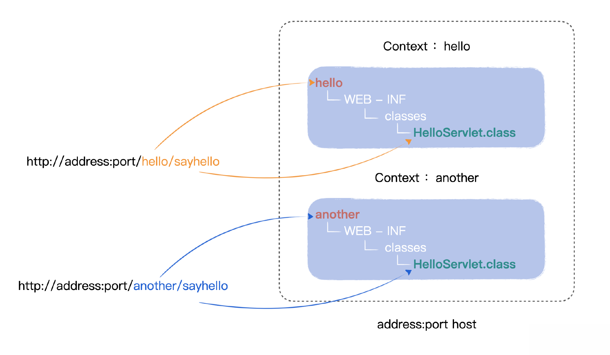
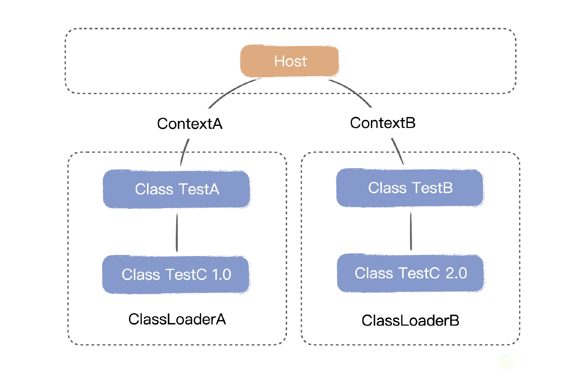

目前我们的测试代码，都写在 /webroot 目录下，但如果有不同的应用，那就都混合在同一路径下了，这样不利于管理。

所以这节课我们进一步考虑支持多路由的转发，通过路径的区分，将请求转发到不同应用之中，我们会引入 Context 这个概念来实现应用的相互隔离。



如图所示，用户在 url 中分别输入路径 hello/ 和 another/，这就代表了两个不同的 context，以此路径分别定位于不同的应用中。

在此基础上，我们再优化 Bootstrap，去除多余的功能，确保它只是一个启动器，贯彻各司其职的设计理念。

下面我们一起来动手实现。

## 项目结构
这节课我们主要新增了 StandardHost、StandardHostValve，以及 WebappClassClassLoader 类。

还有一个重要的变化是在 /webroot 目录下新增 app1 和 app2 目录，用来区分不同的应用。你可以看一下改动后的项目结构。
```shell
MiniTomcat
├─ src
│  ├─ main
│  │  ├─ java
│  │  │  ├─ com
│  │  │  │  ├─ minit
│  │  │  │  │  ├─ connector
│  │  │  │  │  │  ├─ http
│  │  │  │  │  │  │  ├─ DefaultHeaders.java
│  │  │  │  │  │  │  ├─ HttpConnector.java
│  │  │  │  │  │  │  ├─ HttpHeader.java
│  │  │  │  │  │  │  ├─ HttpProcessor.java
│  │  │  │  │  │  │  ├─ HttpRequestImpl.java
│  │  │  │  │  │  │  ├─ HttpRequestLine.java
│  │  │  │  │  │  │  ├─ HttpResponseImpl.java
│  │  │  │  │  │  │  ├─ ServletProcessor.java
│  │  │  │  │  │  │  ├─ SocketInputStream.java
│  │  │  │  │  │  │  ├─ StatisResourceProcessor.java
│  │  │  │  │  │  ├─ HttpRequestFacade.java
│  │  │  │  │  │  ├─ HttpResponseFacade.java
│  │  │  │  │  ├─ core
│  │  │  │  │  │  ├─ ApplicationFilterChain.java
│  │  │  │  │  │  ├─ ApplicationFilterConfig.java
│  │  │  │  │  │  ├─ ContainerBase.java
│  │  │  │  │  │  ├─ ContainerListenerDef.java
│  │  │  │  │  │  ├─ FilterDef.java
│  │  │  │  │  │  ├─ FilterMap.java
│  │  │  │  │  │  ├─ StandardContext.java
│  │  │  │  │  │  ├─ StandardContextValve.java
│  │  │  │  │  │  ├─ StandardHost.java
│  │  │  │  │  │  ├─ StandardHostValve.java
│  │  │  │  │  │  ├─ StandardPipeline.java
│  │  │  │  │  │  ├─ StandardWrapper.java
│  │  │  │  │  │  ├─ StandardWrapperValve.java
│  │  │  │  │  │  ├─ WebappClassLoader.java
│  │  │  │  │  ├─ logger
│  │  │  │  │  │  ├─ Constants.java
│  │  │  │  │  │  ├─ FileLogger.java
│  │  │  │  │  │  ├─ LoggerBase.java
│  │  │  │  │  │  ├─ SystemErrLogger.java
│  │  │  │  │  │  ├─ SystemOutLogger.java
│  │  │  │  │  ├─ session
│  │  │  │  │  │  ├─ StandardSession.java
│  │  │  │  │  │  ├─ StandardSessionFacade.java
│  │  │  │  │  ├─ startup
│  │  │  │  │  │  ├─ BootStrap.java
│  │  │  │  │  ├─ util
│  │  │  │  │  │  ├─ CookieTools.java
│  │  │  │  │  │  ├─ StringManager.java
│  │  │  │  │  │  ├─ URLDecoder.java
│  │  │  │  │  ├─ valves
│  │  │  │  │  │  ├─ AccessLogValve.java
│  │  │  │  │  │  ├─ ValveBase.java
│  │  │  │  ├─ Connector.java
│  │  │  │  ├─ Container.java
│  │  │  │  ├─ ContainerEvent.java
│  │  │  │  ├─ ContainerListener.java
│  │  │  │  ├─ Context.java
│  │  │  │  ├─ InstanceEvent.java
│  │  │  │  ├─ InstanceListener.java
│  │  │  │  ├─ Logger.java
│  │  │  │  ├─ Pipeline.java
│  │  │  │  ├─ Request.java
│  │  │  │  ├─ Response.java
│  │  │  │  ├─ Session.java
│  │  │  │  ├─ SessionEvent.java
│  │  │  │  ├─ SessionListener.java
│  │  │  │  ├─ Valve.java
│  │  │  │  ├─ ValveContext.java
│  │  │  │  ├─ Wrapper.java
│  │  ├─ resources
│  ├─ test
│  │  ├─ java
│  │  │  ├─ test
│  │  │  │  ├─ HelloServlet.java
│  │  │  │  ├─ TestFilter.java
│  │  │  │  ├─ TestListener.java
│  │  │  │  ├─ TestServlet.java
│  │  ├─ resources
├─ webroot
│  ├─ app1
│  │  ├─ test
│  │  │  ├─ HelloServlet.class
│  │  │  ├─ TestFilter.class
│  │  │  ├─ TestListener.class
│  │  │  ├─ TestServlet.class
│  │  ├─ hello.txt
│  ├─ app2
│  │  ├─ test
│  │  │  ├─ HelloServlet.class
│  │  │  ├─ TestFilter.class
│  │  │  ├─ TestListener.class
│  │  │  ├─ TestServlet.class
│  │  ├─ hello.txt
├─ pom.xml
```

## 引入多应用
接下来我们开始正式进行多应用的改造，在改造前我们引入一个新的 ClassLoader——WebappClassLoader，为后续应用拆分以及自定义类加载器做准备，你可以看一下 WebappClassLoader 的定义。
```java
package com.minit.core;
public class WebappClassLoader {
    ClassLoader classLoader;
    String path;
    String docbase;
    Container container;
    public Container getContainer() {
        return container;
    }
    public void setContainer(Container container) {
        this.container = container;
    }
    public String getPath() {
        return path;
    }
    public void setPath(String path) {
        this.path = path;
    }
    public String getDocbase() {
        return docbase;
    }
    public void setDocbase(String docbase) {
        this.docbase = docbase;
    }
    public WebappClassLoader() {
    }
    public ClassLoader getClassLoader() {
        return classLoader;
    }
    public String getInfo() {
        return "A simple loader";
    }
    public void addRepository(String repository) {
    }
    public String[] findRepositories() {
        return null;
    }
    public synchronized void start() {
        System.out.println("Starting WebappLoader");
        try {
            // 创建一个 URLClassLoader
            URL[] urls = new URL[1];
            URLStreamHandler streamHandler = null;
            File classPath = new File(System.getProperty("minit.base"));
            String repository = (new URL("file", null, classPath.getCanonicalPath() + File.separator)).toString() ;
            if (docbase!=null && !docbase.equals("")) {
                repository = repository + docbase + File.separator;
            }
            urls[0] = new URL(null, repository, streamHandler);
            System.out.println("Webapp classloader Repository : "+repository);
            classLoader = new URLClassLoader(urls);
        }
        catch (Exception e) {
            System.out.println(e.toString() );
        }
    }
    public void stop() {
    }
}
```
从代码我们可以看出，一个 WebappClassLoader 主要包含了几个要素：
- classLoader
- docBase
- container

这个 classLoader 其实就是一个 URLClassLoader，它的工作目录由 docBase 来决定。

要实现项目中 /webroot 目录下的多应用解析，在我们的实现里，其实对使用者而言就相当于目录上多了一个 Context 层级：
- 比如请求 http://localhost:8080/app1/servlet/test.TestServlet，主机地址后面的 app1 就是 context，这样可以有两个版本不一样的 test.TestServlet，
- 比如说另一个的请求地址为 http://localhost:8080/app2/servlet/test.TestServlet。

我们需要利用到的，正是刚刚我们定义的 WebappClassLoader，由它来加载应用里的客户类。每一个 WebappClassLoader 都有一个 docBase，比如例子里的 app1 或者 app2，也就是 context 的目录。

每一个 context 都对应一个不同的 WebappClassLoader，根据 Java 类的管理机制，这些不同的 classloader 之间是互相隔离的，所以这些 context 代表的应用之间也就是互相隔离的，这就达到了我们的目的。

Java 的这个机制是：不同 classloader 加载的类在 JVM 看来是两个不同的类，因为在 JVM 里一个类的唯一标识是 classloader+ 类名。通过这种方式我们就能够实现类之间的隔离，甚至可以同时加载某个类的两个不同版本（类名可以相同，用户Servlet位于不同的目录下，同时类加载器不同）。



上面的图示就是 Tomcat 通过 Context 达到应用隔离的原理。

而整个服务器的根工作目录存放在 System.getProperty("minit.base") 里，这个 property 是 BootStrap 启动时指定的，所以在 BootStrap 中我们要定义 System.setProperty("minit.base", WEB_ROOT);。

举个例子，如果 Minit 放在 d:/minit 目录下，那么 WEB_ROOT 目录为 d:/minit/webroot，而 app1 的 webclassloader 的 docbase 是 app1, 那么它加载的目录就是 d:/minit/webroot/app1/。

## 新的 URI 解析
有了上面的 WebappClassLoader 作为基础，我们再来管理后端应用程序，从用户的角度来看，当他在客户端输入的 URL 是 http://localhost:8080/app1/servlet/test.TestServlet 的时候，

我们要修改解析 URL 的程序，需要把 URI 解析成 /servlet/test.TestServlet 的这部分，修改成 /app1/servlet/test.TestServlet，这样就能识别出这个 servlet 是哪一个 context 下的了。

这个步骤的实现，我们放在 HttpRequestImpl.parseRequestLine() 这个方法中调整，你可以看一下具体调整的核心代码。
```java
//get context from uri
int contextslash = uri.indexOf("/", 1);
if (contextslash != -1) {
    this.docbase = uri.substring(1, contextslash);
    uri = uri.substring(contextslash);
}
```

其实比较简单，就是按照字符串分隔符来完成这个工作。你再来看完整的 parseRequestLine() 方法，在两个判断条件中都增加了解析实现。
```java
package com.minit.connector.http;
public class HttpRequestImpl implements HttpServletRequest, Request {
    String docbase;
    public String getDocbase() {
        return docbase;
    }
    public void setDocbase(String docbase) {
        this.docbase = docbase;
    }

    private void parseRequestLine() {
        int question = requestLine.indexOf("?");
        if (question >= 0) {
            queryString = new String(requestLine.uri, question + 1, requestLine.uriEnd - question - 1);
            uri = new String(requestLine.uri, 0, question);
            String tmp = ";" + DefaultHeaders.JSESSIONID_NAME + "=";
            int semicolon = uri.indexOf(tmp);
            if (semicolon >= 0) {
                sessionid = uri.substring(semicolon+tmp.length());
                uri = uri.substring(0, semicolon);
            }
            int contextslash = uri.indexOf("/", 1);
            if (contextslash != -1) {
                this.docbase = uri.substring(1, contextslash);
                uri = uri.substring(contextslash);
            }
        } else {
            queryString = null;
            uri = new String(requestLine.uri, 0, requestLine.uriEnd);
            String tmp = ";" + DefaultHeaders.JSESSIONID_NAME + "=";
            int semicolon = uri.indexOf(tmp);
            if (semicolon >= 0) {
                sessionid = uri.substring(semicolon+tmp.length());
                uri = uri.substring(0, semicolon);
            }
            int contextslash = uri.indexOf("/", 1);
            if (contextslash != -1) {
                this.docbase = uri.substring(1, contextslash);
                uri = uri.substring(contextslash);
            }
        }
    }
}
```
到这里多应用的改造就告一段落了。

## 独立服务器 Host
接下来我们还要继续精简启动类的工作，目前启动类 BootStrap 里，已经集成了监听器和过滤器的启动工作，其实这些都是服务器的功能，我们要进一步简化。

我们的思路是把 BootStrap 仅仅当成一个服务器的启动器，它本身不是服务器，所以我们这里就要把服务器的功能代码从 BootStrap 中抽到一个服务器中，我们可以把实现服务器的代码定义在 StandardHost 类里面，你可以看一下代码。

```java
package com.minit.core;
public class StandardHost extends ContainerBase{
    HttpConnector connector = null;
    //host中用一个map存储了所管理的context，一个context代表了一个独立的web应用
    Map<String,StandardContext> contextMap = new ConcurrentHashMap<>();//contextName - servletContext
    //下面的listener是host本身的监听
    private ArrayList<ContainerListenerDef> listenerDefs = new ArrayList<>();
    private ArrayList<ContainerListener> listeners = new ArrayList<>();
    public StandardHost(){
        super();
        pipeline.setBasic(new StandardHostValve());
        log("Host created.");
    }
    public String getInfo() {
        return "Minit host, vesion 0.1";
    }
    public HttpConnector getConnector() {
        return connector;
    }
    public void setConnector(HttpConnector connector) {
        this.connector = connector;
    }
    public void invoke(Request request, Response response)
            throws IOException, ServletException {
        System.out.println("StandardHost invoke()");
        super.invoke(request, response);
    }
    //从host中根据context名(路径名)找到对应的context
    //如果找不到就新建一个context
    public StandardContext getContext(String name){
        StandardContext context = contextMap.get(name);
        if ( context == null) {
            //创建新的context，有自己独立的根目录和类加载器
            context = new StandardContext();
            context.setDocBase(name);
            context.setConnector(connector);
            WebappClassLoader loader = new WebappClassLoader();
            context.setLoader(loader);
            loader.start();
            this.contextMap.put(name, context);
        }
        return context;
    }
    //host的启动方法，现在没有做什么事情，仅仅是启用监听器
    //在MiniTomcat中，Host是一个极简化的形态
    public void start(){
        fireContainerEvent("Host Started",this);
        Logger logger = new FileLogger();
        setLogger(logger);
        ContainerListenerDef listenerDef = new ContainerListenerDef();
        listenerDef.setListenerName("TestListener");
        listenerDef.setListenerClass("test.TestListener");
        addListenerDef(listenerDef);
        listenerStart();
    }
    public void addContainerListener(ContainerListener listener) {
        synchronized (listeners) {
            listeners.add(listener);
        }
    }
    public void removeContainerListener(ContainerListener listener) {
        synchronized (listeners) {
            listeners.remove(listener);
        }
    }
    public void fireContainerEvent(String type, Object data) {
        if (listeners.size() < 1)
            return;
        ContainerEvent event = new ContainerEvent(this, type, data);
        ContainerListener list[] = new ContainerListener[0];
        synchronized (listeners) {
            list = (ContainerListener[]) listeners.toArray(list);
        }
        for (int i = 0; i < list.length; i++)
            ((ContainerListener) list[i]).containerEvent(event);
    }
    public void addListenerDef(ContainerListenerDef listenererDef) {
        synchronized (listenerDefs) {
            listenerDefs.add(listenererDef);
        }
    }
    //初始化监听器
    public boolean listenerStart() {
        System.out.println("Listener Start..........");
        boolean ok = true;
        synchronized (listeners) {
            listeners.clear();
            Iterator<ContainerListenerDef> defs = listenerDefs.iterator();
            while (defs.hasNext()) {
                ContainerListenerDef def = defs.next();
                ContainerListener listener = null;
                try {
                    // Identify the class loader we will be using
                    String listenerClass = def.getListenerClass();
                    WebappClassLoader classLoader = null;
                    //host对应的loader就是listener的loader
                    classLoader = this.getLoader();
                    ClassLoader oldCtxClassLoader =
                            Thread.currentThread().getContextClassLoader();
                    // Instantiate a new instance of this filter and return it
                    Class<?> clazz = classLoader.getClassLoader().loadClass(listenerClass);
                    listener = (ContainerListener) clazz.newInstance();
                    addContainerListener(listener);
                } catch (Throwable t) {
                    t.printStackTrace();
                    ok = false;
                }
            }
        }
        return (ok);
    }
}
```

我们可以看到，我们新加的这个 StandardHost 里面包含了：
- 一个 connector 
- 下一级容器 Context
- 另外 Listener 也由 StandardHost 来启动。

Host 本身也可以看成是一个更大的容器，按照 Tomcat 的做法，相应地定义 Valve。
```java
package com.minit.core;
public class StandardHostValve extends ValveBase{
    @Override
    public void invoke(Request request, Response response, ValveContext context) throws IOException, ServletException {
        System.out.println("StandardHostValve invoke()");
        String docbase = ((HttpRequestImpl)request).getDocbase();
        System.out.println("StandardHostValve invoke getdocbase : " + docbase);
        StandardHost host = (StandardHost)getContainer();
        StandardContext servletContext = host.getContext(docbase);
        try {
            servletContext.invoke(request, response);
        }
        catch (Exception e) {
            System.out.println(e.toString());
        }
        catch (Throwable e) {
            System.out.println(e.toString());
        }
    }
}
```

通过 StandardHost 类我们可以看到，许多以前在启动类中的代码都移到这个类里了。

过滤器的启动被划在 filterStart 方法里了，而监听器的启动则由 listenerStart 方法负责，在调用 StandardHost 类中的 start 方法的时候，会调用这两个方法。

这时候，我们就可以把 BootStrap 中一大段服务器功能的实现，替换成使用 Host，你可以看一下替换后的 main 方法。

```java
public static void main(String[] args) {
    if (debug >= 1)
        log(".... startup ....");
    System.setProperty("minit.base", WEB_ROOT);
    HttpConnector connector = new HttpConnector();
    StandardHost container = new StandardHost();
    WebappClassLoader loader = new WebappClassLoader();
    container.setLoader(loader);
    loader.start();
    connector.setContainer(container);
    container.setConnector(connector);
    container.start();
    connector.start();
}
```

这个时候 StandardHost 的 start 方法已经把之前的启动代码都涵盖了。可以看到这个 BootStrap 现在很简单，真的只是一个启动器。

## 测试
在这节课的测试中，我们先把原来 /webroot 目录下的文件全部复制到 /webroot/app1 里，随后我们修改 TestServlet，人为地造出两个不同的应用，你可以看一下 TestServlet 修改后的代码。
```java
package test;
import javax.servlet.ServletException;
import javax.servlet.http.HttpServlet;
import javax.servlet.http.HttpServletRequest;
import javax.servlet.http.HttpServletResponse;
import javax.servlet.http.HttpSession;
import java.io.IOException;
public class TestServlet extends HttpServlet{
    static int count = 0;
    private static final long serialVersionUID = 1L;
    @Override
    public void doGet(HttpServletRequest request, HttpServletResponse response)throws ServletException, IOException {
        System.out.println("Another TestServlet Enter doGet()");
        System.out.println("Another TestServlet  parameter name : "+request.getParameter("name"));
        TestServlet.count++;
        System.out.println("::::::::Another TestServlet call count ::::::::: " + TestServlet.count);
        if (TestServlet.count>2) {
            response.addHeader("Connection", "close");
        }
        HttpSession session = request.getSession(true);
        String user = (String) session.getAttribute("user");
        System.out.println("get user from session : " + user);
        if (user == null || user.equals("")) {
            session.setAttribute("user", "yale");
        }

        response.setCharacterEncoding("UTF-8");
        String doc = "<!DOCTYPE html> \n" +
                "<html>\n" +
                "<head><meta charset=\"utf-8\"><title>Test</title></head>\n"+
                "<body bgcolor=\"#f0f0f0\">\n" +
                "<h1 align=\"center\">" + "Test 你好" + "</h1>\n";
        System.out.println(doc);
        response.getWriter().println(doc);
    }
    public void doPost(HttpServletRequest request, HttpServletResponse response)throws ServletException, IOException {
        System.out.println("Enter doGet()");
        System.out.println("parameter name : "+request.getParameter("name"));
        response.setCharacterEncoding("UTF-8");
        String doc = "<!DOCTYPE html> \n" +
                "<html>\n" +
                "<head><meta charset=\"utf-8\"><title>Test</title></head>\n"+
                "<body bgcolor=\"#f0f0f0\">\n" +
                "<h1 align=\"center\">" + "Test 你好" + "</h1>\n";
        System.out.println(doc);
        response.getWriter().println(doc);
    }
}
```

主要在于输出的日志不同，修改后用了“Another TestServlet”的标识，将修改后的 TestServlet 单独编译，参考前面的步骤把这些文件放入 /webroot/app2 里，用来区分，方便我们对两个应用的场景进行模拟测试。

最后还有个小调整，之前我们在 HttpProcessor 的 process(Socket socket) 方法中通过 Header 头 Connection：Close 判断是否要关闭长连接，现在简化一下，直接关闭。
```java
//if ("close".equals(response.getHeader("Connection"))) {
    keepAlive = false;
//}
```

app1测试请求见：[get1.http](get1.http)
app2测试请求见：[get2.http](get2.http)

## 小结
这节课我们新增了多应用的支持，支持多路由转发，通过路径的区分，将请求转发到不同应用之中。

比如用户在客户端输入地址 http://address:port/app1/testservlet，这个 url 中，app1 将定位到某个应用 context，testservlet 将定位到具体的某个程序。这里的 app1/ 目录就框定了一个应用，下面的各个程序都是在 app1 应用下运行的。

而 app2/ 目录就代表了另一个应用。

多个应用之间是独立的，但里面可以有同名的程序，那么我们怎么区分的呢？这里利用了我们自定义的 WebappClassLoader 对通用的 ClassLoader 进行了一层封装，实现了应用之间的相互隔离，并为接下来的自定义类加载器打下了基础。在这个基础上，我们又继续优化了 Bootstrap，去除了多余的功能，确保它只是一个启动器。