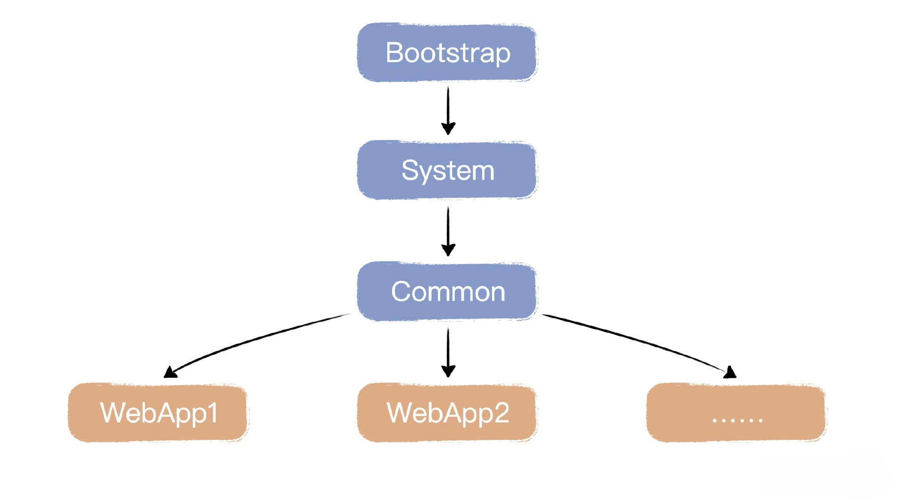
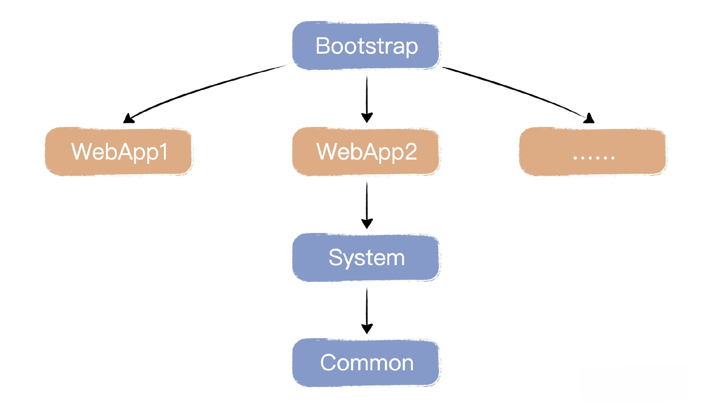

上节我们引入了多应用的支持，实现了通过路由将请求发送到不同应用中，不同的应用路径，创建不同的类加载器实例 WebappClassLoader 来进行隔离。

但是光有隔离还不够，因为不同的类加载器有不同的加载方式和顺序，而 Java 自身的系统级 ClassLoader 也不能完全满足我们的需要，所以这节课我们要继续扩展这个话题，深入讨论自定义的 ClassLoader。

## JVM类加载器原理
我们平时写程序的时候似乎感觉不到类加载器，其实是因为 Java 在帮我们默认使用，我们的程序中每涉及到一个类的使用，运行时 Java 都会通过一个类加载器来加载它。

Java 里面对它的定义是：类加载器是一个对象，它负责加载别的类（Class Loader is an object that is responsible for loading classes）。

我们简单回顾一下一个 Java 对象是如何在 JVM 里面运行起来的。一个简单的语句 new Test(); 大体会经过下面几个步骤。

步骤一：类级别的工作。具体某个类的加载过程只会做一次。
1. 加载：找到 class 文件，打开并获取它的字节流，按照虚拟机规范存储在 JVM 里，同时创建一个和它匹配的 java.lang.Class 类对象。这个时候，类的定义和内存表达就准备好了，但是还没有开始对象的创建。
2. 链接：这个阶段执行类的链接过程，给类分配内存。具体它有三个动作要做。
   1. 验证：用于验证 class 文件是否合规。按照字节码的规范检验 class 文件的格式是否正确，就是在这一步完成的。
   2. 准备：这个阶段给类里面的静态变量分配内存，赋予默认值。
   3. 解析：将符号引用转成直接内存引用。
3. 初始化：这个阶段完成类加载，把所有静态变量赋初始值，执行静态代码块。

步骤二：对象级别的工作。经过第一步，我们的类就准备好了，对象有了模子。创建对象（实例）的事情就简单了。
1. 实例化：为对象在堆中分配内存，需要注意的是，实例字段包括自身定义的和从父类继承下来的两个部分。
2. 初始化：对实例内存进行零值初始化。
3. 调用对象的构造函数。

我们继续探讨类的加载，自底向上，在 Java 中有三种类加载器存在
- 一个应用加载器apploader，加载我们自己写的类
- 一个扩展加载器extloader，加载 Java 核心类的扩展部分，也就是那些放在 $JRE_HOME/lib/ext 目录下的类
- 一个根加载器，加载 Java 平台核心类，比如 java.lang.Object 和 java.lang.Thread 以及 rt.jar 里的类。

这几个类加载器之间是有层次关系的，这种关系就叫做委托模型（Delegation Model）。一个类加载器把对类的加载任务委托给它的上层（Parent）去做。

具体来说，一个类加载器自己先不加载，而是交给它的上层去处理，而上层再交给它的上层去处理，一层层委托上去一直到根类加载器，如果上层发现自己加载不了这个类，才会交给下层加载。

一般情况下是这样的次序，先是应用类加载器加载客户程序，它自己不做，交给上层的扩展类加载器，再交给根类加载器。

之后方向反过来，根类加载器发现不能加载，就返给扩展类加载器，如果还是加载不了，最后再返给应用类加载器。

这就是 Java 里面的标准类加载模式，叫做双亲委托模型。这个模式初看起来奇怪，但是它这个机制保证了 Java 系统的安全性，**保护了 Java 自身的核心类不被替换掉**。

## 问题引出
那么问题来了，Java 把这一套机制设计得好好的，我们为什么要用自定义类加载器呢？这是由我们的需求决定的，我们的 MiniTomcat 是一个应用服务器，它负责管理多个 Java 应用，因此它需要满足几个特性。

1. 不同应用之间可以共享某些基础包。**理解为tomcat本身的基础库lib，而非委托给最上面的jdk**
2. 应用之间类隔离，不同的应用使用同一个类是可以的，相当于同类有不同版本，不应该冲突。**理解为优先加载webapps/app1/、webapps/app2/、路径下用户实现的Servlet，而非委托给最上面的jdk**
3. 应用与 MiniTomcat 本身的类应该互相不干扰。

对这些特性，用标准模式不能满足应用。因为按照双亲委托模型，都先交给上层类加载器，就是 AppClassLoader 去加载了。这个父类加载器分不清具体每一个应用所需要的类。

因此，我们自己的类加载器中需要自己定义不同的加载顺序。简单来讲，应该由自定义的类加载器自行加载类，而不是一概交给上层去加载。

## 项目结构
这节课我们新增了 Loader 通用接口，定义了 WebappLoader 类，并且为了使结构保持一致，把原有的 webroot 目录更名为 webapps，并进一步调整优化目录结构。你可以看一下目前的项目结构。
```shell
MiniTomcat
├─ src
│  ├─ main
│  │  ├─ java
│  │  │  ├─ com
│  │  │  │  ├─ minit
│  │  │  │  │  ├─ connector
│  │  │  │  │  │  ├─ http
│  │  │  │  │  │  │  ├─ DefaultHeaders.java
│  │  │  │  │  │  │  ├─ HttpConnector.java
│  │  │  │  │  │  │  ├─ HttpHeader.java
│  │  │  │  │  │  │  ├─ HttpProcessor.java
│  │  │  │  │  │  │  ├─ HttpRequestImpl.java
│  │  │  │  │  │  │  ├─ HttpRequestLine.java
│  │  │  │  │  │  │  ├─ HttpResponseImpl.java
│  │  │  │  │  │  │  ├─ ServletProcessor.java
│  │  │  │  │  │  │  ├─ SocketInputStream.java
│  │  │  │  │  │  │  ├─ StatisResourceProcessor.java
│  │  │  │  │  │  ├─ HttpRequestFacade.java
│  │  │  │  │  │  ├─ HttpResponseFacade.java
│  │  │  │  │  ├─ core
│  │  │  │  │  │  ├─ ApplicationFilterChain.java
│  │  │  │  │  │  ├─ ApplicationFilterConfig.java
│  │  │  │  │  │  ├─ CommonClassLoader.java
│  │  │  │  │  │  ├─ CommonLoader.java
│  │  │  │  │  │  ├─ ContainerBase.java
│  │  │  │  │  │  ├─ ContainerListenerDef.java
│  │  │  │  │  │  ├─ FilterDef.java
│  │  │  │  │  │  ├─ FilterMap.java
│  │  │  │  │  │  ├─ StandardContext.java
│  │  │  │  │  │  ├─ StandardContextValve.java
│  │  │  │  │  │  ├─ StandardHost.java
│  │  │  │  │  │  ├─ StandardHostValve.java
│  │  │  │  │  │  ├─ StandardPipeline.java
│  │  │  │  │  │  ├─ StandardWrapper.java
│  │  │  │  │  │  ├─ StandardWrapperValve.java
│  │  │  │  │  │  ├─ WebappClassLoader.java
│  │  │  │  │  │  ├─ WebappLoader.java
│  │  │  │  │  ├─ logger
│  │  │  │  │  │  ├─ Constants.java
│  │  │  │  │  │  ├─ FileLogger.java
│  │  │  │  │  │  ├─ LoggerBase.java
│  │  │  │  │  │  ├─ SystemErrLogger.java
│  │  │  │  │  │  ├─ SystemOutLogger.java
│  │  │  │  │  ├─ session
│  │  │  │  │  │  ├─ StandardSession.java
│  │  │  │  │  │  ├─ StandardSessionFacade.java
│  │  │  │  │  ├─ startup
│  │  │  │  │  │  ├─ BootStrap.java
│  │  │  │  │  ├─ util
│  │  │  │  │  │  ├─ CookieTools.java
│  │  │  │  │  │  ├─ StringManager.java
│  │  │  │  │  │  ├─ URLDecoder.java
│  │  │  │  │  ├─ valves
│  │  │  │  │  │  ├─ AccessLogValve.java
│  │  │  │  │  │  ├─ ValveBase.java
│  │  │  │  ├─ Connector.java
│  │  │  │  ├─ Container.java
│  │  │  │  ├─ ContainerEvent.java
│  │  │  │  ├─ ContainerListener.java
│  │  │  │  ├─ Context.java
│  │  │  │  ├─ InstanceEvent.java
│  │  │  │  ├─ InstanceListener.java
│  │  │  │  ├─ Loader.java
│  │  │  │  ├─ Logger.java
│  │  │  │  ├─ Pipeline.java
│  │  │  │  ├─ Request.java
│  │  │  │  ├─ Response.java
│  │  │  │  ├─ Session.java
│  │  │  │  ├─ SessionEvent.java
│  │  │  │  ├─ SessionListener.java
│  │  │  │  ├─ Valve.java
│  │  │  │  ├─ ValveContext.java
│  │  │  │  ├─ Wrapper.java
│  │  ├─ resources
│  ├─ test
│  │  ├─ java
│  │  │  ├─ test
│  │  │  │  ├─ HelloServlet.java
│  │  │  │  ├─ TestFilter.java
│  │  │  │  ├─ TestListener.java
│  │  │  │  ├─ TestServlet.java
│  │  ├─ resources
├─ webapps
│  ├─ app1
│  │  ├─ WEB-INF
│  │  │  ├─ classes
│  │  │  │  ├─ test
│  │  │  │  │  ├─ HelloServlet.class
│  │  │  │  │  ├─ TestFilter.class
│  │  │  │  │  ├─ TestListener.class
│  │  │  │  │  ├─ TestServlet.class
│  │  ├─ hello.txt
│  ├─ app2
│  │  ├─ WEB-INF
│  │  │  ├─ classes
│  │  │  │  ├─ test
│  │  │  │  │  ├─ HelloServlet.class
│  │  │  │  │  ├─ TestFilter.class
│  │  │  │  │  ├─ TestListener.class
│  │  │  │  │  ├─ TestServlet.class
│  │  ├─ hello.txt
├─ pom.xml
```

## 定义 tomcat Loader 通用接口。
到目前为止，我们的 MiniTomcat 框架里涉及到三类 ClassLoader
- 一类是 Java 提供的系统级的 ClassLoader，下文同称为system加载器，包括app, ext
- 二类是 MiniTomcat 启动的时候用于加载的lib目录的通用型加载器CommonClassLoader
- 三类是 MiniTomcat 所管理的每一个 Context 应用级别的 WebappClassLoader。

二三类这节课的重点，我们整理一下，先定义 Loader 通用接口。
```java
package com.minit;
public interface Loader {
    public Container getContainer();
    public void setContainer(Container container);
    public String getPath();
    public void setPath(String path);
    public String getDocbase();
    public void setDocbase(String docbase);
    public ClassLoader getClassLoader();
    public String getInfo();
    public void addRepository(String repository);
    public String[] findRepositories();
    public void start();
    public void stop();
}
```

在 Container 通用接口中，把引用的 WebappClassLoader 也改为引用 Loader 类型。
```java
package com.minit;
public interface Container {
    public Loader getLoader();
    public void setLoader(Loader loader);
}
```

因此实现的 Container 接口里的 getLoader 和 setLoader 方法的 ContainerBase 需要调整，你可以看一下具体调整了哪些地方。
```java
package com.minit.core;
import java.util.Map;
import java.util.concurrent.ConcurrentHashMap;
public abstract class ContainerBase implements Container,Pipeline {
     public Loader getLoader() {
        if (loader != null)
            return (loader);
        if (parent != null)
            return (parent.getLoader());
        return (null);
    }
    public synchronized void setLoader(Loader loader) {
        loader.setPath(path);
        loader.setDocbase(docbase);
        loader.setContainer(this);
        Loader oldLoader = this.loader;
        if (oldLoader == loader)
            return;
        this.loader = loader;
    }
}
```

后续调用 ContainerBase 中的 getLoader 和 setLoader 方法都需要将返回值改为 Loader，这会涉及到 ApplicationFilterConfig、StandardContext、StandardHost、StandardWrapper 等类的修改，因为比较简单，所以这里我就不再把这些代码一一列出了。

## 修改类加载过程分析
参照 Tomcat 的实现，我们会提供两个 ClassLoader，一个是 CommonClassLoader，一个是 WebappClassLoader。

为什么我们要提供两个 ClassLoader？因为我们要把 MiniTomcat 自身需要的类库和应用需要的类库分开，所以需要两个不同的 ClassLoader：
- 我们把 MiniTomcat 自身需要的类由 CommonClassLoader 加载，放在 lib 目录下
- 应用程序的类由 WebappClassLoader 加载，放在\WEB-INF\classes 目录下

遵循默认JVM双亲委派模式的MiniTomcat的类加载图分析如下：



如果在配置文件中配置了<Loader delegate = "true"> ，那么就是遵循双亲委派规则，那么加载顺序就是这样的:
1. 先从 JVM 的 BootStrapClassLoader 中加载。
2. 加载上面定义的 System classpath 路径下面的类。
3. 加载上面定义的 Common 路径下面的类。
4. 加载 Web 应用下 /WEB-INF/classes 中的类。

打破默认JVM双亲委派模式的MiniTomcat的类加载图分析如下：（本节实现重点）



1. 先从 JVM 的 BootStrapClassLoader 中加载。
2. 加载 Web 应用下 /WEB-INF/classes 中的类。
3. 加载 System classpath 路径下面的类。
4. 加载 Common 路径下面的类。

可以看出，两种加载次序的不同在于自定义的类加载器在何时起效，MiniTomcat 参照 Tomcat 的实现，先由自定义类加载器加载，然后再给 system 加载器。代码与 Tomcat 有所不同，主要的目的是展示与标准不同的加载顺序。

还需要注意的是，上面两幅图是继承结构，但是落到代码层面，加载器之间的关系是通过parent引用来组合实现

## 实现我们的自定义类加载器
你可以看一下 CommonLoader 和 CommonClassLoader 的代码定义。

CommonLoader：

```java
package com.minit.core;
public class CommonLoader implements Loader {
    ClassLoader classLoader;
    ClassLoader parent;
    String path;
    String docbase;
    Container container;
    public CommonLoader() {
    }
    public CommonLoader(ClassLoader parent) {
        this.parent = parent;
    }
    public Container getContainer() {
        return container;
    }
    public void setContainer(Container container) {
        this.container = container;
    }
    public String getPath() {
        return path;
    }
    public void setPath(String path) {
        this.path = path;
    }
    public String getDocbase() {
        return docbase;
    }
    public void setDocbase(String docbase) {
        this.docbase = docbase;
    }

    public ClassLoader getClassLoader() {
        return classLoader;
    }
    public String getInfo() {
        return "A simple loader";
    }
    public void addRepository(String repository) {
    }
    public String[] findRepositories() {
        return null;
    }
    public synchronized void start() {
        System.out.println("Starting Common Loader, docbase: " + docbase);
        try {
            // 创建一个URLClassLoader
            //类加载目录是minit安装目录下的lib目录
            URL[] urls = new URL[1];
            URLStreamHandler streamHandler = null;
            File classPath = new File(System.getProperty("minit.home"));
            String repository = (new URL("file", null, classPath.getCanonicalPath() + File.separator)).toString() ;
            repository = repository + "lib" + File.separator;
            urls[0] = new URL(null, repository, streamHandler);
            System.out.println("Common classloader Repository : "+repository);
            classLoader = new CommonClassLoader(urls);
        }
        catch (Exception e) {
            System.out.println(e.toString() );
        }
    }
    public void stop() {
    }
}
```

CommonClassLoader：其中system 是 Java 内置提供的那些 ClassLoader。
```java
package com.minit.core;
public class CommonClassLoader extends URLClassLoader {
    protected boolean delegate = false;
    private ClassLoader parent = null;
    private ClassLoader system = null;
    public CommonClassLoader() {
        super(new URL[0]);
        this.parent = getParent();
        system = getSystemClassLoader();
    }
    public CommonClassLoader(URL[] urls) {
        super(urls);
        this.parent = getParent();
        system = getSystemClassLoader();
    }
    public CommonClassLoader(ClassLoader parent) {
        super(new URL[0], parent);
        this.parent = parent;
        system = getSystemClassLoader();
    }
    public CommonClassLoader(URL[] urls, ClassLoader parent) {
        super(urls, parent);
        this.parent = parent;
        system = getSystemClassLoader();
    }
    public boolean getDelegate() {
        return (this.delegate);
    }
    public void setDelegate(boolean delegate) {
        this.delegate = delegate;
    }
    public Class findClass(String name) throws ClassNotFoundException {
        Class clazz = null;
        try {
            clazz = super.findClass(name);
        } catch (RuntimeException e) {
            throw e;
        }
        if (clazz == null) {
            throw new ClassNotFoundException(name);
        }
        // 返回我们定位的类
        return (clazz);
    }
    public Class loadClass(String name) throws ClassNotFoundException {
        return (loadClass(name, false));
    }
    //加载类，注意加载次序，这个方法同时考虑了双亲委托模式
    public Class<?> loadClass(String name, boolean resolve)
            throws ClassNotFoundException {
        Class<?> clazz = null;
        // 先是尝试使用系统类加载器加载类，以防止Web应用程序覆盖J2SE类
        try {
            clazz = system.loadClass(name);
            if (clazz != null) {
                if (resolve)
                    resolveClass(clazz);
                return (clazz);
            }
        } catch (ClassNotFoundException e) {
            // Ignore
        }
        boolean delegateLoad = delegate;
        // 到这里，系统类加载器不能加载，就判断是不是委托代理模式，将其委托给父类
        if (delegateLoad) {
            ClassLoader loader = parent;
            if (loader == null)
                loader = system;
            try {
                clazz = loader.loadClass(name);
                if (clazz != null) {
                    if (resolve)
                        resolveClass(clazz);
                    return (clazz);
                }
            } catch (ClassNotFoundException e) {
                ;
            }
        }
        // 到这里，搜索本地存储库，自己加载
        try {
            clazz = findClass(name);
            if (clazz != null) {
                if (resolve)
                    resolveClass(clazz);
                return (clazz);
            }
        } catch (ClassNotFoundException e) {
            ;
        }
        // (3) 到了这里，自己加载不了，就委托给父类
        if (!delegateLoad) {
            ClassLoader loader = parent;
            if (loader == null)
                loader = system;
            try {
                clazz = loader.loadClass(name);
                if (clazz != null) {
                    if (resolve)
                        resolveClass(clazz);
                    return (clazz);
                }
            } catch (ClassNotFoundException e) {
                ;
            }
        }
        // 该类未找到
        throw new ClassNotFoundException(name);
    }
    private void log(String message) {
        System.out.println("WebappClassLoader: " + message);
    }
    private void log(String message, Throwable throwable) {
        System.out.println("WebappClassLoader: " + message);
        throwable.printStackTrace(System.out);
    }
}
```

我们看到，Tomcat 在 CommonClassLoader 中，依然会沿用双亲委托机制，这是因为\lib 目录下的类是整个 Tomcat 使用的，只有一份，这样加载就可以。CommonLoader 是 Minit 全局共通的，它从 lib 目录下加载类。
```java
 public synchronized void start() {
    repository = repository + "lib" + File.separator;
    urls[0] = new URL(null, repository, streamHandler);
    classLoader = new CommonClassLoader(urls);
}
```

我们再来看 WebappClassLoader，其中的 parent 是调用的时候传进来的，对于每一个应用 context 来说，classloader 就是 WebappClassLoader，而 parent 就是 CommonClassLoader

WebappLoader 这里指定了一个应用的类加载目录：webapps/WEB-INF
```java
package com.minit.core;
public class WebappLoader implements Loader {
    ClassLoader classLoader;
    ClassLoader parent;
    String path;
    String docbase;
    Container container;
    public WebappLoader(String docbase) {
        this.docbase = docbase;
    }
    public WebappLoader(String docbase, ClassLoader parent) {
        this.docbase = docbase;
        this.parent = parent;
    }
    public Container getContainer() {
        return container;
    }
    public void setContainer(Container container) {
        this.container = container;
    }
    public String getPath() {
        return path;
    }
    public void setPath(String path) {
        this.path = path;
    }
    public String getDocbase() {
        return docbase;
    }
    public void setDocbase(String docbase) {
        this.docbase = docbase;
    }

    public ClassLoader getClassLoader() {
        return classLoader;
    }
    public String getInfo() {
        return "A simple loader";
    }
    public void addRepository(String repository) {
    }
    public String[] findRepositories() {
        return null;
    }
    public synchronized void start() {
        System.out.println("Starting WebappLoader");
        try {
            // create a URLClassLoader
            //加载目录是minit.base规定的根目录，加上应用目录，
            //然后之下的WEB-INF/classes目录
            //这意味着每一个应用有自己的类加载器，达到隔离的目的
            URL[] urls = new URL[1];
            URLStreamHandler streamHandler = null;
            File classPath = new File(System.getProperty("minit.base"));
            String repository = (new URL("file", null, classPath.getCanonicalPath() + File.separator)).toString();
            if (docbase != null && !docbase.equals("")) {
                repository = repository + docbase + File.separator;
            }
            repository = repository + "WEB-INF" + File.separator + "classes" + File.separator;
            urls[0] = new URL(null, repository, streamHandler);
            System.out.println("WEbapp classloader Repository : " + repository);
            classLoader = new WebappClassLoader(urls, parent);
        } catch (Exception e) {
            System.out.println(e.toString());
        }
    }
    public void stop() {
    }
}
```

可以看出 WebappLoader 是某个应用 context 的，它从应用的 WEB-INF/classes 下加载类。
```java
public synchronized void start() {
    if (docbase!=null && !docbase.equals("")) {
    repository = repository + docbase + File.separator;
    }
    repository = repository + "WEB-INF"+File.separator+"classes" + File.separator;
    urls[0] = new URL(null, repository, streamHandler);
    classLoader = new WebappClassLoader(urls,parent);
}
```

然后再来看看 WebappClassLoader 是如何加载类的。
```java
package com.minit.core;
public class WebappClassLoader extends URLClassLoader {
    protected boolean delegate = false;
    private ClassLoader parent = null;
    private ClassLoader system = null;
    public WebappClassLoader() {
        super(new URL[0]);
        this.parent = getParent();
        system = getSystemClassLoader();
    }
    public WebappClassLoader(URL[] urls) {
        super(urls);
        this.parent = getParent();
        system = getSystemClassLoader();
    }
    public WebappClassLoader(ClassLoader parent) {
        super(new URL[0], parent);
        this.parent = parent;
        system = getSystemClassLoader();
    }
    public WebappClassLoader(URL[] urls, ClassLoader parent) {
        super(urls, parent);
        this.parent = parent;
        system = getSystemClassLoader();
    }
    public boolean getDelegate() {
        return (this.delegate);
    }
    public void setDelegate(boolean delegate) {
        this.delegate = delegate;
    }
    public Class findClass(String name) throws ClassNotFoundException {
        Class clazz = null;
        try {
            clazz = super.findClass(name);
        } catch (RuntimeException e) {
            throw e;
        }
        if (clazz == null) {
            throw new ClassNotFoundException(name);
        }
        // Return the class we have located
        return (clazz);
    }
    public Class loadClass(String name) throws ClassNotFoundException {
        return (loadClass(name, false));
    }
    //核心方法，按照自定义的加载次序加载类
    public Class<?> loadClass(String name, boolean resolve)
            throws ClassNotFoundException {
        Class<?> clazz = null;
        try {
            //首先是用系统类加载器加载类
            clazz = system.loadClass(name);
            if (clazz != null) {
                if (resolve)
                    resolveClass(clazz);
                return (clazz);
            }
        } catch (ClassNotFoundException e) {
        }
        
        boolean delegateLoad = delegate;
        //到了这里，系统类加载器加载不成功，则判断是否为双亲委托模式，如果是，
        //则用parent来加载器来加载
        if (delegateLoad) {
            ClassLoader loader = parent;
            if (loader == null)
                loader = system;
            try {
                clazz = loader.loadClass(name);
                if (clazz != null) {
                    if (resolve)
                        resolveClass(clazz);
                    return (clazz);
                }
            } catch (ClassNotFoundException e) {
                ;
            }
        }
        //到了这里，或者是父类加载器加载不成功，或者是不支持双亲委托模式，
        //所以要自己去加载类
        try {
            clazz = findClass(name);
            if (clazz != null) {
                if (resolve)
                    resolveClass(clazz);
                return (clazz);
            }
        } catch (ClassNotFoundException e) {
            ;
        }
        //到这里，自己加载不成功，则反过来交给父类加载器去加载
        if (!delegateLoad) {
            ClassLoader loader = parent;
            if (loader == null)
                loader = system;
            try {
                clazz = loader.loadClass(name);
                if (clazz != null) {
                    if (resolve)
                        resolveClass(clazz);
                    return (clazz);
                }
            } catch (ClassNotFoundException e) {
                ;
            }
        }
        throw new ClassNotFoundException(name);
    }
    private void log(String message) {
        System.out.println("WebappClassLoader: " + message);
    }
    private void log(String message, Throwable throwable) {
        System.out.println("WebappClassLoader: " + message);
        throwable.printStackTrace(System.out);
    }
}
```

我们再详细看看 WebappClassLoader 类的实现，由于这个类继承自 URLClassLoader，所以 findClass() 没有变化，就是简单地使用父类 URLClassLoader 的 findClass()。

构造方法WebappClassLoader记录了 parent 和 system 两个变量，这也是两个 ClassLoader
- parent 是调用的时候传进来的，对于每一个应用 context 来说，classloader 就是 WebappClassLoader，而 parent 就是 CommonClassLoader
- system 是 Java 内置提供的那些 ClassLoader。

变化比较大的是 loadClass()，你可以看一下实现代码。
```java
public Class<?> loadClass(String name, boolean resolve)
        throws ClassNotFoundException {
    Class<?> clazz = null;
    try {
        //先用系统类加载器进行加载
        clazz = system.loadClass(name);
        if (clazz != null) {
            if (resolve)
                resolveClass(clazz);
            return (clazz);
        }
    } catch (ClassNotFoundException e) {
    }
    boolean delegateLoad = delegate;
    //到这里，系统类加载器加载不成功，判断是不是双亲委托模式
    //如果是，则用parent类加载器进行加载
    if (delegateLoad) {
        ClassLoader loader = parent;
        if (loader == null)
            loader = system;
        try {
            clazz = loader.loadClass(name);
            if (clazz != null) {
                if (resolve)
                    resolveClass(clazz);
                return (clazz);
            }
        } catch (ClassNotFoundException e) {
            ;
        }
    }
    //到这里，系统和父类加载器都加载不成功，则自己去加载
    try {
        clazz = findClass(name);
        if (clazz != null) {
            if (resolve)
                resolveClass(clazz);
            return (clazz);
        }
    } catch (ClassNotFoundException e) {
        ;
    }
    //到这里，自己加载不成功，如果不是双亲委托模式，则交给父类去加载
    if (!delegateLoad) {
        ClassLoader loader = parent;
        if (loader == null)
            loader = system;
        try {
            clazz = loader.loadClass(name);
            if (clazz != null) {
                if (resolve)
                    resolveClass(clazz);
                return (clazz);
            }
        } catch (ClassNotFoundException e) {
            ;
        }
    }
    throw new ClassNotFoundException(name);
```
在这段代码里，它是按照下面这个次序来加载类的。
1. 尝试用系统的 ClassLoader 去加载某个类，防止覆盖 Java 自身的类。
2. 如果是 delegate 模式（Java 类加载机制的默认模式），就由 parent 去加载这个类，随后再试着自己加载类。
3. 如果自己加载类失败，并且不是 delegate 模式，则最后用 parent 加载，如果 parent 为空，就用 system 加载。

通过这个次序我们可以看到，Java 标准类加载机制已经被打破，我们自定义了一套加载规则，先尝试使用自身定义的类加载器，如果不生效再考虑使用双亲类加载器。

而目录结构在 BootStrap 启动类中通过 MINIT_HOME 和 WEB_ROOT 常量定义。所以根据上述定义，如果 Minit 的安装目录是 f:\minit，那么目录结构就是这样的。

```shell
f:\minit
f:\minit\lib         
f:\minit\webapps
f:\mimit\webapps\app1
f:\mimit\webapps\app2
f:\mimit\webapps\app1\WEB-INF\classes

f:\minit\lib         由CommonClassLoader加载
f:\mimit\webapps\app1\WEB-INF\classes      由WebappClassLoader加载
```

## 调整服务器代码
最后我们把BootStrap启动类调整一下
```java
package com.minit.startup;
public class BootStrap {
    public static final String MINIT_HOME = System.getProperty("user.dir");
    public static final String WEB_ROOT =
            System.getProperty("user.dir") + File.separator + "webapps";
    public static final int PORT = 8080;
    private static int debug = 0;
    public static void main(String[] args) {
        if (debug >= 1)
            log(".... startup ....");
        System.setProperty("minit.home", MINIT_HOME);
        System.setProperty("minit.base", WEB_ROOT);
        HttpConnector connector = new HttpConnector();
        StandardHost container = new StandardHost();
        Loader loader = new CommonLoader();
        container.setLoader(loader);
        loader.start();
        connector.setContainer(container);
        container.setConnector(connector);
        container.start();
        connector.start();
    }
}
```

程序里面使用的是 StandardHost，Host 代表了总容器，Minit 启动的时候会启动 Connector 和 Host。

Host 的类加载器就是刚才我们定义的 CommonLoader。以后由 用户请求到来 执行到 valve.invoke() 的时候，都会从 host 开始了。请回顾一下，我们服务器中的Valve#invoke是当用户请求过来的时候懒触发的
```java
public class StandardHostValve extends ValveBase{

    @Override
    public void invoke(Request request, Response response, ValveContext context) throws IOException, ServletException {
        System.out.println("StandardHostValve invoke()");

        String docbase = ((HttpRequestImpl)request).getDocbase();
        System.out.println("StandardHostValve invoke getdocbase : " + docbase);
        StandardHost host = (StandardHost)getContainer();

        StandardContext servletContext = host.getContext(docbase);
        try {
            servletContext.invoke(request, response);
        }
        catch (Exception e) {
            System.out.println(e.toString());
        }
        catch (Throwable e) {
            System.out.println(e.toString());
        }
    }

}
```

其实 Host 也是容器，只是在 Context 更上一层，而 Context 里的类加载器则使用的是 WebappClassLoader，你可以参考 StandardHost 类里关于 getContext 方法的实现。
```java
public StandardContext getContext(String name){
    StandardContext context = contextMap.get(name); 
    if ( context == null) {
      context = new StandardContext();
          context.setDocBase(name);
          context.setConnector(connector);
          Loader loader = new WebappLoader(name,this.loader.getClassLoader());
          context.setLoader(loader);
          loader.start();
      
      this.contextMap.put(name, context);
    }
    return context;
  }
```

它内部有个 Map 数据结构保存了当前在用的 context，如果没有找到，就创建一个，指定它用一个对应的 WebappLoader。对应存在一个 StandardHostValve，调用 invoke 方法后，就会执行 getContext 方法，拿到 context 再做后续工作。

最后，为了使代码保持一致，可以适当调整代码。一是将服务器启动端口统一在 BootStrap 中定义，HttpConnector 类里涉及 port 变量的地方都使用 BootStrap.PORT 替换。二是为了和类加载器名称一致，原本 /webroot 目录改名为 /webapps，并在应用下新增 WEB-INF 层级，都和上述类加载器里的代码定义保持一致。

## 测试
测试用例与之前类似，本节只是引入了自定义类加载机制，代码结构上做了调整

[get1.http](get1.http)

[get2.http](get2.http)

## 小结

上一节使用默认的双亲委派模式也能实现这个需求啊，上一小节的app1和app2中的servlet 不就是这种情况吗？

确实可以，因为上一节使用了不同的WebappClassLoader 完成了不同的用户应用路径下的 servlet 的加载


而这一节，打破了默认的双亲委派模式：
- CommonClassLoader设置了delegate为false，系统加载器system最先生效，自身加载器插队（优先加载指定路径lib），最后才是parent加载器
- WebappClassLoader设置了delegate为false，系统加载器system最先生效，自身加载器插队（优先加载指定路径webapps/app1、webapps/app2），最后才是parent加载器


> system是指Java提供的加载器，包括app, ext