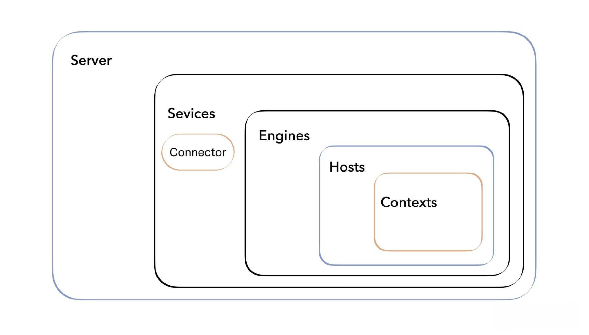

这节课我们计划做进一步的优化调整:
- 一是在进入 Host 层之前，预先装载 Context
- 二是通过配置文件来配置服务器，跟 Tomcat 一样。

## 项目结构
这节课我们把所有的 ClassLoader 移到 /loader 目录里，随后使用 server.xml 和 web.xml 分别管理 Host 启动配置与 Servlet 加载配置，这也是我们这节课的重点，你可以看一下现在的目录结构
```shell
MiniTomcat
├─ conf
│  ├─ server.xml
├─ src
│  ├─ main
│  │  ├─ java
│  │  │  ├─ com
│  │  │  │  ├─ minit
│  │  │  │  │  ├─ connector
│  │  │  │  │  │  ├─ http
│  │  │  │  │  │  │  ├─ DefaultHeaders.java
│  │  │  │  │  │  │  ├─ HttpConnector.java
│  │  │  │  │  │  │  ├─ HttpHeader.java
│  │  │  │  │  │  │  ├─ HttpProcessor.java
│  │  │  │  │  │  │  ├─ HttpRequestImpl.java
│  │  │  │  │  │  │  ├─ HttpRequestLine.java
│  │  │  │  │  │  │  ├─ HttpResponseImpl.java
│  │  │  │  │  │  │  ├─ ServletProcessor.java
│  │  │  │  │  │  │  ├─ SocketInputStream.java
│  │  │  │  │  │  │  ├─ StatisResourceProcessor.java
│  │  │  │  │  │  ├─ HttpRequestFacade.java
│  │  │  │  │  │  ├─ HttpResponseFacade.java
│  │  │  │  │  ├─ core
│  │  │  │  │  │  ├─ ApplicationFilterChain.java
│  │  │  │  │  │  ├─ ApplicationFilterConfig.java
│  │  │  │  │  │  ├─ ContainerBase.java
│  │  │  │  │  │  ├─ ContainerListenerDef.java
│  │  │  │  │  │  ├─ FilterDef.java
│  │  │  │  │  │  ├─ FilterMap.java
│  │  │  │  │  │  ├─ StandardContext.java
│  │  │  │  │  │  ├─ StandardContextValve.java
│  │  │  │  │  │  ├─ StandardHost.java
│  │  │  │  │  │  ├─ StandardHostValve.java
│  │  │  │  │  │  ├─ StandardPipeline.java
│  │  │  │  │  │  ├─ StandardWrapper.java
│  │  │  │  │  │  ├─ StandardWrapperValve.java
│  │  │  │  │  ├─ loader
│  │  │  │  │  │  ├─ CommonClassLoader.java
│  │  │  │  │  │  ├─ CommonLoader.java
│  │  │  │  │  │  ├─ WebappClassLoader.java
│  │  │  │  │  │  ├─ WebappLoader.java
│  │  │  │  │  ├─ logger
│  │  │  │  │  │  ├─ Constants.java
│  │  │  │  │  │  ├─ FileLogger.java
│  │  │  │  │  │  ├─ LoggerBase.java
│  │  │  │  │  │  ├─ SystemErrLogger.java
│  │  │  │  │  │  ├─ SystemOutLogger.java
│  │  │  │  │  ├─ session
│  │  │  │  │  │  ├─ StandardSession.java
│  │  │  │  │  │  ├─ StandardSessionFacade.java
│  │  │  │  │  ├─ startup
│  │  │  │  │  │  ├─ BootStrap.java
│  │  │  │  │  ├─ util
│  │  │  │  │  │  ├─ CookieTools.java
│  │  │  │  │  │  ├─ StringManager.java
│  │  │  │  │  │  ├─ URLDecoder.java
│  │  │  │  │  ├─ valves
│  │  │  │  │  │  ├─ AccessLogValve.java
│  │  │  │  │  │  ├─ ValveBase.java
│  │  │  │  ├─ Connector.java
│  │  │  │  ├─ Container.java
│  │  │  │  ├─ ContainerEvent.java
│  │  │  │  ├─ ContainerListener.java
│  │  │  │  ├─ Context.java
│  │  │  │  ├─ InstanceEvent.java
│  │  │  │  ├─ InstanceListener.java
│  │  │  │  ├─ Loader.java
│  │  │  │  ├─ Logger.java
│  │  │  │  ├─ Pipeline.java
│  │  │  │  ├─ Request.java
│  │  │  │  ├─ Response.java
│  │  │  │  ├─ Session.java
│  │  │  │  ├─ SessionEvent.java
│  │  │  │  ├─ SessionListener.java
│  │  │  │  ├─ Valve.java
│  │  │  │  ├─ ValveContext.java
│  │  │  │  ├─ Wrapper.java
│  │  ├─ resources
│  ├─ test
│  │  ├─ java
│  │  │  ├─ test
│  │  │  │  ├─ HelloServlet.java
│  │  │  │  ├─ TestFilter.java
│  │  │  │  ├─ TestListener.java
│  │  │  │  ├─ TestServlet.java
│  │  ├─ resources
├─ webapps
│  ├─ app1
│  │  ├─ WEB-INF
│  │  │  ├─ classes
│  │  │  │  ├─ test
│  │  │  │  │  ├─ HelloServlet.class
│  │  │  │  │  ├─ TestFilter.class
│  │  │  │  │  ├─ TestListener.class
│  │  │  │  │  ├─ TestServlet.class
│  │  │  ├─ web.xml
│  │  ├─ hello.txt
│  ├─ app2
│  │  ├─ WEB-INF
│  │  │  ├─ classes
│  │  │  │  ├─ test
│  │  │  │  │  ├─ HelloServlet.class
│  │  │  │  │  ├─ TestFilter.class
│  │  │  │  │  ├─ TestListener.class
│  │  │  │  │  ├─ TestServlet.class
│  │  │  ├─ web.xml
│  │  ├─ hello.txt
├─ pom.xml
```

## 预装载 Context
前面我们提到了，如何在调用一个 Host 之前知道有哪些 Context 呢？之前是在访问 Host 的时候 调用 getContext() 方法实现的，现在我们可以进一步改造，在 Host 启动时就进行识别，预先装载 Context，不必每次都再调用 getContext()。

我们在 StandardHost 类的 start() 方法中添加一段代码。

```java
package com.minit.core;
public class StandardHost extends ContainerBase {

    //启动 Host
    public void start(){
        fireContainerEvent("Host Started",this);
        Logger logger = new FileLogger();
        setLogger(logger);
        ContainerListenerDef listenerDef = new ContainerListenerDef();
        listenerDef.setListenerName("TestListener");
        listenerDef.setListenerClass("test.TestListener");
        addListenerDef(listenerDef);
        listenerStart();
        //在/webapps目录下加载所有上下文
        File classPath = new File(System.getProperty("minit.base"));
        String dirs[] = classPath.list();
        for (int i=0; i < dirs.length; i++) {
            getContext(dirs[i]);
        }
    }
}
```

相比之前，我们在 start() 方法里新增的就是下面这一段代码。
```java
        //在/webapps目录下加载所有上下文
        File classPath = new File(System.getProperty("minit.base"));
        String dirs[] = classPath.list();
        for (int i=0; i < dirs.length; i++) {
            getContext(dirs[i]);
        }
```

代码中有一个 minit.base 属性，它代表了应用的基础目录，比如 webapps，我们认为它下面的每个子目录都代表了一个不同的应用。这个属性是在 BootStrap 里设置的，我们就先改造 BootStrap。

参考 Tomcat，这节课我们也要定义 server.xml，虽然我们可以自己编写工具类进行 XML 解析，但这不是我们的重点，因而不再重复造轮子了，在开始改造 BootStrap 前，我们在 pom.xml 里引入新的依赖。
```xml
<dependency>
    <groupId>org.dom4j</groupId>
    <artifactId>dom4j</artifactId>
    <version>2.1.3</version>
</dependency>
```

Server.xml 文件代表了 Tomcat 的总体结构，启动配置都放在这个文件中。你打开一个文件，看一下它的主体部分。
```xml
<?xml version="1.0" encoding="UTF-8"?>
<Server port="8005" shutdown="SHUTDOWN">
  <Listener className="org.apache.catalina.startup.VersionLoggerListener" />

  <Service name="Catalina">
    <Executor name="tomcatThreadPool" namePrefix="catalina-exec-"
        maxThreads="150" minSpareThreads="4"/>
    <Connector executor="tomcatThreadPool"
               port="8080" protocol="HTTP/1.1"
               connectionTimeout="20000"
               redirectPort="8443" />

    <Engine name="Catalina" defaultHost="localhost">
      <Host name="localhost"  appBase="webapps"
            unpackWARs="true" autoDeploy="true">

        <Valve className="org.apache.catalina.valves.AccessLogValve" directory="logs"
               prefix="localhost_access_log" suffix=".txt"
               pattern="%h %l %u %t &quot;%r&quot; %s %b" />

      </Host>
    </Engine>
  </Service>
</Server>
```

我们可以看到，这个 Server.xml 就对应了我们目前探讨的 Tomcat 内部的概念，Service、Engine、Host、Connector 等等。 在 Host 中还可以定义 Context，不过因为现在一般都是自动部署应用，所以并不推荐它了。



顶层： <Server>和<Service>
- <Server>是 Server.xml 配置文件的根元素
- <Service>代表一个 Engine 以及一组与之相连的 Connector。

连接器： <Connector>
- <Connector>代表了客户端发送请求到特定 Service 的接口，如通过 8080 端口访问；反过来它也是外部客户端从特定 Service 接收响应的接口。

容器：<Engine>、<Host> 和 <Context>
- 容器用来处理通过 Connector 进来的请求，并调用相关的 Servlet 产生相应的响应。Engine、Host 和 Context 都是容器，它们是上下级关系，层层包含：Engine 包含 Host，Host 包含 Context。一个 Engine 组件可以处理 Service 中的所有请求，一个 Host 组件可以处理发向一个特定虚拟主机的所有请求，一个 Context 组件可以处理一个特定 Web 应用的所有请求。

## 解析server.xml
接下来我们调整 BootStrap 类，主要涉及启动方法的调整。
```java
package com.minit.startup;
public class BootStrap {
    public static final String MINIT_HOME =
            System.getProperty("user.dir");
    public static String WEB_ROOT =
            System.getProperty("user.dir");
    public static int PORT = 8080;
    private static int debug = 0;
    public static void main(String[] args) {
        if (debug >= 1)
            log(".... startup ....");
        //scan server.xml
        //scan web.xml
        String file = MINIT_HOME + File.separator + "conf" + File.separator + "server.xml";
        SAXReader reader = new SAXReader();
        Document document;
        try {
            document = reader.read(file);
            Element root = document.getRootElement();
            Element connectorelement= root.element("Connector");
            Attribute portattribute = connectorelement.attribute("port");
            PORT = Integer.parseInt(portattribute.getText());
            Element hostelement = root.element("Host");
            Attribute appbaseattribute = hostelement.attribute("appBase");
            WEB_ROOT =  WEB_ROOT + File.separator + appbaseattribute.getText();
        }
        catch(Exception e) {
        }
        System.setProperty("minit.home", MINIT_HOME);
        System.setProperty("minit.base", WEB_ROOT);
        HttpConnector connector = new HttpConnector();
        StandardHost container = new StandardHost();
        Loader loader = new CommonLoader();
        container.setLoader(loader);
        loader.start();
        connector.setContainer(container);
        container.setConnector(connector);
        container.start();
        connector.start();
    }
}
```
相比之前，新增了对 server.xml 的解析:
- 解析了<Connector> 标签里的 port 参数
- 解析了以及 <Host>标签里的 appBase 参数

我们在项目根目录下新建 /conf 文件夹，并新增 server.xml，参考配置如下：
```xml
<?xml version="1.0" encoding="UTF-8"?>
<Server>
    <Connector port="8080" />
    <Host name="localhost"  appBase="webapps">
    </Host>
</Server>
```

在 server.xml 里我们定义服务器端口为 8080，应用的根目录为 /webapps，这也和我们目前的项目结构对应。

这一部分解析代码我们简化处理了，使用 Dom4j 读取文件在内存构造一棵 Dom 树。Tomcat 实际上用的是 Digester，这是一种基于 SAX 实现的模型。我们没有使用 Digester，是因为它比较复杂，使用的人也比较少，而且并不关系 Tomcat 的核心结构。

在 BootStrap 的 main 方法解析完 server.xml 后，minit.base 的值已经指向了项目中的 /webapps 目录，所以在这个目录里我们进行遍历工作，依次调用 getContext 方法，你可以看一下这个方法改造后的样子。

```java
public StandardContext getContext(String name){
    StandardContext context = contextMap.get(name);
    if ( context == null) {
        System.out.println("loading context : " + name);
        context = new StandardContext();
        context.setDocBase(name);
        context.setConnector(connector);
        Loader loader = new WebappLoader(name, this.loader.getClassLoader());
        context.setLoader(loader);
        loader.start();
        context.start();
        this.contextMap.put(name, context);
    }
    return context;
}
```

getContext 方法和之前不一样的地方在于，新增了 context.start() 这一行代码，正因如此，遍历 /webapps 目录后会启动所有的 Context，这样也就实现了在 Host 调用前预装载 Context。

## 解析web.xml
我们总是会有这样的需求：访问的路径要简单易记，因为这是面向用户的，而代码编写时的类名则比较完整比较冗长，所以在这二者之间我们要建立映射关系。

参考 Tomcat，我们在这里也引入 web.xml 文件，通过自定义配置建立访问路径与类名之间的联系。

web.xml 的参考配置如下：
```xml
<?xml version="1.0" encoding="UTF-8"?>
<web-app version="3.0"
         xmlns="http://java.sun.com/xml/ns/javaee"
         xmlns:xsi="http://www.w3.org/2001/XMLSchema-instance"
         xsi:schemaLocation="http://java.sun.com/xml/ns/javaee
    http://java.sun.com/xml/ns/javaee/web-app_3_0.xsd">
    <filter>
        <filter-name>testfilter</filter-name>
        <filter-class>test.TestFilter</filter-class>
    </filter>
    <filter-mapping>
        <filter-name>testfilter</filter-name>
        <url-pattern>/*</url-pattern>
    </filter-mapping>
    <servlet>
        <servlet-name>testservlet</servlet-name>
        <servlet-class>test.TestServlet</servlet-class>
        <load-on-startup>1</load-on-startup>
    </servlet>
    <listener>
        <listener-class>test.TestListener</listener-class>
    </listener>
</web-app>
```

<filter>标签用来配置过滤器的信息； <filter-mapping>则配置过滤器过滤的 URL，”/*“ 表示不进行任何过滤操作； 

<servlet>标签用于配置 Servlet 的信息， <servlet-name>就是我们提到的给 Servlet 配置的别名，<servlet-class>表示实际访问到的Servlet的cls名，而<load-on-startup>则表示 Servlet 加载次序，当这个值大于等于 0 时，启动时按照顺序依次加载 Servlet，而小于 0 或者未定义时，就在第一次调用 Servlet 时加载； 

<listener>标签则用于配置监听器信息。

上一部分中我们在调用的 getContext 方法中，调用了 context.start() 方法，而解析 web.xml 的工作就放在 start 方法里。你可以看一下参考代码。
```java
package com.minit.core;
public class StandardContext extends ContainerBase implements Context{
    public void start(){
        fireContainerEvent("Container Started",this);
        Logger logger = new FileLogger();
        setLogger(logger);
        //扫描 web.xml
        String file = System.getProperty("minit.base") + File.separator +
                this.docbase + File.separator + "WEB-INF" + File.separator + "web.xml";
        SAXReader reader = new SAXReader();
        Document document;
        try {
            document = reader.read(file);
            Element root = document.getRootElement();
            //listeners
            List<Element> listeners = root.elements("listener");
            for (Element listener : listeners) {
                Element listenerclass = listener.element("listener-class");
                String listenerclassname = listenerclass.getText();
                System.out.println("listenerclassname: " + listenerclassname);
                //加载 listeners
                ContainerListenerDef listenerDef = new ContainerListenerDef();
                listenerDef.setListenerName(listenerclassname);
                listenerDef.setListenerClass(listenerclassname);
                addListenerDef(listenerDef);
            }
            listenerStart();
            //filters
            List<Element> filters = root.elements("filter");
            for (Element filter : filters) {
                Element filetername = filter.element("filter-name");
                String fileternamestr = filetername.getText();
                Element fileterclass = filter.element("filter-class");
                String fileterclassstr = fileterclass.getText();
                System.out.println("filter " + fileternamestr + fileterclassstr);
                //加载 filters
                FilterDef filterDef = new FilterDef();
                filterDef.setFilterName(fileternamestr);
                filterDef.setFilterClass(fileterclassstr);
                addFilterDef(filterDef);
            }
            //filter 映射
            List<Element> filtermaps = root.elements("filter-mapping");
            for (Element filtermap : filtermaps) {
                Element filetername = filtermap.element("filter-name");
                String fileternamestr = filetername.getText();
                Element urlpattern = filtermap.element("url-pattern");
                String urlpatternstr = urlpattern.getText();
                System.out.println("filter mapping " + fileternamestr + urlpatternstr);
                FilterMap filterMap = new FilterMap();
                filterMap.setFilterName(fileternamestr);
                filterMap.setURLPattern(urlpatternstr);
                addFilterMap(filterMap);
            }
            filterStart();
            //servlet
            List<Element> servlets = root.elements("servlet");
            for (Element servlet : servlets) {
                Element servletname = servlet.element("servlet-name");
                String servletnamestr = servletname.getText();
                Element servletclass = servlet.element("servlet-class");
                String servletclassstr = servletclass.getText();
                Element loadonstartup = servlet.element("load-on-startup");
                String loadonstartupstr = null;
                if (loadonstartup != null) {
                    loadonstartupstr = loadonstartup.getText();
                }
                System.out.println("servlet " + servletnamestr + servletclassstr);
                this.servletClsMap.put(servletnamestr, servletclassstr);
                if (loadonstartupstr != null) {
                    getWrapper(servletnamestr);
                }
            }
        } catch (DocumentException e) {
            // TODO Auto-generated catch block
            e.printStackTrace();
        }
        System.out.println("Context started.........");
    }
}
```
上述代码和解析 server.xml 类似，就是把 XML 文件按照标签格式，一层层地抽丝剥茧，最终将我们自定义的 Servlet 别名和实际 Servlet 类建立映射关系，从而简化 URL 的路径请求。

## 测试
有了 Servlet 自定义的别名和实际 Servlet 类的配置，用户现在在浏览器地址栏上输入 http://localhost:8080/app1/servlet/testservlet?name=yale，URI 里就不再是 test.TestServlet 这个类名，而是 testservlet 这个别名了。

测试样例：

[get1.http](get1.http)

[get2.http](get2.http)

## 小节
这节课我们进一步完善了 MiniTomcat，新增 Context 类的预加载，在调用 Host 之前提前加载 Context，不再像之前那样，每次调用 Host 的时候都临时加载 Context，避免了很多重复工作。

参考 Tomcat，我们还引入了 server.xml 和 web.xml，分别对服务端和 Servlet 进行自定义配置，以配置的方式启动服务器，对业务开发程序员和使用方更加友好。到现在为止，我们的 MiniTomcat 现在已经是一个完整的小型 Tomcat 了。
