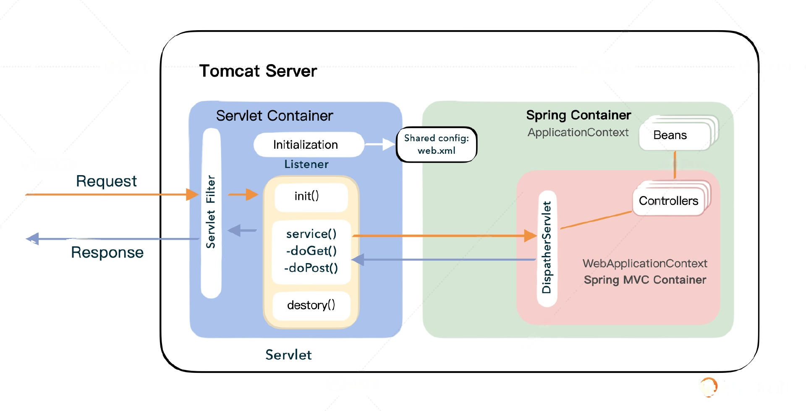

从原理上来说，只要是按照 Servlet 规范实现的服务器，就可以将 MiniSpring 直接放在 webapps 目录下运行，不用做任何额外的工作。

不过，因为 MiniTomcat 毕竟是一个麻雀版的 Tomcat，并没有完整地实现 Servlet 规范，所以现在这么直接绑在一起是不能顺利运行的，我们还需要做一点完善的工作。

## 切入点
我们先回顾一下，MiniSpring 启动的时候，依赖 Tomcat 环境做什么事情。

一、miniSpring改造点：

首先集成工作一切的起点都在Tomcat的 web.xml 文件中，里面定义了 Listener、Filter 和 Servlet。

为了让 MiniSpring 启动起来，我们要实现一个 ContextLoaderListener：com.minis.web.context.ContextLoaderListener ，这个 Listener 的目的是启动 MiniSpring 的 IoC 容器。

后续就是 DispatcherServlet 来拦截一切路径，通过这个 DispatcherServlet 来使用 MiniSpring 的 MVC。



二、miniTomcat改造点：

1. Spring的ContextLoaderListener需要传参ServletContext，但是目前Tomcat还没有解析 web.xml 中的初始化参数 context-param，而且 Servlet 还配置不了 url-pattern 和 init-param。 
2. 还有Tomcat的 Listener 接口不符合 servlet 规范，不支持 ServletContextListener，所以 MiniTomcat 还不能通过 Listener 把 MiniSpring 启动起来。 
3. 另外，以前在 HttpProcessor 里只是简单地判断路径，带有 /servlet/ 路径的就认为是要调用一个后台的 Servlet，这点也需要调整一下。 
4. 同时 Servlet 的名字是直接从 URI 中截取的，现在应该改用查找 url-pattern 通过路径匹配某个 Servlet 了。

## MiniSpring 中的 Bean
以前在 MiniSpring 项目中，我们自己实现了 @RequestMapping 等 Spring 中的常用注解，并且利用注解在 HelloWorldBean 类中对接口进行了定义。这个 bean 也仍然是我们的实现目标，也就是说通过这个 bean 来验证 MiniTomcat 和 MiniSpring 的集成。之前 bean 的代码主体如下：
```java
package com.test.controller;
public class HelloWorldBean {
    @Autowired
    BaseService baseservice;
    @Autowired
    UserService userService;
    
    @RequestMapping("/test2")
    public void doTest2(HttpServletRequest request, HttpServletResponse response) {
       String str = "test 2, hello world!";
       try {
          response.getWriter().write(str);
       } catch (IOException e) {
          // TODO Auto-generated catch block
          e.printStackTrace();
       }
    }
    @RequestMapping("/test5")
    public ModelAndView doTest5(User user) {
       ModelAndView mav = new ModelAndView("test","msg",user.getName());
       return mav;
    }
    
    @Autowired
    IAction action;
    @RequestMapping("/testaop2")
    public void doTestAop2(HttpServletRequest request, HttpServletResponse response) {
       action.doSomething();
       
       String str = "test aop 2, hello world!";
       try {
          response.getWriter().write(str);
       } catch (IOException e) {
          // TODO Auto-generated catch block
          e.printStackTrace();
       }
    }  
}
```

之前我们通常是采用嵌入式的方式使 Spring 业务项目与 Tomcat 结合在一起，即项目中内嵌一个 Tomcat 的 Web 服务器，这是因为 Tomcat 本身提供了内嵌这一种模式。

而目前这种内嵌模式我们还没有实现，我们实现的是依托于 MiniTomcat 项目本身，将业务服务代码打包成 App 的形式，在项目中运行。这个时候 MiniTomcat 是一个独立运行的容器，管理多个 webapp。

在后续集成过程中，我们会将 MiniSpring 这一项目整体编译，然后通过类似 Servlet 调用方式，例如 http://localhost:8080/app/test2 进行接口测试。

## 项目结构
这节课我们把所有的 ClassLoader 移到 /loader 目录下，然后使用 server.xml 和 web.xml 分别管理 Host 启动配置与 Servlet 加载配置，这也是我们这节课的重点，你可以看一下参考目录。
```shell
MiniTomcat
├─ conf
│  ├─ server.xml
├─ src
│  ├─ main
│  │  ├─ java
│  │  │  ├─ com
│  │  │  │  ├─ minit
│  │  │  │  │  ├─ connector
│  │  │  │  │  │  ├─ http
│  │  │  │  │  │  │  ├─ DefaultHeaders.class
│  │  │  │  │  │  │  ├─ HttpConnector.class
│  │  │  │  │  │  │  ├─ HttpHeader.class
│  │  │  │  │  │  │  ├─ HttpProcessor.class
│  │  │  │  │  │  │  ├─ HttpRequestImpl.class
│  │  │  │  │  │  │  ├─ HttpRequestLine.class
│  │  │  │  │  │  │  ├─ HttpResponseImpl.class
│  │  │  │  │  │  │  ├─ ServletProcessor.class
│  │  │  │  │  │  │  ├─ SocketInputStream.class
│  │  │  │  │  │  │  ├─ StatisResourceProcessor.class
│  │  │  │  │  │  ├─ HttpRequestFacade.class
│  │  │  │  │  │  ├─ HttpResponseFacade.class
│  │  │  │  │  ├─ core
│  │  │  │  │  │  ├─ ApplicationFilterChain.class
│  │  │  │  │  │  ├─ ApplicationFilterConfig.class
│  │  │  │  │  │  ├─ ContainerBase.class
│  │  │  │  │  │  ├─ ContainerListenerDef.class
│  │  │  │  │  │  ├─ FilterDef.class
│  │  │  │  │  │  ├─ FilterMap.class
│  │  │  │  │  │  ├─ StandardContext.class
│  │  │  │  │  │  ├─ StandardContextValve.class
│  │  │  │  │  │  ├─ StandardHost.class
│  │  │  │  │  │  ├─ StandardHostValve.class
│  │  │  │  │  │  ├─ StandardPipeline.class
│  │  │  │  │  │  ├─ StandardServletConfig.class
│  │  │  │  │  │  ├─ StandardServletContext.class
│  │  │  │  │  │  ├─ StandardWrapper.class
│  │  │  │  │  │  ├─ StandardWrapperValve.class
│  │  │  │  │  ├─ loader
│  │  │  │  │  │  ├─ CommonClassLoader.class
│  │  │  │  │  │  ├─ CommonLoader.class
│  │  │  │  │  │  ├─ WebappClassLoader.class
│  │  │  │  │  │  ├─ WebappLoader.resources.class
│  │  │  │  │  ├─ logger
│  │  │  │  │  │  ├─ Constants.class
│  │  │  │  │  │  ├─ FileLogger.class
│  │  │  │  │  │  ├─ LoggerBase.class
│  │  │  │  │  │  ├─ SystemErrLogger.class
│  │  │  │  │  │  ├─ SystemOutLogger.class
│  │  │  │  │  ├─ session
│  │  │  │  │  │  ├─ StandardSession.class
│  │  │  │  │  │  ├─ StandardSessionFacade.class
│  │  │  │  │  ├─ startup
│  │  │  │  │  │  ├─ BootStrap.class
│  │  │  │  │  ├─ util
│  │  │  │  │  │  ├─ CookieTools.class
│  │  │  │  │  │  ├─ StringManager.class
│  │  │  │  │  │  ├─ URLDecoder.class
│  │  │  │  │  ├─ valves
│  │  │  │  │  │  ├─ AccessLogValve.class
│  │  │  │  │  │  ├─ ValveBase.class
│  │  │  │  ├─ Connector.class
│  │  │  │  ├─ Container.class
│  │  │  │  ├─ ContainerEvent.class
│  │  │  │  ├─ ContainerListener.class
│  │  │  │  ├─ Context.class
│  │  │  │  ├─ InstanceEvent.class
│  │  │  │  ├─ InstanceListener.class
│  │  │  │  ├─ Loader.class
│  │  │  │  ├─ Logger.class
│  │  │  │  ├─ Pipeline.class
│  │  │  │  ├─ Request.class
│  │  │  │  ├─ Response.class
│  │  │  │  ├─ Session.class
│  │  │  │  ├─ SessionEvent.class
│  │  │  │  ├─ SessionListener.class
│  │  │  │  ├─ Valve.class
│  │  │  │  ├─ ValveContext.class
│  │  │  │  ├─ Wrapper.class
│  │  ├─ resources
│  ├─ test
│  │  ├─ java
│  │  │  ├─ test
│  │  │  │  ├─ HelloServlet.class
│  │  │  │  ├─ TestFilter.class
│  │  │  │  ├─ TestListener.class
│  │  │  │  ├─ TestServlet.class
│  │  ├─ resources
├─ webapps
│  ├─ app-minispring
│  │  ├─ WEB-INF
│  │  │  ├─ lib
│  │  │  ├─ classes
│  │  │  │  ├─ com
│  │  │  │  │  ├─ minis
│  │  │  │  │  ├─ test
│  │  │  │  ├─ applicationContext.xml
│  │  │  ├─ minisMVC-servlet.xml
│  │  │  ├─ web.xml
├─ pom.xml
```
其中 app-minispring 下的代码是我们从 minis 最终代码中编译得到的，都放置在 WEB-INF/classes/com 目录下，这里就不再依次列出了。

## 解析web.xml，实现Spring所需的ServletContextListener
构造ServletContext：

我们知道，一个应用的启动，依赖于解析 web.xml，从这个 XML 配置文件中指定要启动的 Listener 和 Servlet。

我们的目标是通过 Listener 启动 minis 的 IoC，随后所有的调用都通过 DispatcherServlet，转发到应用内部进行处理。

接下来我们先看看一个标准的 web.xml 具备哪些元素。
```xml
<?xml version="1.0" encoding="UTF-8"?>
<web-app version="3.0"
         xmlns="http://java.sun.com/xml/ns/javaee"
         xmlns:xsi="http://www.w3.org/2001/XMLSchema-instance"
         xsi:schemaLocation="http://java.sun.com/xml/ns/javaee
    http://java.sun.com/xml/ns/javaee/web-app_3_0.xsd">
    <context-param>
        <param-name>contextConfigLocation</param-name>
        <param-value>applicationContext.xml</param-value>
    </context-param>
    <listener>
        <listener-class>com.minis.web.context.ContextLoaderListener</listener-class>
    </listener>
    <servlet>
        <servlet-name>minisMVC</servlet-name>
        <servlet-class>com.minis.web.servlet.DispatcherServlet</servlet-class>
        <init-param>
            <param-name>contextConfigLocation</param-name>
            <param-value>minisMVC-servlet.xml</param-value>
        </init-param>
        <load-on-startup>1</load-on-startup>
    </servlet>
    <servlet-mapping>
        <servlet-name>minisMVC</servlet-name>
        <url-pattern>/</url-pattern>
    </servlet-mapping>
</web-app>
```
参考目前我们对 web.xml 的解析可以发现，<context-param>、 <servlet>标签下的 <init-param>，还有<servlet-mapping>标签都没有解析，所以这是我们要增加的解析部分。

一个 web.xml 代表一个应用的配置，对应的容器是 Context，所以我们要先在 StandardContext 中的 start() 方法内进行改造。

```java
    public void start(){
        Logger logger = new FileLogger();
        setLogger(logger);
        
        //scan web.xml
        String file = System.getProperty("minit.base") + File.separator + 
               this.docbase + File.separator + "WEB-INF" + File.separator + "web.xml";
        
        SAXReader reader = new SAXReader();
        Document document;
       try {
          document = reader.read(file);
          Element root = document.getRootElement();
          // 解析context-param
          List<Element> contextParams = root.elements("context-param");
          for (Element contextParam : contextParams) {
             Element element = contextParam.element("param-name");
             String paramName = element.getText();
             Element paramValueElement = contextParam.element("param-value");
             String paramValue = paramValueElement.getText();
             initParametersMap.put(paramName, paramValue);
          }
          servletContext = new StandardServletContext(this.docbase, initParametersMap);
            
          //解析servlet
          List<Element> servlets = root.elements("servlet");
            for (Element servlet : servlets) {
                Element servletname = servlet.element("servlet-name");
                String servletnamestr = servletname.getText();
                Element servletclass = servlet.element("servlet-class");
                String servletclassstr = servletclass.getText();
                //解析init-param
             Element servletInitParamElement = servlet.element("init-param");
             Element servletInitParamNameElement = servletInitParamElement.element("param-name");
             String servletInitParamName = servletInitParamNameElement.getText();
             Element servletInitParamValueElement = servletInitParamElement.element("param-value");
             String servletInitParamValue = servletInitParamValueElement.getText();
             Map<String, String> servletInitParamMap = new ConcurrentHashMap<>();
             servletInitParamMap.put(servletInitParamName, servletInitParamValue);
             servletInitParametersMap.put(servletclassstr, servletInitParamMap);
                Element loadonstartup = servlet.element("load-on-startup");
                String loadonstartupstr = null;
                if (loadonstartup != null) {
                   loadonstartupstr = loadonstartup.getText();
                }
                
                System.out.println("servlet " + servletnamestr + servletclassstr);
                this.servletClsMap.put(servletnamestr, servletclassstr);
                if (loadonstartupstr != null) {
                   getWrapper(servletnamestr);
                }
                
            }
          // 解析servlet-mapping
          List<Element> servletMappings = root.elements("servlet-mapping");
          for (Element servletMapping : servletMappings) {
             Element servletname = servletMapping.element("servlet-name");
             String servletnamestr = servletname.getText();
             Element servletclass = servletMapping.element("url-pattern");
             String urlPatternStr = servletclass.getText();
             servletMappingMap.put(urlPatternStr, servletnamestr);
          }
       } catch (DocumentException e) {
          e.printStackTrace();
       }
        System.out.println("Context started.........");
 }  
```

上面的代码列出了对<context-param>、 <servlet>标签下的 <init-param>，还有<servlet-mapping>标签的解析，我们分别定义 initParametersMap、servletInitParamMap、servletMappingMap 三个 Map 数据结构，来存储解析的数据。

这样后续的程序就可以从这里获取到这些配置信息了。

然后我们再来看看 Listener，我们已经说过，Listener 是 Tomcat 和 Spring 的初始结合点，那么 MiniSpring 也是在这里与 MiniTomcat 进行第一次接触的。

MiniSpring 遵从了 Servlet 的规范，所以为了让我们的 Minit 能顺利运行 MiniSpring，我们也要适配 Servlet 规范，支持 ServletContextListener。

我们将 StandardContext 里用到自定义 ContainerListener 的地方全部替换成 ServletContextListener，ServletContextListener 是 javax.servlet 包中定义的接口。所以我们可以启动 MiniSpring 的 ContextLoaderListener，进而启动 Minis 的 IoC。

你可以看一下 MiniSpring 里对 ServletContextListener 的 contextInitialized 方法的实现。
```java
@Override
public void contextInitialized(ServletContextEvent event) {
    initWebApplicationContext(event.getServletContext());
}
```

在代码实现中，initWebApplicationContext 传入了一个 ServletContext 类型的参数，因此在 MiniTomcat 中我们需要考虑做一个 ServletContext 接口的实现类。

在 MiniTomcat 中定义了 StandardServletContext，你可以看一下代码的主体部分。
```java
package com.minit.core;
public class StandardServletContext implements ServletContext {
    private Map<String, String> initParametersMap = new ConcurrentHashMap<>();
    private Map<String, Object> attributeMap = new ConcurrentHashMap<>();
    private String docbase;
    public StandardServletContext() {
    }
    public StandardServletContext(String docbase, Map<String, String> initParametersMap) {
        this.initParametersMap = initParametersMap;
        this.docbase = docbase;
    }
    @Override
    public URL getResource(String s) throws MalformedURLException {
        try {
            URLStreamHandler urlStreamHandler = null;
            File classPath = new File(System.getProperty("minit.base"));
            String repository = (new URL("file", null, classPath.getCanonicalPath() + File.separator)).toString() ;
            repository = repository + this.docbase + File.separator;
            repository = repository + "WEB-INF" + File.separator;
            return new URL(null, repository + s, urlStreamHandler);
        } catch (IOException e) {
            throw new MalformedURLException(e.getMessage());
        }
    }
    @Override
    public String getInitParameter(String s) {
        return initParametersMap.get(s);
    }
    @Override
    public Object getAttribute(String s) {
        return this.attributeMap.get(s);
    }
    @Override
    public void setAttribute(String s, Object o) {
        this.attributeMap.put(s, o);
    }
}
```
为了遵从规范，需要定义的方法比较多，但我们的实际需求只是简单地将它们运行起来，以此来说明原理，我们只需要实现 getResource、getInitParameter、getAttribute、setAttribute 就可以了，其他的暂时用不到。

后续 MiniSpring 启动时调用的 ServletContext，其内部就是调用 MiniTomcat 的 StandardServletContext。

## 解析web.xml，创建出Spring所需的DispatcherServlet
同理，在 MiniToimcat 的 StandardWrapper 里，需要调用 loadServlet 加载应用的 Servlet，在 web.xml 中我们配置了 DispatcherServlet。

因而在 loadServlet 中，有一行 servlet.init(null)，此时我们需要进行一定的改造，传入具体的 ServletConfig 实现，里面包含一个 Servlet 的元信息，如名字、初始化参数、上下文 context 等。

所以我们在 MiniTomcat 中也就要实现一个 StandardServletConfig。
```java
package com.minit.core;
public class StandardServletConfig implements ServletConfig {
    private Map<String, String> servletInitParamMap = new ConcurrentHashMap<>();
    private ServletContext servletContext;
    private String servletName;
    public StandardServletConfig(String servletName, ServletContext servletContext, Map<String, String> servletInitParamMap) {
        this.servletInitParamMap = servletInitParamMap;
        this.servletContext = servletContext;
        this.servletName = servletName;
    }
    @Override
    public String getServletName() {
        return servletName;
    }
    @Override
    public ServletContext getServletContext() {
        return this.servletContext;
    }
    @Override
    public String getInitParameter(String s) {
        return servletInitParamMap.get(s);
    }
    @Override
    public Enumeration<String> getInitParameterNames() {
        return null;
    }
}
```

这个时候 StandardWrapper 里的 loadServlet 方法需要改造一下。
```java
public Servlet loadServlet() throws ServletException {
    // Call the initialization method of this servlet
    try {
      servlet.init(new StandardServletConfig(servletClass,
            standardContext.getServletContext(),
            standardContext.getServletInitParametersMap().get(servletClass)));
    }
    catch (Throwable f) {
      throw new ServletException("Failed initialize servlet.");
    }
}
```

主要改动在于在调用 servlet 的 init() 时，将原来传入的 null，改为了传入一个 ServletConfig，通过这个方法的调用，我们就可以加载 MiniSpring 中的 DispatcherServlet。注意了，这也是系统中唯一一个 Servlet。

## DispatcherServlet全部接管Servlet流量
还有一处需要改动，就是我们之前调用应用的 Servlet，会以路径中最后一个分隔符（/）为界，最后面一段字符串代表 Servlet 的名称。

而我们现在调用 MiniSpring 的时候，则是考虑最后路径为 @RequestMapping 注解里配置的值，而这个时候这个值并不是 Servlet 的名称，其实整个系统现在只有一个 Servlet，也就是 DispatcherServlet，其他的都被 MiniSpring 封装了。

因此在 MiniTomcat 里，解析请求路径的 StandardContextValve 类里的 invoke 方法也需要调整。

你可以看一下这个方法调整之后的样子。
```java
package com.minit.core;
final class StandardContextValve extends ValveBase {
    public void invoke(Request request, Response response, ValveContext valveContext)
        throws IOException, ServletException {
        System.out.println("StandardContextValve invoke()");
        StandardWrapper servletWrapper = null;
        String uri = ((HttpRequestImpl)request).getUri();
        //通过uri拿到pattern
        String servletPattern = uri.substring(uri.lastIndexOf("/"));
        //通过pattern找到合适的servlet名
        String servletName = this.urlMatch(servletPattern);
        StandardContext context = (StandardContext)getContainer();
        
        servletWrapper = (StandardWrapper)context.getWrapper(servletName); 
        try {
           System.out.println("Call service()");
           servletWrapper.invoke(request, response);
        }
        catch (Exception e) {
           System.out.println(e.toString());
        }
        catch (Throwable e) {
           System.out.println(e.toString());
        }
    }
    //简单的匹配规则，以url-pattern开头继任为匹配上
    private String urlMatch(String urlPattern) {
       Map<String, String> servletMappingMap = standardContext.getServletMappingMap();
       Set<String> keySet = servletMappingMap.keySet();
       for (Map.Entry<String, String> entry : servletMappingMap.entrySet()) {
          String key = entry.getKey();
          if (urlPattern.startsWith(key)) {
             return entry.getValue();
          }
       }
       return null;
    }
}
```
关键的改动在于我们解析了 ServletMapping，并要求 ServletMapping 中定义的 ServletName 与 Servlet 标签匹配。这里如果我们指定 url-pattern 为斜杠（/），表示不做任何拦截。

因此在 invoke 方法中，我们获取到了最后一段字符串，类似 ”/test2“ 这种，就是调用到 Minis 的 DispatcherServlet 中，之后代码逻辑都转到 MiniSpring 中去处理了。

## 测试
将编译后的tomcat放好：根目录/classes，注意内部类`StandardPipeline$StandardPipelineValveContext.class`漏掉的话要补齐

将编译后的spring放好：根目录/webapps

在这些主要的改动调整完毕后，我们编译部署，你可以看一下运行目录。
```shell
MiniTomcat
├─ conf
│  ├─ server.xml
├─ classes
│  ├─ com
│  │  ├─ minit
│  │  │  ├─ connector
│  │  │  │  ├─ http
│  │  │  ├─ core
│  │  │  ├─ loader
│  │  │  ├─ logger
│  │  │  ├─ session
│  │  │  ├─ startup
│  │  │  ├─ util
│  │  │  ├─ valves
├─ lib
├─ logs
├─ webapps
│  ├─ app-minispring
│  │  ├─ WEB-INF
│  │  │  ├─ lib
│  │  │  ├─ classes
│  │  │  │  ├─ com
│  │  │  │  │  ├─ minis
│  │  │  │  │  ├─ test
│  │  │  │  ├─ applicationContext.xml
│  │  │  ├─ minisMVC-servlet.xml
│  │  │  ├─ web.xml
├─ startup.bat
```

startup.bat 是启动程序，直接双击 startup.bat 启动 MiniTomcat 和 MiniSpring。你从控制台的输出中就能看到 IoC 和 MVC 分别启动了。

在浏览器地址栏上输入 http://localhost:8080/app-minispring/test2，可以看到浏览器页面上输出 ”test2，hello world!“，这样就表示 MiniSpring 顺利地在 MiniTomcat 中运行起来了。

## 小结
这节课我们将 MiniSpring 与 MiniTomcat 进行集成，构成了一个更大的框架。

我们采取的方案是将 MiniTomcat 作为独立服务器启动，然后把 MiniSpring 作为一个应用装载在 MiniTomcat 里。为了能够集成，我们做的改造工作是按照规范解析 web.xml，增加 context-param、servlet-mapping、init-param 的解析。然后我们实现了 ServletContextListener 接口，通过 Listener MiniTomcat 和 MiniSpring 有了一个最初的结合点。后面我们又实现了 ServletConfig，以便初始化 DispatcherServlet，同时也不再是通过 /servlet/ 目录来判断是否是一个 servlet 了，而是通过 servlet mapping 去获得的。

总之只要符合 Servlet 规范，就能将 Tomcat 和 Spring 集成起来。